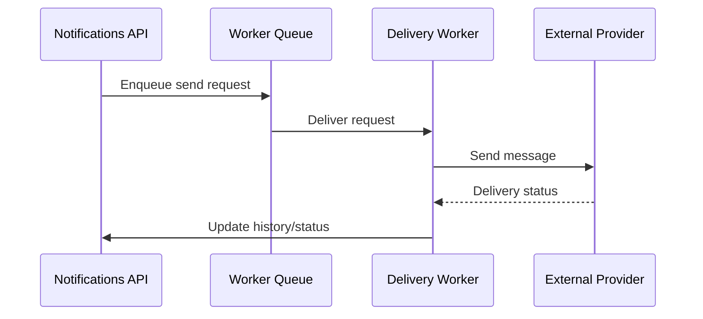
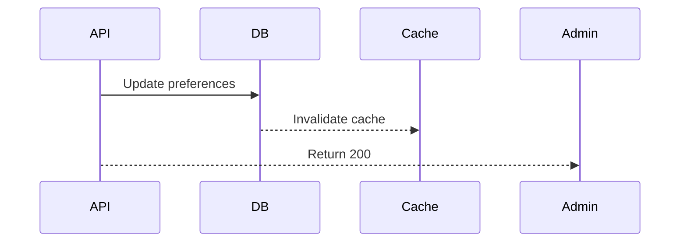



# Notifications API Documentation

_Based on OpenAPI specification: notifications.yaml_

## Executive Summary

**Audience:** Stakeholders

- Business value: centralized, auditable notification delivery for email, SMS and push channels; enables critical incident alerts, customer communications, and regulatory notifications.
- Key capabilities: organization-level preferences, delivery history, templated sends, rate limiting and retries.
- Strategic importance: Reduces time-to-market for communications, improves reliability and observability of customer-facing messages, supports audit and compliance reporting.

## Service Overview

**Audience:** All

- Business Purpose:

  - Deliver transactional and batch notifications reliably to users and accounts.
  - Provide organization-level preference management for channels and templates.
  - Record delivery history for audit, troubleshooting and compliance.
  - Support templated messages with metadata for localization and personalization.
  - Provide rate limiting, retry logic and backoff for resilient delivery.

- Technical Architecture:
  - RESTful API fronted by an event-driven delivery pipeline (worker queues + external providers).
  - Multi-tenant isolation via orgId headers/claims.
  - Pluggable providers for email/SMS/push with provider-fallback.
  - Persistent storage for delivery history and deduplication (idempotency keys).
  - Observability via structured logs, tracing, and metrics per channel and org.

## API Specifications

**Audience:** Technical

- Base Configuration (YAML reference):

```yaml
openapi: 3.1.0
info:
  title: Quub Exchange - Notifications API
  version: 2.0.0
  servers:
    - url: https://api.quub.exchange/v1
```

- Authentication & Authorization:
  - Supports OAuth2 scopes (read:notifications, write:notifications) and API key fallback for service integrations.
  - Endpoints require either bearer OAuth2 tokens or an API key passed in the configured header.

## Core Endpoints

Grouped by functional area. For each endpoint below we include method, path, business use case, request and response examples, and implementation notes.

### Preferences

- GET /orgs/{orgId}/notifications/preferences
  - Business use case: Retrieve org-level notification channel preferences and templates.
  - Request example:

```json
GET /orgs/01234567-89ab-cdef-0123-456789abcdef/notifications/preferences
Authorization: Bearer <token>
```

- Response example (200):

```json
{
  "data": [
    {
      "channel": "EMAIL",
      "enabled": true,
      "templates": ["account_activation", "trade_confirmation"]
    }
  ]
}
```

- Implementation notes:

  1. Cache preferences per org with short TTL; invalidate on PUT.
  2. Validate template identifiers against stored templates.
  3. Enforce RBAC so only org admins can update preferences.

- PUT /orgs/{orgId}/notifications/preferences
  - Business use case: Update org-level notification preferences.
  - Request example:

```json
{
  "preferences": [
    { "channel": "EMAIL", "enabled": true },
    { "channel": "SMS", "enabled": false }
  ]
}
```

### History

- GET /orgs/{orgId}/notifications/history
  - Business use case: Audit and troubleshooting; retrieve delivery attempts and statuses.
  - Query filters: type (EMAIL/SMS/PUSH), status (PENDING/SENT/FAILED), since (timestamp).
  - Response example: paginated list of Notification objects (see components).

Implementation notes:

1. Support cursor-based pagination.
2. Ensure retention policy (e.g., 90 days) configurable per org.

### Send

- POST /orgs/{orgId}/notifications/send
  - Business use case: Trigger a notification send (transactional or batch).
  - Request example (transactional):

```json
POST /orgs/0123/notifications/send
{
  "type": "EMAIL",
  "recipients": ["user-123"],
  "subject": "Trade confirmed",
  "body": "Your trade of 100 XYZ has been executed.",
  "metadata": {"templateId": "trade_confirmation", "locale": "en-US"}
}
```

- Response example (201):

```json
{
  "data": {
    "id": "f47ac10b-58cc-4372-a567-0e02b2c3d479",
    "status": "PENDING"
  }
}
```

Implementation notes:

1. Validate recipients (account IDs or email addresses) and expand to delivery addresses.
2. Support idempotency with idempotencyKey header to avoid duplicate sends.
3. Enqueue send requests to worker queue and return early with PENDING status.
4. Apply rate limiting and provider throttling per org and per channel.

## Security Implementation

**Audience:** Technical + Project Teams

- Multi-tenant isolation:
  - All endpoints require an `orgId` path param and optional `X-Org-Id` header; enforce token-scoped org membership server-side.
  - Example policy (YAML snippet):

```yaml
multiTenant:
  enforceOrgScope: true
  orgHeader: X-Org-Id
```

- Data protection measures:

  - Sensitive PII (email addresses) stored encrypted at rest.
  - Access to delivery logs restricted to org-admins and auditors via RBAC.

- Access Controls (example):

```json
{ "roles": ["org_admin", "notification_writer", "notification_reader"] }
```

## Business Workflows

**Audience:** Stakeholders + Project Teams

### Primary Workflow — Send Notification (Mermaid)



- Business value: Decouples API latency from provider delivery, improves throughput and retry handling.
- Success metrics: 99.9% API availability, 95% deliveries within SLA, <1% undelivered due to provider errors.

### Secondary Workflow — Preference Update



## Integration Guide

**Audience:** Project Teams

- Development setup (shell):

```bash
# install deps (example)
npm install
export NODE_ENV=sandbox
```

- JavaScript/Node.js example (send):

```javascript
import fetch from "node-fetch";

async function sendNotification(orgId, token, payload) {
  const res = await fetch(
    `https://api.quub.exchange/v1/orgs/${orgId}/notifications/send`,
    {
      method: "POST",
      headers: {
        Authorization: `Bearer ${token}`,
        "Content-Type": "application/json",
      },
      body: JSON.stringify(payload),
    }
  );
  return res.json();
}

// usage
sendNotification("org-uuid", process.env.API_TOKEN, {
  type: "EMAIL",
  recipients: ["user@example.com"],
  subject: "Hi",
  body: "Hello",
});
```

- Python example (send):

```python
import requests

def send_notification(org_id, token, payload):
    url = f"https://api.quub.exchange/v1/orgs/{org_id}/notifications/send"
    headers = { 'Authorization': f'Bearer {token}', 'Content-Type': 'application/json' }
    r = requests.post(url, json=payload, headers=headers)
    return r.json()

# usage
send_notification('org-uuid', 'TOKEN', { 'type':'SMS', 'recipients':['+15551234567'], 'body':'Hello' })
```

## Error Handling

**Audience:** Technical + Project Teams

- Standard error response:

```json
{
  "error": {
    "code": "ValidationError",
    "message": "recipient missing",
    "details": [
      { "field": "recipients", "message": "At least one recipient required" }
    ]
  }
}
```

- Error codes reference (example):

  - ValidationError — 422 — input validation issues
  - BadRequest — 400 — bad payload
  - Unauthorized — 401 — invalid token
  - Forbidden — 403 — RBAC/tenant mismatch
  - TooManyRequests — 429 — rate limit
  - InternalServerError — 500 — transient provider or platform failure

- Best practices:
  1. Use idempotency keys for safe retries.
  2. Surface provider-level errors in delivery history with an error code.
  3. Implement exponential backoff for transient failures.

## Implementation Checklist

**Audience:** Project Teams

- Pre-Development:

  - [ ] Confirm provider integrations and SLAs
  - [ ] Define retention/archival policy for delivery logs
  - [ ] Prepare templates and localization strategy

- Development Phase:

  - [ ] Implement API endpoints and validation
  - [ ] Add idempotency and rate limiting
  - [ ] Add unit tests for edge cases (invalid recipients, large payloads)

- Testing Phase:

  - [ ] Integration tests with mock providers
  - [ ] Load tests for throughput and rate-limits
  - [ ] Verify failure and retry paths

- Production Readiness:
  - [ ] Monitoring and alerts in place (delivery failure rate, provider latency)
  - [ ] Runbook for provider outages and fallback
  - [ ] Security audit / PII encryption verified

## Monitoring & Observability

**Audience:** Technical + Project Teams

- Key metrics:

  - total_sent_per_channel (target: per-org SLA)
  - delivery_success_rate (target: >95%)
  - avg_delivery_latency_ms
  - retry_count and provider_error_rate

- Logging (structured JSON example):

```json
{
  "timestamp": "2025-11-02T10:00:00Z",
  "orgId": "org-uuid",
  "event": "notification.sent",
  "channel": "EMAIL",
  "provider": "SES",
  "status": "SENT",
  "notificationId": "..."
}
```

- Alerts:
  - Delivery success rate < 90% for 5m
  - Provider error rate spike > 5% for 10m

## API Versioning & Evolution

- Current Version: v1 (stable)
- Planned Enhancements (v1.1): template management API, webhook callbacks for delivery receipts.
- Breaking Changes (v2.0): switching to event-first async-only model (requires consumers to listen to delivery webhooks).

## Additional Resources

- Stakeholders:

  - Product brief: /docs/notifications/product-brief
  - Compliance: /docs/notifications/compliance

- Technical:

  - OpenAPI spec: /openapi/notifications.yaml
  - Integration SDKs: /sdk

- Project teams:
  - Runbook: /runbooks/notifications
  - Monitoring dashboard: /dashboards/notifications

## Footer

For implementation help or questions, contact the platform engineering team and include `orgId`, `request-id`, and timestamps in any issue report.
