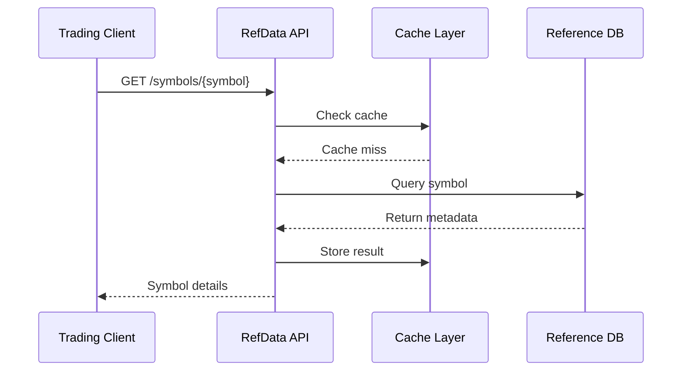
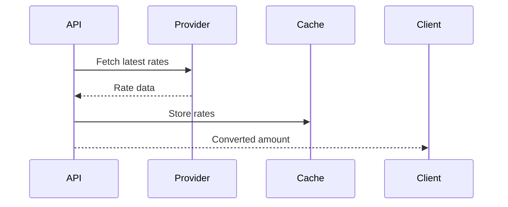



# Pricing & Reference Data API Documentation

_Based on OpenAPI specification: pricing-refdata.yaml_

## Executive Summary

**Audience:** Stakeholders

- Business value proposition: Centralized, reliable reference data for trading symbols, FX rates, and indices; enables accurate pricing, risk management, and compliance across the exchange.
- Key capabilities: Real-time and historical FX rates, comprehensive symbol metadata, index definitions; supports multi-asset classes (equity, crypto, commodities).
- Strategic importance: Reduces integration complexity for market participants, ensures data consistency, supports regulatory reporting and audit trails.

## Service Overview

**Audience:** All

- Business Purpose:

  - Provide authoritative reference data for all tradable instruments and market indices.
  - Deliver current and historical foreign exchange rates for currency conversions.
  - Support filtering and pagination for efficient data retrieval.
  - Enable real-time updates and caching for high-performance access.
  - Facilitate compliance with market data regulations and audit requirements.

- Technical Architecture:
  - RESTful API with read-only endpoints for reference data.
  - Multi-tenant isolation via org-scoped access controls.
  - Caching layer (Redis/CDN) for frequently accessed data like symbols and indices.
  - Integration with external data providers for FX rates and index compositions.
  - Structured logging and metrics for observability and SLA monitoring.

## API Specifications

**Audience:** Technical

- Base Configuration (YAML format):

```yaml
openapi: 3.1.0
info:
  title: Quub Exchange - Pricing & Reference Data API
  version: 2.0.0
servers:
  - url: https://api.quub.exchange/v1
```

- Authentication & Authorization:
  - Supports OAuth2 scopes (read:pricing) for user-based access.
  - API key authentication for service integrations.
  - Rate limiting applied per org and endpoint to prevent abuse.

## Core Endpoints

Grouped by functional area. For each endpoint below we include method, path, business use case, request and response examples, and implementation notes.

### Symbols

- GET /refdata/symbols
  - Business use case: Retrieve list of all supported trading symbols with metadata for portfolio management and order validation.
  - Request example:

```json
GET /refdata/symbols?assetClass=CRYPTO&baseAsset=BTC&limit=50
Authorization: Bearer <token>
```

- Response example (200):

```json
{
  "data": [
    {
      "symbol": "BTC-USD",
      "name": "Bitcoin / US Dollar",
      "baseAsset": "BTC",
      "quoteAsset": "USD",
      "assetClass": "CRYPTO",
      "tradingHours": "24/7",
      "tickSize": 0.01,
      "precision": 2,
      "status": "ACTIVE",
      "createdAt": "2023-01-01T00:00:00Z"
    }
  ],
  "pagination": {
    "cursor": "next-page-token",
    "hasMore": true
  }
}
```

- Implementation notes:

  1. Supports filtering by assetClass, baseAsset, quoteAsset for targeted queries.
  2. Cache symbols for 1 hour to reduce load on upstream providers.
  3. Validate symbol codes against allowed patterns (e.g., no special chars).
  4. Enforce pagination limits (max 1000 per page) to prevent large responses.

- GET /refdata/symbols/{symbol}
  - Business use case: Get detailed metadata for a specific symbol before placing orders.
  - Request example:

```json
GET /refdata/symbols/BTC-USD
Authorization: Bearer <token>
```

- Response example (200):

```json
{
  "data": {
    "symbol": "BTC-USD",
    "name": "Bitcoin / US Dollar",
    "baseAsset": "BTC",
    "quoteAsset": "USD",
    "assetClass": "CRYPTO",
    "tradingHours": "24/7",
    "tickSize": 0.01,
    "precision": 2,
    "status": "ACTIVE",
    "createdAt": "2023-01-01T00:00:00Z"
  }
}
```

### FX Rates

- GET /refdata/fx-rates
  - Business use case: Retrieve current or historical FX rates for currency conversions in trading and settlements.
  - Request example (current rates):

```json
GET /refdata/fx-rates?base=USD&quote=EUR
Authorization: Bearer <token>
```

- Response example (200):

```json
{
  "data": [
    {
      "baseCurrency": "USD",
      "quoteCurrency": "EUR",
      "rate": 0.9213,
      "timestamp": "2025-11-02T12:00:00Z",
      "source": "ECB"
    }
  ],
  "pagination": {
    "cursor": null,
    "hasMore": false
  }
}
```

- Implementation notes:
  1. Historical rates available via 'since' parameter (max 30 days back).
  2. Rates sourced from reliable providers (ECB, Fed, etc.) with freshness checks.
  3. Cache rates for 5-15 minutes depending on volatility.
  4. Support cross-rates by chaining conversions if direct pair unavailable.

### Indices

- GET /refdata/indices
  - Business use case: Access definitions and compositions of market indices for benchmarking and analytics.
  - Request example:

```json
GET /refdata/indices?type=CRYPTO&limit=20
Authorization: Bearer <token>
```

- Response example (200):

```json
{
  "data": [
    {
      "id": "550e8400-e29b-41d4-a716-446655440000",
      "name": "Quub Global Digital Assets Index",
      "type": "CRYPTO",
      "description": "Weighted index of major digital assets",
      "components": ["BTC", "ETH", "ADA"],
      "baseValue": 1000,
      "lastUpdated": "2025-11-02T10:00:00Z"
    }
  ],
  "pagination": {
    "cursor": "next-page-token",
    "hasMore": true
  }
}
```

- Implementation notes:
  1. Indices updated periodically from data providers.
  2. Include component weights and rebalancing schedules in full schema.
  3. Cache index data for 1 hour with invalidation on updates.
  4. Support filtering by type (MARKET, CRYPTO, DEFI) for targeted access.

## Security Implementation

**Audience:** Technical + Project Teams

- Multi-tenant isolation:
  - Org-scoped rate limits and access controls; no cross-org data leakage.
  - Example policy (YAML snippet):

```yaml
multiTenant:
  enforceOrgScope: true
  rateLimitPerOrg: 1000 req/min
```

- Data protection measures:

  - Public reference data with no PII; encrypted storage for any sensitive metadata.
  - Audit logging for all access requests with org and user context.

- Access Controls (example):

```json
{ "roles": ["read:pricing", "org_member"] }
```

## Business Workflows

**Audience:** Stakeholders + Project Teams

### Primary Workflow — Symbol Validation (Mermaid)



- Business value: Ensures order accuracy and reduces failed trades; supports real-time validation.
- Success metrics: 99.5% cache hit rate, <100ms average response time, 99.9% uptime.

### Secondary Workflow — FX Conversion



## Integration Guide

**Audience:** Project Teams

- Development Setup (bash commands):

```bash
# install deps
npm install axios
export API_KEY=your-key
export BASE_URL=https://api.quub.exchange/v1
```

- JavaScript/Node.js example (get symbols):

```javascript
import axios from "axios";

async function getSymbols(assetClass = "CRYPTO") {
  const response = await axios.get("/refdata/symbols", {
    params: { assetClass },
    headers: { Authorization: `Bearer ${process.env.API_TOKEN}` },
  });
  return response.data.data;
}

// usage
getSymbols("EQUITY").then((symbols) => console.log(symbols));
```

- Python example (get FX rates):

```python
import requests

def get_fx_rates(base='USD', quote='EUR'):
    url = 'https://api.quub.exchange/v1/refdata/fx-rates'
    headers = {'Authorization': f'Bearer {os.getenv("API_TOKEN")}'}
    params = {'base': base, 'quote': quote}
    r = requests.get(url, headers=headers, params=params)
    return r.json()['data']

# usage
rates = get_fx_rates()
print(rates)
```

## Error Handling

**Audience:** Technical + Project Teams

- Standard error response:

```json
{
  "error": {
    "code": "BadRequest",
    "message": "Invalid asset class filter",
    "details": [
      {
        "field": "assetClass",
        "message": "Must be one of: EQUITY, CRYPTO, COMMODITY"
      }
    ]
  }
}
```

- Error codes reference (table):

  - BadRequest (400) — Invalid parameters or filters
  - Unauthorized (401) — Missing or invalid auth
  - Forbidden (403) — Insufficient permissions
  - NotFound (404) — Symbol or index not found
  - TooManyRequests (429) — Rate limit exceeded
  - InternalServerError (500) — Upstream provider failure

- Best practices:
  1. Implement exponential backoff for 429/500 errors.
  2. Cache error responses for 404s to reduce load.
  3. Log client errors for debugging invalid requests.

## Implementation Checklist

**Audience:** Project Teams

- Pre-Development:

  - [ ] Confirm data provider contracts and SLAs
  - [ ] Define caching strategy and TTLs
  - [ ] Prepare data validation rules for symbols/indices

- Development Phase:

  - [ ] Implement endpoints with pagination and filtering
  - [ ] Add caching layer and invalidation logic
  - [ ] Unit tests for data transformations and validations

- Testing Phase:

  - [ ] Integration tests with mock providers
  - [ ] Load tests for high-volume requests
  - [ ] Verify data freshness and accuracy

- Production Readiness:
  - [ ] Monitoring for data staleness and provider health
  - [ ] Backup data sources for failover
  - [ ] Rate limiting and abuse prevention in place

## Monitoring & Observability

**Audience:** Technical + Project Teams

- Key metrics:

  - request_rate_per_endpoint (target: <10k req/min per org)
  - cache_hit_rate (target: >90%)
  - data_freshness_delay_ms (target: <5000ms for FX rates)
  - error_rate (target: <1%)

- Logging (structured JSON example):

```json
{
  "timestamp": "2025-11-02T12:00:00Z",
  "orgId": "org-uuid",
  "endpoint": "/refdata/symbols",
  "method": "GET",
  "status": 200,
  "responseTimeMs": 45,
  "cacheHit": true
}
```

- Alerts:
  - Cache hit rate < 80% for 5m
  - Data freshness > 10min for FX rates
  - Error rate > 5% for 10m

## API Versioning & Evolution

**Audience:** All

- Current Version: v1 (stable)
- Planned Enhancements (v1.1): Real-time streaming updates for FX rates and indices.
- Breaking Changes (v2.0): Migration to GraphQL for complex queries (requires client updates).

## Additional Resources

**Audience:** All

- Stakeholders:

  - Data quality report: /docs/refdata/quality
  - Provider SLAs: /docs/refdata/providers

- Technical:

  - OpenAPI spec: /openapi/pricing-refdata.yaml
  - Data schemas: /schemas/refdata

- Project teams:
  - Data pipeline docs: /docs/refdata/pipeline
  - Troubleshooting guide: /docs/refdata/troubleshooting

## Footer

For data accuracy issues or API support, contact the data engineering team with orgId, request-id, and timestamps in any issue report.
