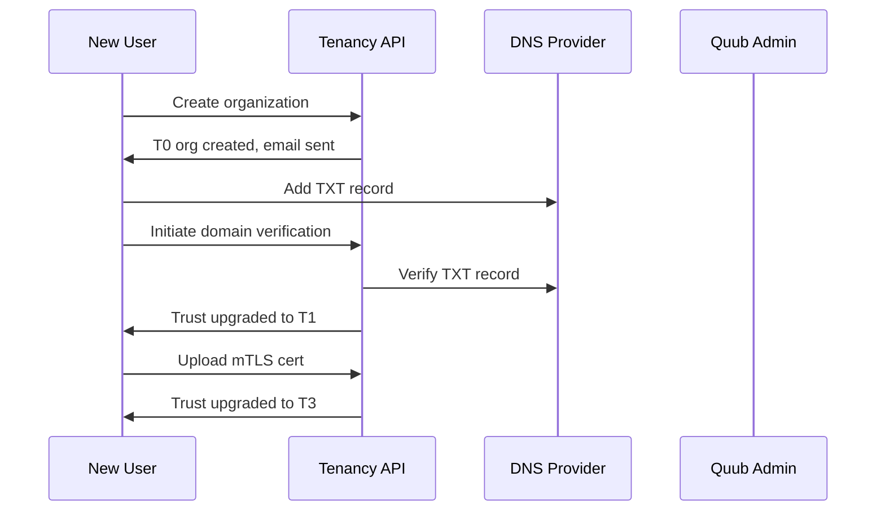
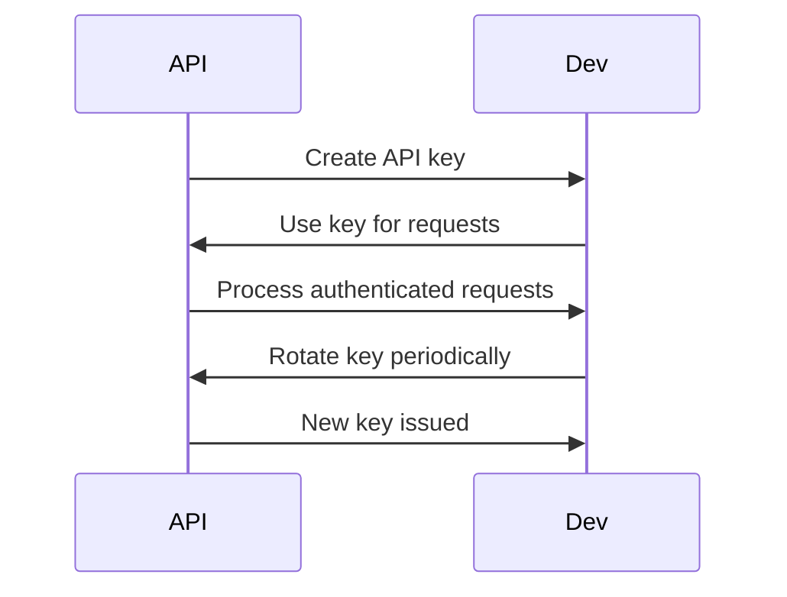



# Tenancy & Trust API Documentation

_Based on OpenAPI specification: tenancy-trust.yaml_

## Executive Summary

**Audience:** Stakeholders

- Business value proposition: Secure multi-tenancy platform enabling organizations to establish trust through domain verification, API key management, mTLS certificates, and webhook configurations.
- Key capabilities: Trust level progression (T0-T3), domain ownership verification, secure API access management, institutional-grade mTLS authentication, and event-driven webhook integrations.
- Strategic importance: Provides foundation for secure, compliant multi-tenant operations with progressive trust building and comprehensive security controls.

## Service Overview

**Audience:** All

- Business Purpose:

  - Manage organization tenants with hierarchical trust levels.
  - Verify domain ownership through DNS challenges.
  - Issue and manage scoped API keys for secure access.
  - Upload and validate mTLS certificates for institutional clients.
  - Configure webhook endpoints for real-time event notifications.
  - Support progressive trust escalation from email-only to full institutional verification.

- Technical Architecture:
  - Multi-tenant organization isolation with trust-based access controls.
  - DNS TXT record verification for domain ownership.
  - Scoped API key generation with granular permissions.
  - PEM certificate validation and storage for mTLS authentication.
  - Webhook signature verification and retry mechanisms.
  - Event-driven architecture for trust level upgrades.

## API Specifications

**Audience:** Technical

- Base Configuration (YAML format):

```yaml
openapi: 3.1.0
info:
  title: Quub Exchange - Tenancy & Trust API
  version: 2.0.0
servers:
  - url: https://api.quub.exchange/v1
```

- Authentication & Authorization:
  - OAuth2 scopes (read:tenancy, write:tenancy).
  - API key authentication for programmatic access.
  - Trust-level based access controls (higher trust = more permissions).

## Core Endpoints

Grouped by functional area. For each endpoint below we include method, path, business use case, request and response examples, and implementation notes.

### Organizations

- GET /orgs
  - Business use case: List organizations for administrative oversight and tenant management.
  - Request example:

```json
GET /orgs?limit=50&cursor=next-page
Authorization: Bearer <token>
```

- Response example (200):

```json
{
  "data": [
    {
      "id": "org_123",
      "name": "Quub Capital Ltd.",
      "domain": "quub.exchange",
      "trustLevel": "T2",
      "verified": true,
      "createdAt": "2025-01-15T10:00:00Z"
    }
  ],
  "pagination": {
    "cursor": "next-page",
    "hasMore": true
  }
}
```

- Implementation notes:

  1. Paginated results for large tenant bases.
  2. Filters available for trust level and verification status.
  3. Admin-only access for cross-org visibility.

- POST /orgs
  - Business use case: Create new organization tenant with initial trust level.
  - Request example:

```json
POST /orgs
{
  "name": "New Trading Corp",
  "domain": "newtrading.com"
}
```

- Response example (201):

```json
{
  "data": {
    "id": "org_456",
    "name": "New Trading Corp",
    "domain": "newtrading.com",
    "trustLevel": "T0",
    "verified": false,
    "createdAt": "2025-11-02T14:30:00Z"
  }
}
```

- Implementation notes:

  1. Automatic T0 trust level assignment.
  2. Domain uniqueness validation.
  3. Triggers welcome email with verification instructions.

- GET /orgs/{orgId}
  - Business use case: Retrieve detailed organization information including trust status.
  - Request example:

```json
GET /orgs/01234567-89ab-cdef-0123-456789abcdef
Authorization: Bearer <token>
```

- Response example (200):

```json
{
  "data": {
    "id": "org_123",
    "name": "Quub Capital Ltd.",
    "domain": "quub.exchange",
    "trustLevel": "T2",
    "verified": true,
    "createdAt": "2025-01-15T10:00:00Z"
  }
}
```

### Domain Verification

- POST /orgs/{orgId}/verify-domain
  - Business use case: Initiate domain verification process to upgrade trust level.
  - Request example:

```json
POST /orgs/01234567-89ab-cdef-0123-456789abcdef/verify-domain
Authorization: Bearer <token>
```

- Response example (201):

```json
{
  "data": {
    "id": "org_123",
    "name": "Quub Capital Ltd.",
    "domain": "quub.exchange",
    "trustLevel": "T1",
    "verified": true,
    "createdAt": "2025-01-15T10:00:00Z"
  }
}
```

- Implementation notes:
  1. Generates unique DNS TXT record for verification.
  2. Automatic trust level upgrade upon successful verification.
  3. Supports DNSSEC and CAA record validation for T2 level.

### API Keys

- GET /orgs/{orgId}/api-keys
  - Business use case: List API keys for security audit and key rotation planning.
  - Request example:

```json
GET /orgs/01234567-89ab-cdef-0123-456789abcdef/api-keys?limit=20
Authorization: Bearer <token>
```

- Response example (200):

```json
{
  "data": [
    {
      "id": "key_789",
      "name": "Treasury Automation Key",
      "keyPrefix": "qbk_1234",
      "scopes": ["treasury:read", "treasury:write"],
      "createdAt": "2025-10-01T09:00:00Z"
    }
  ],
  "pagination": {
    "cursor": null,
    "hasMore": false
  }
}
```

- Implementation notes:

  1. Shows key prefix only, not full key for security.
  2. Includes creation timestamps for rotation policies.
  3. Supports filtering by scope and creation date.

- POST /orgs/{orgId}/api-keys
  - Business use case: Create scoped API key for programmatic access to Quub services.
  - Request example:

```json
POST /orgs/01234567-89ab-cdef-0123-456789abcdef/api-keys
{
  "name": "Settlement Processor",
  "scopes": ["settlements:read", "settlements:write"]
}
```

- Response example (201):

```json
{
  "data": {
    "id": "key_890",
    "name": "Settlement Processor",
    "keyPrefix": "qbk_5678",
    "scopes": ["settlements:read", "settlements:write"],
    "createdAt": "2025-11-02T15:00:00Z",
    "secret": "qbk_5678abcd1234efgh5678ijkl9012mnop"
  }
}
```

- Implementation notes:
  1. Returns full key only once at creation time.
  2. Scopes must match organization's trust level permissions.
  3. Keys are org-scoped and cannot access other tenants.

### mTLS Certificates

- GET /orgs/{orgId}/mtls-certificates
  - Business use case: List uploaded mTLS certificates for certificate lifecycle management.
  - Request example:

```json
GET /orgs/01234567-89ab-cdef-0123-456789abcdef/mtls-certificates
Authorization: Bearer <token>
```

- Response example (200):

```json
{
  "data": [
    {
      "id": "cert_123",
      "subjectCN": "*.quub.exchange",
      "issuedBy": "Quub Root CA",
      "validFrom": "2025-01-01T00:00:00Z",
      "validTo": "2026-01-01T00:00:00Z"
    }
  ]
}
```

- Implementation notes:

  1. Shows certificate metadata without private key.
  2. Includes validity dates for renewal planning.
  3. Required for T3 institutional trust level.

- POST /orgs/{orgId}/mtls-certificates
  - Business use case: Upload mTLS certificate to achieve institutional trust level.
  - Request example:

```json
POST /orgs/01234567-89ab-cdef-0123-456789abcdef/mtls-certificates
{
  "certificatePem": "-----BEGIN CERTIFICATE-----\nMIIBIjANBgkqhkiG9w0BAQEFAAOCAQ8AMIIBCgKCAQEA...\n-----END CERTIFICATE-----"
}
```

- Response example (201):

```json
{
  "data": {
    "id": "cert_456",
    "subjectCN": "*.quub.exchange",
    "issuedBy": "Quub Root CA",
    "validFrom": "2025-11-01T00:00:00Z",
    "validTo": "2026-11-01T00:00:00Z"
  }
}
```

- Implementation notes:
  1. Validates PEM format and certificate chain.
  2. Upgrades organization to T3 trust level upon successful upload.
  3. Enables mTLS authentication for API calls.

### Webhooks

- GET /orgs/{orgId}/webhooks
  - Business use case: List configured webhook endpoints for event monitoring.
  - Request example:

```json
GET /orgs/01234567-89ab-cdef-0123-456789abcdef/webhooks
Authorization: Bearer <token>
```

- Response example (200):

```json
{
  "data": [
    {
      "id": "wh_123",
      "url": "https://webhooks.quub.exchange/receive",
      "events": ["trade.executed", "settlement.completed"],
      "signingSecret": "whsec_abc123xyz",
      "createdAt": "2025-10-15T12:00:00Z"
    }
  ]
}
```

- Implementation notes:

  1. Shows signing secret for webhook verification.
  2. Lists subscribed events for each endpoint.
  3. Supports multiple endpoints per organization.

- POST /orgs/{orgId}/webhooks
  - Business use case: Register webhook endpoint for real-time event notifications.
  - Request example:

```json
POST /orgs/01234567-89ab-cdef-0123-456789abcdef/webhooks
{
  "url": "https://api.company.com/webhooks/quub",
  "events": ["trade.executed", "settlement.failed"]
}
```

- Response example (201):

```json
{
  "data": {
    "id": "wh_456",
    "url": "https://api.company.com/webhooks/quub",
    "events": ["trade.executed", "settlement.failed"],
    "signingSecret": "whsec_def456uvw",
    "createdAt": "2025-11-02T16:00:00Z"
  }
}
```

- Implementation notes:
  1. Generates unique signing secret for webhook verification.
  2. Validates URL format and accessibility.
  3. Supports event filtering and retry policies.

## Security Implementation

**Audience:** Technical + Project Teams

- Multi-tenant isolation:
  - Org-scoped resources prevent cross-tenant access.
  - Trust-level based permission escalation.

```yaml
multiTenant:
  enforceOrgScope: true
  trustBasedAccess: true
```

- Data protection measures:

  - Encrypted storage of API keys and certificates.
  - Secure webhook signature verification.
  - Audit logging for all trust operations.

- Access Controls:

```json
{
  "trustLevels": ["T0", "T1", "T2", "T3"],
  "permissions": ["read", "write", "admin"]
}
```

## Business Workflows

**Audience:** Stakeholders + Project Teams

### Primary Workflow — Organization Onboarding (Mermaid)



- Business value: Streamlined onboarding with progressive trust building.
- Success metrics: 95% T1 verification completion rate, 80% T3 institutional adoption, <24h average onboarding time.

### Secondary Workflow — API Key Management



## Integration Guide

**Audience:** Project Teams

- Development Setup:

```bash
npm install axios crypto
export TENANCY_API_URL=https://api.quub.exchange/v1
export ORG_ID=your-org-id
```

- JavaScript/Node.js example (create API key):

```javascript
import axios from "axios";

async function createApiKey(orgId, token, keyData) {
  const response = await axios.post(`/orgs/${orgId}/api-keys`, keyData, {
    headers: { Authorization: `Bearer ${token}` },
  });
  return response.data;
}

// usage
createApiKey("org-uuid", "TOKEN", {
  name: "Trading Bot Key",
  scopes: ["exchange:read", "exchange:write"],
});
```

- Python example (verify domain):

```python
import requests

def initiate_domain_verification(org_id, token):
    url = f'https://api.quub.exchange/v1/orgs/{org_id}/verify-domain'
    headers = {'Authorization': f'Bearer {token}'}
    r = requests.post(url, headers=headers)
    return r.json()

# usage
result = initiate_domain_verification('org-uuid', 'TOKEN')
print(f"Trust level: {result['data']['trustLevel']}")
```

## Error Handling

**Audience:** Technical + Project Teams

- Standard error response:

```json
{
  "error": {
    "code": "ValidationError",
    "message": "Invalid domain format",
    "details": [{ "field": "domain", "message": "Must be valid FQDN" }]
  }
}
```

- Error codes:

  - BadRequest (400) — Invalid parameters or business rules
  - Unauthorized (401) — Authentication failure
  - Forbidden (403) — Insufficient trust level or permissions
  - NotFound (404) — Organization or resource not found
  - Conflict (409) — Domain already verified by another org
  - ValidationError (422) — Business rule violation
  - TooManyRequests (429) — Rate limit exceeded

- Best practices:
  1. Implement exponential backoff for DNS verification retries.
  2. Store API keys securely with rotation policies.
  3. Validate webhook URLs before registration.

## Implementation Checklist

**Audience:** Project Teams

- Pre-Development:

  - [ ] Define trust level requirements and permissions
  - [ ] Set up DNS infrastructure for domain verification
  - [ ] Plan certificate authority for mTLS certificates

- Development Phase:

  - [ ] Implement organization CRUD operations
  - [ ] Add DNS TXT record verification logic
  - [ ] Integrate API key generation and validation

- Testing Phase:

  - [ ] Test trust level progression workflows
  - [ ] Validate mTLS certificate upload and verification
  - [ ] Test webhook signature verification

- Production Readiness:
  - [ ] Security audit for multi-tenant isolation
  - [ ] Monitoring for trust level distribution
  - [ ] Backup and recovery for certificates and keys

## Monitoring & Observability

**Audience:** Technical + Project Teams

- Key metrics:

  - trust_level_distribution (target: 70% T1+, 30% T3)
  - domain_verification_success_rate (target: >95%)
  - api_key_rotation_rate (target: <90 days average age)
  - webhook_delivery_success_rate (target: >99%)

- Logging example:

```json
{
  "timestamp": "2025-11-02T15:30:00Z",
  "orgId": "org-uuid",
  "event": "trust.upgraded",
  "fromLevel": "T1",
  "toLevel": "T2",
  "reason": "DNSSEC verification"
}
```

- Alerts:
  - Trust verification failures > 5% for 1h
  - API key creation rate spikes (potential abuse)
  - Webhook delivery failures > 1% for 30min
  - Certificate expiry < 30 days

## API Versioning & Evolution

**Audience:** All

- Current Version: v1 (stable)
- Planned Enhancements (v1.1): Automated certificate renewal, enhanced DNSSEC validation.
- Breaking Changes (v2.0): Mandatory mTLS for T3 organizations, webhook payload encryption.

## Additional Resources

**Audience:** All

- Stakeholders:

  - Trust model documentation: /docs/tenancy/trust-levels
  - Security best practices: /docs/tenancy/security

- Technical:

  - OpenAPI spec: /openapi/tenancy-trust.yaml
  - Trust workflows: /docs/tenancy/workflows

- Project teams:
  - Integration examples: /examples/tenancy
  - Certificate management: /docs/tenancy/certificates

## Footer

For trust level escalations or security concerns, contact the tenancy team with orgId and trust level details.
