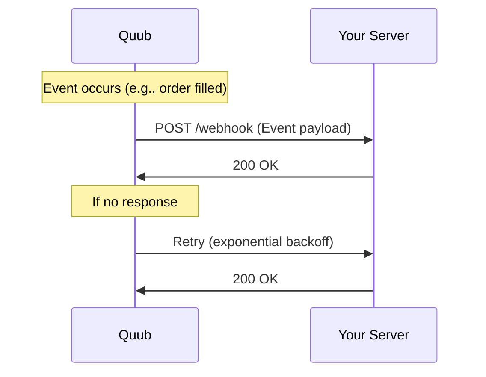

# Webhooks & Events

Receive real-time notifications about important events in your Quub Exchange account through webhooks. This guide covers webhook setup, event types, security, and best practices.

## Overview

Webhooks allow you to:

- Get instant notifications when events occur
- Automate workflows based on trading activity
- Monitor account changes in real-time
- Build event-driven applications

## How Webhooks Work



## Setting Up Webhooks

### 1. Create Webhook Endpoint

```bash
curl -X POST https://api.quub.exchange/events/v1/webhooks \
  -H "Authorization: Bearer YOUR_ACCESS_TOKEN" \
  -H "X-Tenant-ID: your-org-id" \
  -H "Content-Type: application/json" \
  -d '{
    "url": "https://your-server.com/webhooks/quub",
    "events": [
      "order.filled",
      "order.created",
      "deposit.completed"
    ],
    "secret": "your-webhook-secret",
    "active": true
  }'
```

### Response

```json
{
  "webhookId": "wh_abc123",
  "url": "https://your-server.com/webhooks/quub",
  "events": ["order.filled", "order.created", "deposit.completed"],
  "secret": "whsec_xyz789",
  "active": true,
  "createdAt": "2025-11-03T10:00:00Z"
}
```

## Event Types

### Trading Events

| Event                    | Description              | Payload       |
| ------------------------ | ------------------------ | ------------- |
| `order.created`          | New order placed         | Order object  |
| `order.filled`           | Order fully executed     | Order + fills |
| `order.partially_filled` | Order partially executed | Order + fills |
| `order.canceled`         | Order canceled           | Order object  |
| `order.expired`          | Order expired            | Order object  |
| `trade.executed`         | Trade executed           | Trade object  |

### Account Events

| Event                  | Description          | Payload           |
| ---------------------- | -------------------- | ----------------- |
| `deposit.pending`      | Deposit initiated    | Deposit object    |
| `deposit.completed`    | Deposit confirmed    | Deposit object    |
| `withdrawal.pending`   | Withdrawal requested | Withdrawal object |
| `withdrawal.completed` | Withdrawal processed | Withdrawal object |
| `balance.updated`      | Balance changed      | Balance object    |

### Compliance Events

| Event                | Description               | Payload            |
| -------------------- | ------------------------- | ------------------ |
| `kyc.approved`       | KYC verification approved | User object        |
| `kyc.rejected`       | KYC verification rejected | User + reason      |
| `risk.alert`         | Risk threshold exceeded   | Alert object       |
| `compliance.flagged` | Transaction flagged       | Transaction object |

### Market Events

| Event            | Description        | Payload       |
| ---------------- | ------------------ | ------------- |
| `price.updated`  | Price feed updated | Price object  |
| `market.halted`  | Trading halted     | Market object |
| `market.resumed` | Trading resumed    | Market object |

## Webhook Payload Structure

### Standard Format

```json
{
  "eventId": "evt_abc123xyz",
  "eventType": "order.filled",
  "timestamp": "2025-11-03T10:30:00Z",
  "orgId": "org_456",
  "data": {
    "orderId": "ord_789",
    "symbol": "BTC-USD",
    "side": "buy",
    "type": "limit",
    "status": "filled",
    "quantity": 0.1,
    "price": 45000.0,
    "filled": 0.1,
    "averagePrice": 45000.0,
    "fills": [
      {
        "fillId": "fill_111",
        "quantity": 0.1,
        "price": 45000.0,
        "timestamp": "2025-11-03T10:30:00Z"
      }
    ]
  }
}
```

### Event Examples

#### Order Filled

```json
{
  "eventId": "evt_order_filled_123",
  "eventType": "order.filled",
  "timestamp": "2025-11-03T10:30:00Z",
  "orgId": "org_456",
  "data": {
    "orderId": "ord_789",
    "symbol": "BTC-USD",
    "side": "buy",
    "status": "filled",
    "quantity": 0.5,
    "price": 45000.0,
    "filled": 0.5,
    "averagePrice": 44995.0,
    "totalValue": 22497.5
  }
}
```

#### Deposit Completed

```json
{
  "eventId": "evt_deposit_456",
  "eventType": "deposit.completed",
  "timestamp": "2025-11-03T11:00:00Z",
  "orgId": "org_456",
  "data": {
    "depositId": "dep_789",
    "asset": "USDC",
    "amount": 10000.0,
    "network": "ethereum",
    "txHash": "0x1234...abcd",
    "confirmations": 12,
    "status": "completed"
  }
}
```

## Webhook Security

### Signature Verification

Every webhook includes a signature in the `X-Quub-Signature` header:

```
X-Quub-Signature: t=1730628000,v1=5257a869e7ecebeda32affa62cdca3fa51cad7e77a0e56ff536d0ce8e108d8bd
```

### Verify Signature (Node.js)

```javascript
const crypto = require("crypto");

function verifyWebhookSignature(payload, signature, secret) {
  const parts = signature.split(",");
  const timestamp = parts[0].split("=")[1];
  const signatureHash = parts[1].split("=")[1];

  // Check timestamp (prevent replay attacks)
  const now = Math.floor(Date.now() / 1000);
  if (Math.abs(now - timestamp) > 300) {
    // 5 minutes
    throw new Error("Webhook timestamp too old");
  }

  // Compute expected signature
  const signedPayload = `${timestamp}.${JSON.stringify(payload)}`;
  const expectedHash = crypto
    .createHmac("sha256", secret)
    .update(signedPayload)
    .digest("hex");

  // Compare signatures (constant-time comparison)
  if (
    !crypto.timingSafeEqual(
      Buffer.from(signatureHash, "hex"),
      Buffer.from(expectedHash, "hex")
    )
  ) {
    throw new Error("Invalid webhook signature");
  }

  return true;
}

// Express.js example
app.post("/webhooks/quub", express.json(), (req, res) => {
  const signature = req.headers["x-quub-signature"];
  const secret = process.env.WEBHOOK_SECRET;

  try {
    verifyWebhookSignature(req.body, signature, secret);

    // Process webhook
    const { eventType, data } = req.body;
    handleWebhookEvent(eventType, data);

    res.status(200).json({ received: true });
  } catch (error) {
    console.error("Webhook verification failed:", error);
    res.status(400).json({ error: "Invalid signature" });
  }
});
```

### Verify Signature (Python)

```python
import hmac
import hashlib
import time
import json

def verify_webhook_signature(payload, signature, secret):
    parts = signature.split(',')
    timestamp = int(parts[0].split('=')[1])
    signature_hash = parts[1].split('=')[1]

    # Check timestamp
    now = int(time.time())
    if abs(now - timestamp) > 300:  # 5 minutes
        raise ValueError('Webhook timestamp too old')

    # Compute expected signature
    signed_payload = f"{timestamp}.{json.dumps(payload, separators=(',', ':'))}"
    expected_hash = hmac.new(
        secret.encode(),
        signed_payload.encode(),
        hashlib.sha256
    ).hexdigest()

    # Compare signatures
    if not hmac.compare_digest(signature_hash, expected_hash):
        raise ValueError('Invalid webhook signature')

    return True

# Flask example
from flask import Flask, request, jsonify

app = Flask(__name__)

@app.route('/webhooks/quub', methods=['POST'])
def handle_webhook():
    signature = request.headers.get('X-Quub-Signature')
    secret = os.environ['WEBHOOK_SECRET']

    try:
        verify_webhook_signature(request.json, signature, secret)

        # Process webhook
        event_type = request.json['eventType']
        data = request.json['data']
        handle_webhook_event(event_type, data)

        return jsonify({'received': True}), 200
    except Exception as e:
        return jsonify({'error': str(e)}), 400
```

## Handling Webhooks

### Best Practices

1. **Return 200 Quickly**

```javascript
app.post("/webhooks/quub", async (req, res) => {
  // Immediately acknowledge receipt
  res.status(200).json({ received: true });

  // Process asynchronously
  processWebhookAsync(req.body);
});
```

2. **Idempotency**

```javascript
const processedEvents = new Set();

async function processWebhook(event) {
  // Check if already processed
  if (processedEvents.has(event.eventId)) {
    console.log("Event already processed:", event.eventId);
    return;
  }

  // Process event
  await handleEvent(event);

  // Mark as processed
  processedEvents.add(event.eventId);
}
```

3. **Error Handling**

```javascript
async function handleWebhookEvent(eventType, data) {
  try {
    switch (eventType) {
      case "order.filled":
        await handleOrderFilled(data);
        break;
      case "deposit.completed":
        await handleDepositCompleted(data);
        break;
      default:
        console.log("Unhandled event type:", eventType);
    }
  } catch (error) {
    console.error("Error processing webhook:", error);
    // Log to monitoring service
    await logError(error);
  }
}
```

## Retry Policy

If your endpoint doesn't respond with 2xx:

1. **Immediate Retry**: After 1 second
2. **Subsequent Retries**: Exponential backoff

   - 5 seconds
   - 25 seconds
   - 2 minutes
   - 10 minutes
   - 1 hour

3. **Max Attempts**: 5 retries over 24 hours
4. **After Max**: Webhook disabled, notification sent

## Testing Webhooks

### Local Testing with ngrok

```bash
# Start ngrok
ngrok http 3000

# Use ngrok URL in webhook config
curl -X POST https://api.quub.exchange/events/v1/webhooks \
  -H "Authorization: Bearer YOUR_TOKEN" \
  -H "X-Tenant-ID: your-org-id" \
  -H "Content-Type: application/json" \
  -d '{
    "url": "https://abc123.ngrok.io/webhooks/quub",
    "events": ["order.filled"]
  }'
```

### Trigger Test Event

```bash
curl -X POST https://api.quub.exchange/events/v1/webhooks/wh_abc123/test \
  -H "Authorization: Bearer YOUR_TOKEN" \
  -H "X-Tenant-ID: your-org-id" \
  -H "Content-Type: application/json" \
  -d '{
    "eventType": "order.filled"
  }'
```

## Managing Webhooks

### List Webhooks

```bash
curl -X GET https://api.quub.exchange/events/v1/webhooks \
  -H "Authorization: Bearer YOUR_TOKEN" \
  -H "X-Tenant-ID: your-org-id"
```

### Update Webhook

```bash
curl -X PATCH https://api.quub.exchange/events/v1/webhooks/wh_abc123 \
  -H "Authorization: Bearer YOUR_TOKEN" \
  -H "X-Tenant-ID: your-org-id" \
  -H "Content-Type: application/json" \
  -d '{
    "events": ["order.filled", "order.created", "trade.executed"],
    "active": true
  }'
```

### Delete Webhook

```bash
curl -X DELETE https://api.quub.exchange/events/v1/webhooks/wh_abc123 \
  -H "Authorization: Bearer YOUR_TOKEN" \
  -H "X-Tenant-ID: your-org-id"
```

## Monitoring & Logs

### View Webhook Logs

```bash
curl -X GET https://api.quub.exchange/events/v1/webhooks/wh_abc123/logs \
  -H "Authorization: Bearer YOUR_TOKEN" \
  -H "X-Tenant-ID: your-org-id"
```

### Response

```json
{
  "webhookId": "wh_abc123",
  "logs": [
    {
      "logId": "log_001",
      "eventId": "evt_789",
      "eventType": "order.filled",
      "timestamp": "2025-11-03T10:30:00Z",
      "httpStatus": 200,
      "responseTime": 142,
      "attempts": 1,
      "success": true
    },
    {
      "logId": "log_002",
      "eventId": "evt_790",
      "eventType": "deposit.completed",
      "timestamp": "2025-11-03T11:00:00Z",
      "httpStatus": 500,
      "responseTime": 5000,
      "attempts": 3,
      "success": false,
      "error": "Internal server error"
    }
  ]
}
```

## Alternative: WebSocket Events

For lower latency, use WebSocket connections:

```javascript
const ws = new WebSocket("wss://api.quub.exchange/events/v1/stream");

ws.onopen = () => {
  // Authenticate
  ws.send(
    JSON.stringify({
      type: "auth",
      token: "YOUR_ACCESS_TOKEN",
      orgId: "org_456",
    })
  );

  // Subscribe to events
  ws.send(
    JSON.stringify({
      type: "subscribe",
      events: ["order.filled", "trade.executed"],
    })
  );
};

ws.onmessage = (event) => {
  const data = JSON.parse(event.data);
  console.log("Event received:", data);
};
```

See [Events API Reference](../../capabilities/events/api-documentation/) for full WebSocket documentation.

## Related Resources

- 📡 [Events API Reference](../../capabilities/events/api-documentation/) - Complete API documentation
- 🔄 [Notifications Service](../../capabilities/notifications/api-documentation/) - Email/SMS notifications
- 📊 [Observability](../../capabilities/observability/api-documentation/) - Monitoring and metrics

## Support

Need help with webhooks?

- 💬 [Community Forum](#)
- 📧 Email: support@quub.exchange
- 📚 [API Reference](../../api-reference/)
