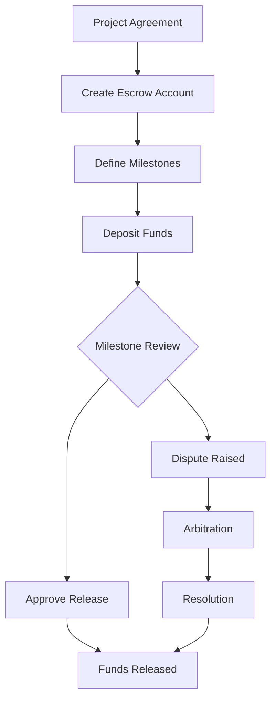
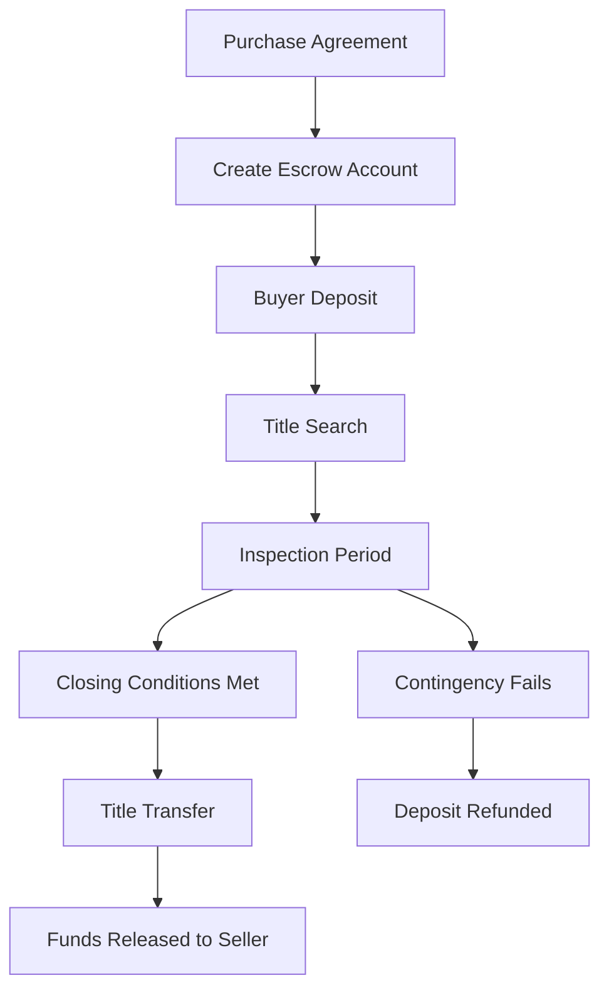



# Escrow API Documentation

_Based on OpenAPI specification: escrow.yaml_

## Executive Summary

**Audience:** Stakeholders

The Escrow API provides secure, programmable escrow services for high-value transactions, enabling conditional fund releases based on milestones, time-based triggers, or multi-signature approvals. This service supports both fiat and cryptocurrency escrow accounts, with comprehensive audit trails and dispute resolution mechanisms.

**Key Business Value:**

- **Trust Building**: Eliminates counterparty risk in large transactions
- **Automation**: Milestone-based releases reduce manual intervention
- **Compliance**: Full audit trails for regulatory reporting
- **Multi-Asset Support**: Unified API for fiat and crypto escrow
- **Scalability**: Handles complex multi-party escrow arrangements

**Strategic Importance:**

- Enables high-value B2B transactions on the platform
- Supports DeFi integration with traditional finance workflows
- Provides competitive advantage in escrow-as-a-service market
- Reduces operational risk and manual processing overhead

## Service Overview

**Audience:** All

**Business Purpose:**

- Secure fund holding for conditional releases in high-value transactions
- Milestone-based payment automation for project-based work
- Multi-party escrow for complex business arrangements
- Regulatory compliance through comprehensive audit trails
- Integration with both traditional and blockchain-based assets
- Dispute resolution framework for transaction conflicts

**Technical Architecture:**

- Multi-tenant architecture with complete data isolation
- Support for fiat and cryptocurrency escrow accounts
- Integration with Chain API for crypto wallet management
- Event-driven architecture for milestone triggers
- Comprehensive audit logging for all escrow operations
- Smart contract integration for automated releases
- RESTful API with webhook notifications for state changes

## API Specifications

**Audience:** Technical

**Base Configuration:**

```yaml
openapi: 3.1.0
info:
  title: Quub Exchange - Escrow API
  version: 2.0.0
servers:
  - url: https://api.quub.exchange/v1
    description: Production API
```

**Authentication & Authorization:**

- OAuth 2.0 with scopes: `read:escrow`, `write:escrow`
- API Key authentication for programmatic access
- Multi-tenant isolation by organization ID
- Role-based access control for escrow operations

## Core Endpoints

**Audience:** Technical + Project Teams

### Escrow Account Management

**GET /orgs/{orgId}/escrow/accounts**

- **Business Use Case**: Retrieve all escrow accounts for an organization
- **Request Example**:

```json
GET /orgs/123e4567-e89b-12d3-a456-426614174000/escrow/accounts?limit=20
Authorization: Bearer {token}
x-org-id: 123e4567-e89b-12d3-a456-426614174000
```

- **Response Example**:

```json
{
  "data": [
    {
      "id": "escrow-123",
      "escrowType": "MILESTONE",
      "accountType": "CRYPTO",
      "balance": "5000000000000000000",
      "currency": "ETH",
      "status": "ACTIVE",
      "parties": [
        {
          "accountId": "acc-456",
          "role": "DEPOSITOR"
        }
      ]
    }
  ],
  "pagination": {
    "hasMore": false,
    "nextCursor": null
  }
}
```

- **Implementation Notes**:
  - Supports cursor-based pagination for large result sets
  - Filter by escrow type, status, and currency
  - Real-time balance updates via webhook notifications
  - Audit trail maintained for all account access

**POST /orgs/{orgId}/escrow/accounts**

- **Business Use Case**: Create a new escrow account for secure fund holding
- **Request Example**:

```json
POST /orgs/123e4567-e89b-12d3-a456-426614174000/escrow/accounts
Authorization: Bearer {token}
x-org-id: 123e4567-e89b-12d3-a456-426614174000
Content-Type: application/json

{
  "escrowType": "MILESTONE",
  "currency": "USDC",
  "parties": [
    {
      "accountId": "acc-buyer",
      "role": "DEPOSITOR"
    },
    {
      "accountId": "acc-seller",
      "role": "BENEFICIARY"
    }
  ]
}
```

- **Response Example**:

```json
{
  "data": {
    "id": "escrow-789",
    "escrowType": "MILESTONE",
    "accountType": "CRYPTO",
    "balance": "0",
    "currency": "USDC",
    "status": "PENDING",
    "parties": [
      {
        "accountId": "acc-buyer",
        "role": "DEPOSITOR"
      },
      {
        "accountId": "acc-seller",
        "role": "BENEFICIARY"
      }
    ],
    "createdAt": "2025-11-02T10:00:00Z"
  }
}
```

- **Implementation Notes**:
  - Validates party roles and permissions before creation
  - Supports both fiat and crypto escrow types
  - Automatic wallet creation for crypto escrow accounts
  - Webhook notification sent upon account creation

### Deposit Operations

**POST /orgs/{orgId}/escrow/accounts/{escrowId}/deposit**

- **Business Use Case**: Add fiat funds to an escrow account
- **Request Example**:

```json
POST /orgs/123e4567-e89b-12d3-a456-426614174000/escrow/accounts/escrow-123/deposit
Authorization: Bearer {token}
x-org-id: 123e4567-e89b-12d3-a456-426614174000
Content-Type: application/json

{
  "amount": "50000.00",
  "currency": "USD"
}
```

- **Response Example**:

```json
{
  "data": {
    "id": "escrow-123",
    "balance": "50000.00",
    "currency": "USD",
    "status": "ACTIVE"
  }
}
```

- **Implementation Notes**:
  - Validates depositor permissions and account status
  - Supports multiple currencies with automatic conversion
  - Real-time balance updates and notifications
  - Full audit trail for compliance reporting

**POST /orgs/{orgId}/escrow/accounts/{escrowId}/deposit-crypto**

- **Business Use Case**: Deposit cryptocurrency to escrow with blockchain verification
- **Request Example**:

```json
POST /orgs/123e4567-e89b-12d3-a456-426614174000/escrow/accounts/escrow-123/deposit-crypto
Authorization: Bearer {token}
x-org-id: 123e4567-e89b-12d3-a456-426614174000
Content-Type: application/json

{
  "walletId": "wallet-456",
  "amount": "1000000000000000000",
  "tokenAddress": "0xA0b86a33E6441e88C5F2712C3E9b74Ae1f8Dc9dD",
  "txHash": "0x8ba1f109551bd432803012645ac136ddd64dba72"
}
```

- **Response Example**:

```json
{
  "data": {
    "id": "escrow-123",
    "balance": "1000000000000000000",
    "currency": "USDC",
    "status": "ACTIVE",
    "chainId": "ethereum",
    "contractAddress": "0x742d35Cc6634C0532925a3b844Bc454e4438f44e"
  }
}
```

- **Implementation Notes**:
  - Blockchain transaction verification required
  - Supports ERC-20 tokens and native cryptocurrencies
  - Automatic balance confirmation via Chain API
  - Smart contract integration for automated escrow

### Release Operations

**POST /orgs/{orgId}/escrow/accounts/{escrowId}/release**

- **Business Use Case**: Release fiat funds to beneficiaries based on conditions
- **Request Example**:

```json
POST /orgs/123e4567-e89b-12d3-a456-426614174000/escrow/accounts/escrow-123/release
Authorization: Bearer {token}
x-org-id: 123e4567-e89b-12d3-a456-426614174000
Content-Type: application/json

{
  "amount": "25000.00",
  "beneficiary": "acc-seller",
  "reason": "Milestone 1 completed - Design phase finished"
}
```

- **Response Example**:

```json
{
  "data": {
    "id": "escrow-123",
    "balance": "25000.00",
    "status": "ACTIVE"
  }
}
```

- **Implementation Notes**:
  - Validates release conditions and approver permissions
  - Supports partial releases for milestone-based payments
  - Automatic notifications to all parties
  - Full audit trail for regulatory compliance

**POST /orgs/{orgId}/escrow/accounts/{escrowId}/release-crypto**

- **Business Use Case**: Release cryptocurrency to beneficiary wallet
- **Request Example**:

```json
POST /orgs/123e4567-e89b-12d3-a456-426614174000/escrow/accounts/escrow-123/release-crypto
Authorization: Bearer {token}
x-org-id: 123e4567-e89b-12d3-a456-426614174000
Content-Type: application/json

{
  "beneficiaryWalletId": "wallet-789",
  "amount": "500000000000000000",
  "tokenAddress": "0xA0b86a33E6441e88C5F2712C3E9b74Ae1f8Dc9dD",
  "reason": "Project milestone achieved",
  "txHash": "0x9ca2f209652bd532904023746bd247eee75cba83"
}
```

- **Response Example**:

```json
{
  "data": {
    "id": "escrow-123",
    "balance": "500000000000000000",
    "status": "ACTIVE"
  }
}
```

- **Implementation Notes**:
  - Blockchain transaction execution via Chain API
  - Gas fee optimization for efficient releases
  - Multi-signature support for high-value releases
  - Real-time transaction monitoring and confirmation

### Milestone Management

**GET /orgs/{orgId}/escrow/accounts/{escrowId}/milestones**

- **Business Use Case**: Retrieve milestone progress for conditional releases
- **Request Example**:

```json
GET /orgs/123e4567-e89b-12d3-a456-426614174000/escrow/accounts/escrow-123/milestones
Authorization: Bearer {token}
x-org-id: 123e4567-e89b-12d3-a456-426614174000
```

- **Response Example**:

```json
{
  "data": [
    {
      "id": "milestone-1",
      "name": "Design Phase",
      "description": "Complete UI/UX design and wireframes",
      "releaseAmount": "25000.00",
      "status": "COMPLETED",
      "dueDate": "2025-11-15",
      "completedAt": "2025-11-10T14:30:00Z"
    },
    {
      "id": "milestone-2",
      "name": "Development Phase",
      "description": "Implement core functionality",
      "releaseAmount": "25000.00",
      "status": "PENDING",
      "dueDate": "2025-12-01"
    }
  ]
}
```

- **Implementation Notes**:
  - Real-time milestone status tracking
  - Automatic notifications for due dates and completions
  - Integration with external project management tools
  - Audit trail for all milestone updates

## Security Implementation

**Audience:** Technical + Project Teams

**Multi-tenant Isolation:**

```json
{
  "orgId": "123e4567-e89b-12d3-a456-426614174000",
  "escrowId": "escrow-123",
  "isolationLevel": "COMPLETE",
  "dataEncryption": "AES-256-GCM",
  "accessControl": "RBAC"
}
```

**Data Protection Measures:**

- End-to-end encryption for all escrow data
- Secure key management with HSM integration
- Audit logging for all operations
- GDPR and SOX compliance frameworks
- Regular security assessments and penetration testing

**Access Controls:**

```json
{
  "roles": {
    "depositor": ["deposit", "read"],
    "beneficiary": ["read", "release_request"],
    "agent": ["read", "approve", "dispute"],
    "auditor": ["read"]
  },
  "permissions": {
    "multiSigRequired": true,
    "approvalThreshold": 2,
    "timeLocks": "24h"
  }
}
```

## Business Workflows

**Audience:** Stakeholders + Project Teams

**Primary Workflow** — Milestone-Based Project Escrow



**Business Value:**

- Reduces payment risk for both parties in project-based work
- Automates payment releases based on objective milestones
- Provides clear audit trail for project progress
- Enables faster project completion through trust-building

**Success Metrics:**

- 95% on-time milestone completion rate
- 80% reduction in payment disputes
- 50% faster project delivery cycles
- 99.9% fund security guarantee

**Secondary Workflow** — Real Estate Transaction Escrow



**Business Value:**

- Eliminates title fraud and ensures clear property ownership
- Protects buyer deposits during due diligence period
- Streamlines real estate transaction process
- Provides neutral third-party fund management

**Success Metrics:**

- 100% fund protection during transaction
- 30% reduction in transaction time
- Zero fraud incidents in escrow transactions
- 98% customer satisfaction rate

## Integration Guide

**Audience:** Project Teams

**Development Setup:**

```bash
# Install dependencies
npm install @quub/exchange-sdk

# Configure environment
export QUUB_API_KEY=your-api-key
export QUUB_BASE_URL=https://api.quub.exchange/v1
```

**Code Examples:**

**JavaScript/Node.js:**

```javascript
const { EscrowClient } = require("@quub/exchange-sdk");

const escrow = new EscrowClient({
  apiKey: process.env.QUUB_API_KEY,
  orgId: "your-org-id",
});

// Create escrow account
const account = await escrow.createAccount({
  escrowType: "MILESTONE",
  currency: "USDC",
  parties: [
    { accountId: "buyer-123", role: "DEPOSITOR" },
    { accountId: "seller-456", role: "BENEFICIARY" },
  ],
});

// Deposit funds
await escrow.deposit(account.id, {
  amount: "1000.00",
  currency: "USDC",
});

// Release milestone
await escrow.release(account.id, {
  amount: "500.00",
  beneficiary: "seller-456",
  reason: "Phase 1 completed",
});
```

**Python:**

```python
from quub_exchange import EscrowClient

escrow = EscrowClient(
    api_key=os.getenv('QUUB_API_KEY'),
    org_id='your-org-id'
)

# Create escrow account
account = escrow.create_account(
    escrow_type='MILESTONE',
    currency='USDC',
    parties=[
        {'account_id': 'buyer-123', 'role': 'DEPOSITOR'},
        {'account_id': 'seller-456', 'role': 'BENEFICIARY'}
    ]
)

# Deposit crypto funds
escrow.deposit_crypto(
    account_id=account.id,
    wallet_id='wallet-789',
    amount='1000000000000000000',  # 1 ETH in wei
    tx_hash='0x8ba1f109551bd432803012645ac136ddd64dba72'
)

# Check milestones
milestones = escrow.list_milestones(account.id)
for milestone in milestones:
    print(f"Milestone: {milestone.name} - {milestone.status}")
```

**Testing Strategy:**

- Unit tests for all escrow operations
- Integration tests with Chain API for crypto operations
- Load testing for concurrent escrow operations
- Security testing for access control and data protection

## Error Handling

**Audience:** Technical + Project Teams

**Standard Error Response:**

```json
{
  "error": {
    "code": "INSUFFICIENT_FUNDS",
    "message": "Escrow account has insufficient balance for release",
    "details": {
      "availableBalance": "500.00",
      "requestedAmount": "750.00",
      "escrowId": "escrow-123"
    },
    "timestamp": "2025-11-02T10:30:00Z",
    "requestId": "req-456"
  }
}
```

**Error Codes Reference:**

| Code                      | Description                        | Resolution                             |
| ------------------------- | ---------------------------------- | -------------------------------------- |
| `INSUFFICIENT_FUNDS`      | Account balance too low            | Check available balance before release |
| `INVALID_PARTY`           | Unauthorized party access          | Verify party roles and permissions     |
| `MILESTONE_NOT_COMPLETED` | Attempted release before milestone | Complete milestone requirements first  |
| `DISPUTE_ACTIVE`          | Release blocked by active dispute  | Resolve dispute before proceeding      |
| `CHAIN_ERROR`             | Blockchain transaction failed      | Check network status and retry         |
| `VALIDATION_ERROR`        | Invalid request parameters         | Review API documentation and correct   |

**Error Handling Best Practices:**

```javascript
try {
  const result = await escrow.release(escrowId, releaseRequest);
  console.log("Release successful:", result);
} catch (error) {
  switch (error.code) {
    case "INSUFFICIENT_FUNDS":
      // Handle insufficient funds
      await notifyUser("Insufficient escrow balance");
      break;
    case "DISPUTE_ACTIVE":
      // Handle active dispute
      await escalateToArbitration(escrowId);
      break;
    default:
      // Log and retry for transient errors
      console.error("Escrow error:", error);
      if (error.retryable) {
        setTimeout(() => retryOperation(), 5000);
      }
  }
}
```

## Implementation Checklist

**Audience:** Project Teams

**Pre-Development:**

- [ ] Review escrow types and select appropriate model
- [ ] Define milestone criteria and approval workflows
- [ ] Configure multi-tenant isolation requirements
- [ ] Set up webhook endpoints for notifications
- [ ] Plan integration with Chain API for crypto operations
- [ ] Define error handling and retry strategies

**Development Phase:**

- [ ] Implement escrow account creation and management
- [ ] Add deposit functionality for fiat and crypto
- [ ] Implement release logic with condition validation
- [ ] Add milestone tracking and completion logic
- [ ] Integrate with notification system for alerts
- [ ] Implement comprehensive audit logging
- [ ] Add rate limiting and abuse prevention

**Testing Phase:**

- [ ] Unit tests for all escrow operations (100% coverage)
- [ ] Integration tests with Chain API
- [ ] Load testing for concurrent operations
- [ ] Security testing for access controls
- [ ] End-to-end testing of complete escrow workflows
- [ ] Performance testing under high load
- [ ] Failover and disaster recovery testing

**Production Readiness:**

- [ ] Configure production API keys and secrets
- [ ] Set up monitoring and alerting dashboards
- [ ] Implement backup and recovery procedures
- [ ] Configure compliance reporting automation
- [ ] Set up customer support escalation paths
- [ ] Perform security audit and penetration testing
- [ ] Create runbooks for incident response

## Monitoring & Observability

**Audience:** Technical + Project Teams

**Key Metrics:**

- **Escrow Account Creation Rate**: Target < 2 seconds average
- **Fund Security**: Target 100% (zero breaches)
- **Release Success Rate**: Target > 99.5%
- **Dispute Resolution Time**: Target < 48 hours average
- **API Response Time**: Target < 500ms p95
- **Blockchain Confirmation Time**: Target < 30 seconds average

**Logging Requirements:**

```json
{
  "timestamp": "2025-11-02T10:30:00Z",
  "level": "INFO",
  "service": "escrow",
  "operation": "release_funds",
  "escrowId": "escrow-123",
  "amount": "50000.00",
  "currency": "USD",
  "userId": "user-456",
  "orgId": "org-789",
  "requestId": "req-abc-123",
  "ipAddress": "192.168.1.100",
  "userAgent": "QuubExchange/1.0"
}
```

**Alerting Configuration:**

```yaml
alerts:
  - name: High Dispute Rate
    condition: rate(disputes_total[5m]) > 10
    severity: critical
    description: "Dispute rate exceeds threshold"

  - name: Escrow Balance Mismatch
    condition: abs(escrow_balance - calculated_balance) > 0.01
    severity: critical
    description: "Escrow balance inconsistency detected"

  - name: Failed Releases
    condition: rate(release_failures_total[5m]) > 5
    severity: warning
    description: "Release failure rate is high"

  - name: API Latency
    condition: histogram_quantile(0.95, rate(http_request_duration_seconds[5m])) > 2
    severity: warning
    description: "API response time is too high"
```

## API Versioning & Evolution

**Audience:** All

**Current Version (v2.0.0):**

- Multi-asset escrow support (fiat + crypto)
- Milestone-based conditional releases
- Smart contract integration
- Enhanced security with multi-signature support
- Comprehensive audit trails and compliance reporting

**Planned Enhancements (v2.1):**

- AI-powered dispute resolution assistance
- Advanced milestone automation with external data sources
- Cross-chain escrow support
- Enhanced reporting and analytics dashboard
- Mobile SDK for escrow management

**Breaking Changes (v3.0 - Future):**

- Migration to GraphQL API for complex queries
- Decentralized escrow options with DAO governance
- Integration with DeFi protocols for yield generation
- Advanced conditional logic with smart contracts
- Multi-party consensus mechanisms

## Additional Resources

**Audience:** All

**For Stakeholders:**

- [Escrow Service Business Case](https://docs.quub.exchange/business/escrow-business-case)
- [Risk Assessment Report](https://docs.quub.exchange/compliance/escrow-risk-assessment)
- [Competitive Analysis](https://docs.quub.exchange/market/escrow-competitive-analysis)
- [ROI Calculator](https://docs.quub.exchange/tools/escrow-roi-calculator)

**For Technical Teams:**

- [API Reference](https://api.quub.exchange/docs/escrow)
- [Webhook Documentation](https://docs.quub.exchange/webhooks/escrow-events)
- [Integration Examples](https://github.com/quub-fi/escrow-integration-examples)
- [Security Best Practices](https://docs.quub.exchange/security/escrow-security)
- [Performance Benchmarks](https://docs.quub.exchange/performance/escrow-benchmarks)

**For Project Teams:**

- [Implementation Guide](https://docs.quub.exchange/guides/escrow-implementation)
- [Testing Framework](https://github.com/quub-fi/escrow-testing-framework)
- [Deployment Playbook](https://docs.quub.exchange/playbooks/escrow-deployment)
- [Troubleshooting Guide](https://docs.quub.exchange/troubleshooting/escrow-issues)
- [Support Portal](https://support.quub.exchange/escrow)
