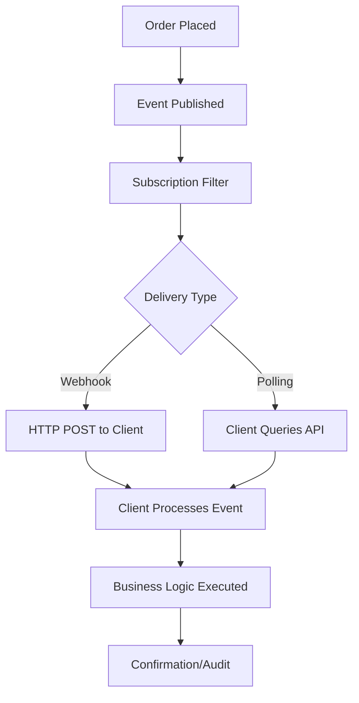
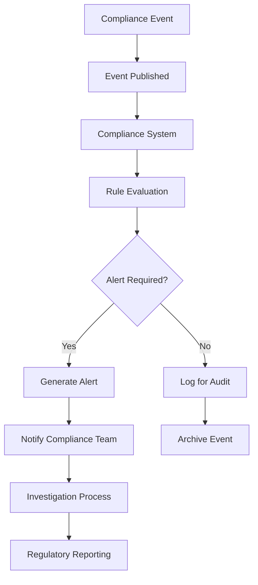



# Events API Documentation

_Based on OpenAPI specification: events.yaml_

## Executive Summary

**Audience:** Stakeholders

The Events API provides a comprehensive event-driven architecture foundation for the Quub Exchange platform, enabling real-time data streaming, system integration, and operational visibility. This service serves as the central nervous system for platform-wide event distribution, supporting everything from trading notifications to compliance monitoring.

**Key Business Value:**

- **Real-time Integration**: Enables seamless integration between platform services and external systems
- **Operational Visibility**: Provides comprehensive audit trails and monitoring capabilities
- **Scalable Architecture**: Supports high-throughput event processing for growing platform demands
- **Regulatory Compliance**: Ensures complete event tracking for audit and compliance requirements
- **Developer Experience**: Offers standardized event schemas and reliable delivery mechanisms

**Strategic Importance:**

- Foundation for microservices communication and data consistency
- Critical for real-time trading platforms and financial systems
- Enables advanced analytics and business intelligence capabilities
- Supports regulatory reporting and audit requirements

## Service Overview

**Audience:** All

**Business Purpose:**

- Provide a unified event streaming platform for all Quub Exchange services
- Enable real-time data synchronization between distributed systems
- Support event-driven workflows for trading, compliance, and operations
- Deliver reliable event notifications to external integrations
- Maintain comprehensive audit trails for regulatory compliance

**Technical Architecture:**

- CloudEvents 1.0 compliant event format for industry standardization
- Multi-tenant event isolation with organization-scoped subscriptions
- High-throughput event processing with guaranteed delivery semantics
- Webhook-based push delivery with automatic retry mechanisms
- Event replay capabilities for system recovery and backfilling
- Schema registry for event type validation and documentation

## API Specifications

**Audience:** Technical

**Base Configuration:**

```yaml
openapi: 3.1.0
info:
  title: Quub Exchange - Events API
  version: 2.0.0
servers:
  - url: https://api.quub.exchange/v1
```

**Authentication & Authorization:**

- OAuth 2.0 with scopes: `read:events`, `write:events`, `admin:events`
- API Key authentication for service-to-service communication
- Multi-tenant authorization with organization-level access control
- HMAC webhook signature verification for secure event delivery

## Core Endpoints

**Audience:** Technical + Project Teams

### Event Schema Management

**GET /events/schemas**
_Business Use Case:_ Retrieve available event schemas for integration planning
_Request Example:_

```bash
curl -X GET "https://api.quub.exchange/v1/events/schemas?category=TRADING" \
  -H "Authorization: Bearer {token}"
```

_Response Example:_

```json
{
  "data": [
    {
      "eventType": "com.quub.trading.order.placed.v1",
      "version": "1.0",
      "category": "TRADING",
      "description": "Order placement event",
      "dataSchema": {...},
      "examples": [...]
    }
  ],
  "pagination": {
    "cursor": "next-page-token",
    "hasMore": true
  }
}
```

_Implementation Notes:_

- Use category filtering to reduce payload size
- Cache schemas locally to reduce API calls
- Validate event payloads against schemas before processing

**GET /events/schemas/{eventType}**
_Business Use Case:_ Get detailed schema for specific event type
_Request Example:_

```bash
curl -X GET "https://api.quub.exchange/v1/events/schemas/com.quub.trading.order.placed.v1" \
  -H "Authorization: Bearer {token}"
```

### Event Subscriptions

**POST /orgs/{orgId}/events/subscriptions**
_Business Use Case:_ Create webhook subscription for real-time event delivery
_Request Example:_

```json
{
  "name": "Trading Integration",
  "description": "Real-time trading event notifications",
  "eventTypes": [
    "com.quub.trading.order.placed.v1",
    "com.quub.trading.trade.executed.v1"
  ],
  "deliveryType": "WEBHOOK",
  "webhookUrl": "https://api.client.com/webhooks/trading",
  "enabled": true
}
```

_Response Example:_

```json
{
  "data": {
    "id": "550e8400-e29b-41d4-a716-446655440000",
    "orgId": "123e4567-e89b-12d3-a456-426614174000",
    "name": "Trading Integration",
    "eventTypes": ["com.quub.trading.*"],
    "deliveryType": "WEBHOOK",
    "webhookUrl": "https://api.client.com/webhooks/trading",
    "enabled": true,
    "createdAt": "2025-11-02T10:00:00Z"
  }
}
```

_Implementation Notes:_

- Implement webhook signature verification using provided secret
- Handle webhook delivery failures gracefully with retry logic
- Use idempotent processing to handle duplicate deliveries

**GET /orgs/{orgId}/events/subscriptions**
_Business Use Case:_ List active event subscriptions for monitoring
_Request Example:_

```bash
curl -X GET "https://api.quub.exchange/v1/orgs/123e4567-e89b-12d3-a456-426614174000/events/subscriptions" \
  -H "Authorization: Bearer {token}"
```

### Event History & Querying

**GET /orgs/{orgId}/events**
_Business Use Case:_ Query historical events for audit and analysis
_Request Example:_

```bash
curl -X GET "https://api.quub.exchange/v1/orgs/123e4567-e89b-12d3-a456-426614174000/events?eventType=com.quub.trading.*&startTime=2025-11-01T00:00:00Z&endTime=2025-11-02T00:00:00Z" \
  -H "Authorization: Bearer {token}"
```

_Response Example:_

```json
{
  "data": [
    {
      "id": "550e8400-e29b-41d4-a716-446655440001",
      "source": "/services/trading",
      "specversion": "1.0",
      "type": "com.quub.trading.order.placed.v1",
      "time": "2025-11-02T10:30:00Z",
      "subject": "/orders/123e4567-e89b-12d3-a456-426614174001",
      "orgId": "123e4567-e89b-12d3-a456-426614174000",
      "data": {
        "orderId": "123e4567-e89b-12d3-a456-426614174001",
        "symbol": "AAPL",
        "quantity": 100,
        "price": 150.0
      }
    }
  ],
  "pagination": {
    "cursor": "next-page-token",
    "hasMore": true
  }
}
```

_Implementation Notes:_

- Use time-based pagination for large result sets
- Implement efficient filtering on event types and resource IDs
- Consider implementing event archiving for long-term storage

### Event Replay

**POST /orgs/{orgId}/events/replay**
_Business Use Case:_ Recover missed events or backfill data after system issues
_Request Example:_

```json
{
  "subscriptionId": "550e8400-e29b-41d4-a716-446655440000",
  "startTime": "2025-11-01T00:00:00Z",
  "endTime": "2025-11-02T00:00:00Z",
  "eventTypes": ["com.quub.trading.*"]
}
```

_Response Example:_

```json
{
  "data": {
    "id": "550e8400-e29b-41d4-a716-446655440002",
    "subscriptionId": "550e8400-e29b-41d4-a716-446655440000",
    "status": "QUEUED",
    "startTime": "2025-11-01T00:00:00Z",
    "endTime": "2025-11-02T00:00:00Z",
    "eventsTotal": 1500,
    "eventsProcessed": 0,
    "createdAt": "2025-11-02T11:00:00Z"
  }
}
```

_Implementation Notes:_

- Monitor replay job status for completion tracking
- Implement rate limiting to avoid overwhelming target systems
- Use replay for initial data synchronization after new subscriptions

## Security Implementation

**Audience:** Technical + Project Teams

**Multi-tenant Isolation:**

```yaml
# Organization-scoped event access
paths:
  /orgs/{orgId}/events/**:
    parameters:
      - name: orgId
        in: path
        required: true
        schema:
          type: string
          format: uuid
```

- Events are isolated by organization ID
- Subscriptions are organization-specific
- Cross-organization event access is prohibited

**Data Protection:**

- Event payloads encrypted at rest and in transit
- HMAC signatures for webhook authenticity verification
- Audit logging of all event access and delivery attempts
- PII data masking in event payloads where applicable

**Access Controls:**

```json
{
  "oauth2": {
    "scopes": {
      "read:events": "Read event schemas and history",
      "write:events": "Create and manage subscriptions",
      "admin:events": "Full event system administration"
    }
  }
}
```

- Role-based access control for different user types
- Service-level authentication for internal event publishing
- IP whitelisting for webhook endpoints

## Business Workflows

**Audience:** Stakeholders + Project Teams

### Primary Workflow: Real-time Trading Integration



**Business Value:**

- Enables real-time trading platforms and algorithmic strategies
- Supports high-frequency trading with low-latency event delivery
- Provides complete audit trail for regulatory compliance
- Enables real-time risk monitoring and position management

**Success Metrics:**

- Event delivery latency < 100ms for 99.9% of events
- 99.99% event delivery success rate
- Zero data loss in event streaming
- Support for 100,000+ events per second

### Secondary Workflow: Compliance Monitoring



**Business Value:**

- Automated compliance monitoring and alerting
- Real-time sanctions screening and KYC validation
- Complete audit trail for regulatory examinations
- Proactive risk management and fraud detection

**Success Metrics:**

- 100% compliance event capture and processing
- Alert generation within 5 seconds of triggering events
- Zero missed regulatory reporting deadlines
- Automated false positive reduction > 80%

## Integration Guide

**Audience:** Project Teams

**Development Setup:**

```bash
# Install dependencies
npm install axios crypto ws

# Set environment variables
export QUUB_API_KEY="your-api-key"
export QUUB_WEBHOOK_SECRET="your-webhook-secret"
export QUUB_ORG_ID="your-org-id"
```

**JavaScript/Node.js Example:**

```javascript
const axios = require("axios");
const crypto = require("crypto");

// Create event subscription
async function createSubscription() {
  const response = await axios.post(
    `https://api.quub.exchange/v1/orgs/${process.env.QUUB_ORG_ID}/events/subscriptions`,
    {
      name: "Trading Bot",
      eventTypes: ["com.quub.trading.order.placed.v1"],
      deliveryType: "WEBHOOK",
      webhookUrl: "https://your-app.com/webhooks/trading",
      enabled: true,
    },
    {
      headers: {
        Authorization: `Bearer ${process.env.QUUB_API_KEY}`,
        "Content-Type": "application/json",
      },
    }
  );
  return response.data;
}

// Webhook signature verification
function verifyWebhookSignature(payload, signature, secret) {
  const expectedSignature = crypto
    .createHmac("sha256", secret)
    .update(JSON.stringify(payload))
    .digest("hex");

  return crypto.timingSafeEqual(
    Buffer.from(signature, "hex"),
    Buffer.from(expectedSignature, "hex")
  );
}

// Query recent events
async function getRecentEvents(eventType, hours = 24) {
  const endTime = new Date();
  const startTime = new Date(endTime.getTime() - hours * 60 * 60 * 1000);

  const response = await axios.get(
    `https://api.quub.exchange/v1/orgs/${process.env.QUUB_ORG_ID}/events`,
    {
      params: {
        eventType,
        startTime: startTime.toISOString(),
        endTime: endTime.toISOString(),
      },
      headers: {
        Authorization: `Bearer ${process.env.QUUB_API_KEY}`,
      },
    }
  );
  return response.data;
}
```

**Python Example:**

```python
import requests
import hmac
import hashlib
import json
from datetime import datetime, timedelta

class QuubEventsClient:
    def __init__(self, api_key, org_id, webhook_secret=None):
        self.api_key = api_key
        self.org_id = org_id
        self.webhook_secret = webhook_secret
        self.base_url = "https://api.quub.exchange/v1"
        self.session = requests.Session()
        self.session.headers.update({
            'Authorization': f'Bearer {api_key}',
            'Content-Type': 'application/json'
        })

    def create_subscription(self, name, event_types, webhook_url):
        """Create a new event subscription"""
        payload = {
            "name": name,
            "eventTypes": event_types,
            "deliveryType": "WEBHOOK",
            "webhookUrl": webhook_url,
            "enabled": True
        }

        response = self.session.post(
            f"{self.base_url}/orgs/{self.org_id}/events/subscriptions",
            json=payload
        )
        response.raise_for_status()
        return response.json()

    def verify_webhook_signature(self, payload, signature):
        """Verify webhook HMAC signature"""
        if not self.webhook_secret:
            raise ValueError("Webhook secret not configured")

        expected = hmac.new(
            self.webhook_secret.encode(),
            json.dumps(payload, separators=(',', ':')).encode(),
            hashlib.sha256
        ).hexdigest()

        return hmac.compare_digest(signature, expected)

    def query_events(self, event_type=None, hours=24):
        """Query recent events"""
        end_time = datetime.utcnow()
        start_time = end_time - timedelta(hours=hours)

        params = {
            'startTime': start_time.isoformat(),
            'endTime': end_time.isoformat()
        }
        if event_type:
            params['eventType'] = event_type

        response = self.session.get(
            f"{self.base_url}/orgs/{self.org_id}/events",
            params=params
        )
        response.raise_for_status()
        return response.json()

    def replay_events(self, subscription_id, start_time, end_time, event_types=None):
        """Request event replay"""
        payload = {
            "subscriptionId": subscription_id,
            "startTime": start_time.isoformat(),
            "endTime": end_time.isoformat()
        }
        if event_types:
            payload["eventTypes"] = event_types

        response = self.session.post(
            f"{self.base_url}/orgs/{self.org_id}/events/replay",
            json=payload
        )
        response.raise_for_status()
        return response.json()

# Usage example
client = QuubEventsClient(
    api_key="your-api-key",
    org_id="123e4567-e89b-12d3-a456-426614174000",
    webhook_secret="your-webhook-secret"
)

# Create subscription
subscription = client.create_subscription(
    name="Trading Monitor",
    event_types=["com.quub.trading.*"],
    webhook_url="https://your-app.com/webhooks"
)

# Query recent events
events = client.query_events(event_type="com.quub.trading.order.placed.v1")
```

**Testing Strategy:**

```bash
# Unit tests for webhook processing
npm test -- --grep "webhook"

# Integration tests with sandbox environment
npm run test:integration

# Load testing for high-throughput scenarios
npm run test:load -- --events-per-second 1000
```

## Error Handling

**Audience:** Technical + Project Teams

**Standard Error Response:**

```json
{
  "error": {
    "code": "EVENT_DELIVERY_FAILED",
    "message": "Failed to deliver event to webhook endpoint",
    "details": {
      "subscriptionId": "550e8400-e29b-41d4-a716-446655440000",
      "eventId": "550e8400-e29b-41d4-a716-446655440001",
      "attempts": 3,
      "lastError": "Connection timeout after 30 seconds"
    },
    "timestamp": "2025-11-02T10:30:00Z",
    "requestId": "req-12345"
  }
}
```

**Error Codes Reference:**

| Error Code                | HTTP Status | Description                    | Resolution                     |
| ------------------------- | ----------- | ------------------------------ | ------------------------------ |
| `INVALID_EVENT_TYPE`      | 400         | Event type not recognized      | Check event schema catalog     |
| `SUBSCRIPTION_NOT_FOUND`  | 404         | Subscription ID doesn't exist  | Verify subscription ID         |
| `WEBHOOK_DELIVERY_FAILED` | 502         | Webhook endpoint unreachable   | Check endpoint URL and network |
| `RATE_LIMIT_EXCEEDED`     | 429         | Too many requests              | Implement exponential backoff  |
| `UNAUTHORIZED_ACCESS`     | 403         | Insufficient permissions       | Check OAuth scopes             |
| `EVENT_NOT_FOUND`         | 404         | Event ID doesn't exist         | Verify event ID and time range |
| `REPLAY_JOB_FAILED`       | 500         | Event replay processing failed | Check replay job status        |

**Error Handling Best Practices:**

```javascript
// Implement exponential backoff for retries
class EventProcessor {
  async processEvent(event, retryCount = 0) {
    try {
      await this.handleEvent(event);
    } catch (error) {
      if (retryCount < 3) {
        const delay = Math.pow(2, retryCount) * 1000; // Exponential backoff
        setTimeout(() => {
          this.processEvent(event, retryCount + 1);
        }, delay);
      } else {
        await this.logFailedEvent(event, error);
      }
    }
  }

  // Implement idempotent processing
  async handleEvent(event) {
    const processed = await this.checkIfProcessed(event.id);
    if (processed) {
      console.log(`Event ${event.id} already processed`);
      return;
    }

    // Process event
    await this.processBusinessLogic(event);

    // Mark as processed
    await this.markAsProcessed(event.id);
  }
}
```

## Implementation Checklist

**Audience:** Project Teams

### Pre-Development

- [ ] Review event schema catalog for required event types
- [ ] Design webhook endpoint architecture for high availability
- [ ] Plan event processing capacity based on expected volume
- [ ] Set up monitoring and alerting for event delivery failures
- [ ] Implement HMAC signature verification for webhook security
- [ ] Design event replay strategy for system recovery scenarios

### Development Phase

- [ ] Implement webhook signature verification middleware
- [ ] Build idempotent event processing to handle duplicates
- [ ] Add comprehensive error handling and retry logic
- [ ] Implement event filtering and routing logic
- [ ] Add request/response logging for debugging
- [ ] Create event processing metrics and monitoring
- [ ] Build event replay functionality for recovery
- [ ] Implement rate limiting and throttling mechanisms

### Testing Phase

- [ ] Unit test webhook signature verification
- [ ] Integration test with sandbox environment
- [ ] Load test event processing under high volume
- [ ] Test event replay functionality with historical data
- [ ] Validate error handling for network failures
- [ ] Test idempotent processing with duplicate events
- [ ] Performance test webhook delivery latency
- [ ] Security test webhook endpoint protection

### Production Readiness

- [ ] Configure production webhook endpoints
- [ ] Set up monitoring dashboards for event metrics
- [ ] Implement alerting for delivery failures
- [ ] Configure event retention policies
- [ ] Set up backup and disaster recovery procedures
- [ ] Document runbooks for common issues
- [ ] Train operations team on event system management
- [ ] Establish SLAs for event delivery guarantees

## Monitoring & Observability

**Audience:** Technical + Project Teams

**Key Metrics:**

- **Event Throughput**: Events processed per second (target: 100,000+ EPS)
- **Delivery Success Rate**: Percentage of successful deliveries (target: 99.99%)
- **Delivery Latency**: Time from event creation to delivery (target: <100ms P99)
- **Webhook Response Time**: External endpoint response time (target: <5s)
- **Retry Rate**: Percentage of events requiring retries (target: <1%)
- **Event Backlog**: Queue depth for pending deliveries (target: <1000)
- **Subscription Health**: Active vs failed subscriptions (target: 99% healthy)

**Logging Requirements:**

```json
{
  "timestamp": "2025-11-02T10:30:00Z",
  "level": "INFO",
  "service": "events",
  "eventId": "550e8400-e29b-41d4-a716-446655440001",
  "subscriptionId": "550e8400-e29b-41d4-a716-446655440000",
  "action": "WEBHOOK_DELIVERED",
  "duration": 45,
  "responseCode": 200,
  "attempt": 1,
  "orgId": "123e4567-e89b-12d3-a456-426614174000"
}
```

**Alerting Configuration:**

```yaml
alerting:
  rules:
    - name: High Delivery Failure Rate
      condition: rate(delivery_failures_total[5m]) > 0.01
      severity: critical
      description: "Event delivery failure rate > 1%"

    - name: Event Processing Backlog
      condition: event_queue_depth > 5000
      severity: warning
      description: "Event processing queue depth is high"

    - name: Webhook Endpoint Down
      condition: up{job="webhook_health"} == 0
      severity: critical
      description: "Webhook endpoint is unreachable"

    - name: High Latency Alert
      condition: histogram_quantile(0.99, rate(event_delivery_duration_bucket[5m])) > 1
      severity: warning
      description: "99th percentile delivery latency > 1 second"
```

## API Versioning & Evolution

**Audience:** All

**Current Version:** v2.0.0

- CloudEvents 1.0 compliance for industry standardization
- Multi-tenant event isolation with organization scoping
- Advanced event replay capabilities for system recovery
- Enhanced webhook delivery with automatic retries
- Comprehensive event schema registry

**Planned Enhancements (v2.1):**

- Event transformation and filtering at subscription level
- Advanced event correlation and aggregation features
- Real-time event streaming via WebSocket connections
- Enhanced monitoring with custom metric collection
- Event archiving and long-term retention policies

**Breaking Changes (v3.0 - Future):**

- Migration to CloudEvents 2.0 specification
- Changes to event type naming conventions
- Updated authentication requirements
- Modified webhook signature algorithm
- Enhanced multi-tenancy with tenant-specific schemas

## Additional Resources

**Audience:** All

**For Stakeholders:**

- [Event-Driven Architecture Overview](https://docs.quub.exchange/architecture/events)
- [Business Value of Real-Time Data](https://docs.quub.exchange/business/real-time-integration)
- [Compliance and Audit Capabilities](https://docs.quub.exchange/compliance/event-auditing)
- [Platform Integration Roadmap](https://docs.quub.exchange/roadmap/integration)

**For Technical Teams:**

- [CloudEvents Specification](https://cloudevents.io/)
- [Webhook Security Best Practices](https://docs.quub.exchange/security/webhooks)
- [Event Schema Registry Guide](https://docs.quub.exchange/api/events/schemas)
- [Troubleshooting Event Delivery](https://docs.quub.exchange/troubleshooting/events)
- [Performance Optimization Guide](https://docs.quub.exchange/performance/events)

**For Project Teams:**

- [Event Type Catalog](https://docs.quub.exchange/api/events/catalog)
- [Integration Patterns](https://docs.quub.exchange/patterns/event-integration)
- [Sample Applications](https://github.com/quub-fi/event-integration-examples)
- [Testing Utilities](https://github.com/quub-fi/event-testing-tools)
- [Deployment Playbooks](https://docs.quub.exchange/deploy/events)
