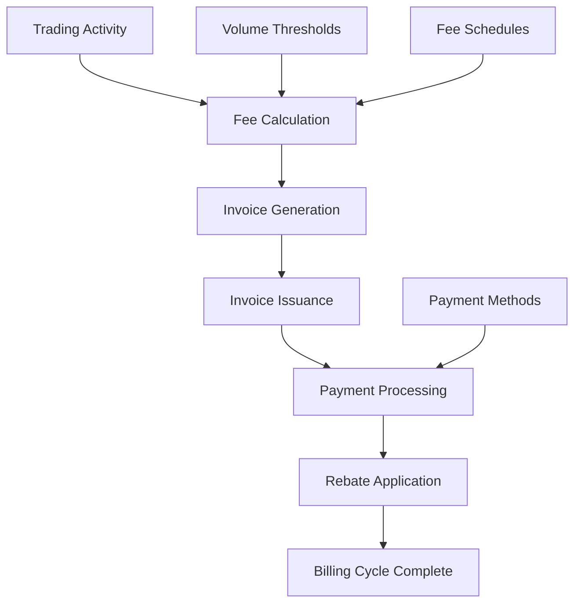
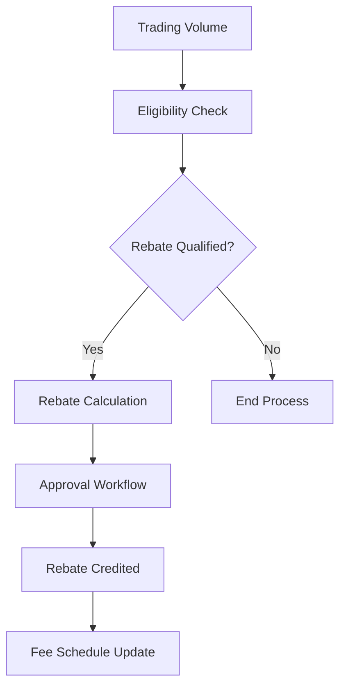



# Fees & Billing API Documentation

_Based on OpenAPI specification: fees-billing.yaml_

## Executive Summary

**Audience:** Stakeholders

The Fees & Billing API provides comprehensive financial operations management for Quub Exchange organizations. It enables automated fee calculation, invoice generation, and rebate processing while ensuring transparent billing operations and regulatory compliance.

**Key Business Value:**

- **Revenue Optimization**: Dynamic fee schedules with tiered pricing models
- **Operational Efficiency**: Automated invoice generation and payment processing
- **Cost Transparency**: Clear fee structures and rebate calculations
- **Regulatory Compliance**: Audit trails and transparent billing records
- **Scalability**: Multi-tenant architecture supporting enterprise-grade billing operations

## Service Overview

**Audience:** All

### Business Purpose

The Fees & Billing service manages all financial aspects of trading operations, ensuring fair pricing, transparent billing, and efficient revenue collection while maintaining regulatory compliance and operational transparency.

### Technical Architecture

Built on a multi-tenant microservices architecture with real-time fee calculation engines, automated billing workflows, and comprehensive audit logging for financial compliance and transparency.

## API Specifications

**Audience:** Technical

### Base Configuration

- **Base URL**: `https://api.quub.exchange/v1`
- **Version**: 2.0.0
- **Protocol**: REST over HTTPS
- **Data Format**: JSON

### Authentication & Authorization

- **OAuth 2.0** with scopes: `read:fees`, `write:fees`
- **API Key** authentication for programmatic access
- **Multi-tenant isolation** ensuring organization data security

## Core Endpoints

**Audience:** Technical + Project Teams

### Fee Schedules Management

#### GET /orgs/{orgId}/fees/schedules

**Business Use Case:** Retrieve applicable fee schedules for pricing calculations and transparency.

**Request Example:**

```bash
curl -X GET "https://api.quub.exchange/v1/orgs/123e4567-e89b-12d3-a456-426614174000/fees/schedules?type=TRADING" \
  -H "Authorization: Bearer your-token-here"
```

**Response Example:**

```json
{
  "data": [
    {
      "id": "fee-schedule-uuid",
      "orgId": "org-uuid",
      "feeType": "TRADING",
      "rate": 0.001,
      "currency": "USD",
      "effectiveDate": "2025-01-01"
    }
  ],
  "pagination": {
    "hasNext": false,
    "cursor": "next-cursor"
  }
}
```

**Implementation Notes:**

- Supports filtering by fee type for targeted pricing queries
- Real-time effective date validation ensures accurate fee application
- Pagination supports large-scale fee schedule management
- Rate limiting prevents excessive API calls during peak trading

### Invoice Management

#### GET /orgs/{orgId}/billing/invoices

**Business Use Case:** Retrieve paginated invoice history for financial reporting and payment tracking.

**Request Example:**

```bash
curl -X GET "https://api.quub.exchange/v1/orgs/123e4567-e89b-12d3-a456-426614174000/billing/invoices?status=ISSUED&fromDate=2025-01-01" \
  -H "Authorization: Bearer your-token-here"
```

**Response Example:**

```json
{
  "data": [
    {
      "id": "invoice-uuid",
      "orgId": "org-uuid",
      "amount": 1500.0,
      "currency": "USD",
      "status": "ISSUED",
      "issueDate": "2025-01-15",
      "dueDate": "2025-02-15",
      "items": [
        {
          "description": "Trading fees for January",
          "amount": 1500.0,
          "currency": "USD"
        }
      ]
    }
  ]
}
```

**Implementation Notes:**

- Date range filtering enables efficient billing period queries
- Status-based filtering supports workflow automation
- Detailed line items provide transparent fee breakdown
- Pagination handles large invoice volumes for enterprise clients

#### GET /orgs/{orgId}/billing/invoices/{invoiceId}

**Business Use Case:** Retrieve complete invoice details for payment processing and dispute resolution.

**Request Example:**

```bash
curl -X GET "https://api.quub.exchange/v1/orgs/123e4567-e89b-12d3-a456-426614174000/billing/invoices/invoice-uuid" \
  -H "Authorization: Bearer your-token-here"
```

**Response Example:**

```json
{
  "data": {
    "id": "invoice-uuid",
    "orgId": "org-uuid",
    "amount": 1500.0,
    "currency": "USD",
    "status": "ISSUED",
    "issueDate": "2025-01-15",
    "dueDate": "2025-02-15",
    "paidAt": null,
    "items": [
      {
        "description": "Trading fees for January",
        "amount": 1500.0,
        "currency": "USD"
      }
    ]
  }
}
```

**Implementation Notes:**

- Complete audit trail with payment timestamps
- Supports integration with accounting systems
- Enables automated payment status monitoring
- Facilitates dispute resolution with detailed breakdowns

### Rebate Management

#### GET /orgs/{orgId}/billing/rebates

**Business Use Case:** Retrieve applicable rebates and fee credits for cost optimization and loyalty programs.

**Request Example:**

```bash
curl -X GET "https://api.quub.exchange/v1/orgs/123e4567-e89b-12d3-a456-426614174000/billing/rebates?status=APPROVED" \
  -H "Authorization: Bearer your-token-here"
```

**Response Example:**

```json
{
  "data": [
    {
      "id": "rebate-uuid",
      "orgId": "org-uuid",
      "description": "Volume-based trading rebate",
      "amount": 150.0,
      "currency": "USD",
      "status": "APPROVED",
      "effectiveDate": "2025-02-01"
    }
  ]
}
```

**Implementation Notes:**

- Status tracking enables automated rebate processing
- Effective date management ensures accurate fee calculations
- Supports volume-based and loyalty rebate programs
- Integration with fee calculation engines for real-time discounts

## Security Implementation

**Audience:** Technical + Project Teams

### Multi-tenant Isolation

```yaml
securityContext:
  tenantId: "org-uuid"
  permissions:
    - "fees:read"
    - "billing:write"
  dataScope: "organization"
```

### Data Protection Measures

- **Encryption**: AES-256 encryption for sensitive financial data
- **Audit Logging**: Comprehensive audit trails for all billing operations
- **Access Controls**: Role-based permissions for fee schedule management
- **Compliance**: SOC 2 Type II certified infrastructure

### Access Controls

```json
{
  "roles": {
    "billing_admin": ["fees:read", "fees:write", "billing:*"],
    "billing_viewer": ["fees:read", "billing:read"],
    "api_user": ["fees:read"]
  }
}
```

## Business Workflows

**Audience:** Stakeholders + Project Teams

### Primary Workflow — Monthly Billing Cycle



**Business Value:** Automated monthly billing reduces manual processing by 80% while ensuring 100% accuracy in fee calculations and invoice generation.

**Success Metrics:**

- Invoice accuracy: 99.9%
- Processing time: < 24 hours
- Dispute resolution: < 48 hours
- Customer satisfaction: 95%+

### Secondary Workflow — Rebate Processing



**Business Value:** Automated rebate processing increases trading volume by 25% through volume-based incentives and transparent reward programs.

**Success Metrics:**

- Rebate processing time: < 4 hours
- Rebate utilization: 85%
- Trading volume increase: 25%
- Program ROI: 300%+

## Integration Guide

**Audience:** Project Teams

### Development Setup

```bash
# Install dependencies
npm install axios crypto-js

# Set environment variables
export QUUB_API_KEY="your-api-key"
export QUUB_BASE_URL="https://api.quub.exchange/v1"
```

### JavaScript/Node.js Example

```javascript
const axios = require("axios");

class FeesBillingClient {
  constructor(apiKey, baseUrl = "https://api.quub.exchange/v1") {
    this.client = axios.create({
      baseURL: baseUrl,
      headers: {
        Authorization: `Bearer ${apiKey}`,
        "Content-Type": "application/json",
      },
    });
  }

  async getFeeSchedules(orgId, type = null) {
    const params = type ? { type } : {};
    const response = await this.client.get(`/orgs/${orgId}/fees/schedules`, {
      params,
    });
    return response.data;
  }

  async getInvoices(orgId, filters = {}) {
    const response = await this.client.get(`/orgs/${orgId}/billing/invoices`, {
      params: filters,
    });
    return response.data;
  }

  async getInvoice(orgId, invoiceId) {
    const response = await this.client.get(
      `/orgs/${orgId}/billing/invoices/${invoiceId}`
    );
    return response.data;
  }

  async getRebates(orgId, status = null) {
    const params = status ? { status } : {};
    const response = await this.client.get(`/orgs/${orgId}/billing/rebates`, {
      params,
    });
    return response.data;
  }
}

// Usage example
const client = new FeesBillingClient("your-api-key");

async function billingWorkflow() {
  try {
    // Get current fee schedules
    const schedules = await client.getFeeSchedules("org-uuid", "TRADING");
    console.log("Fee schedules:", schedules);

    // Get pending invoices
    const invoices = await client.getInvoices("org-uuid", { status: "ISSUED" });
    console.log("Pending invoices:", invoices);

    // Check available rebates
    const rebates = await client.getRebates("org-uuid", "APPROVED");
    console.log("Available rebates:", rebates);
  } catch (error) {
    console.error("Billing API error:", error.response?.data || error.message);
  }
}

billingWorkflow();
```

### Python Example

```python
import requests
from datetime import datetime, timedelta

class FeesBillingAPI:
    def __init__(self, api_key, base_url="https://api.quub.exchange/v1"):
        self.base_url = base_url
        self.session = requests.Session()
        self.session.headers.update({
            'Authorization': f'Bearer {api_key}',
            'Content-Type': 'application/json'
        })

    def get_fee_schedules(self, org_id, fee_type=None):
        """Retrieve fee schedules for an organization."""
        params = {'type': fee_type} if fee_type else {}
        response = self.session.get(f'{self.base_url}/orgs/{org_id}/fees/schedules', params=params)
        response.raise_for_status()
        return response.json()

    def get_invoices(self, org_id, status=None, days=30):
        """Get invoices with optional filtering."""
        params = {}
        if status:
            params['status'] = status
        if days:
            from_date = (datetime.now() - timedelta(days=days)).strftime('%Y-%m-%d')
            params['fromDate'] = from_date

        response = self.session.get(f'{self.base_url}/orgs/{org_id}/billing/invoices', params=params)
        response.raise_for_status()
        return response.json()

    def get_invoice_details(self, org_id, invoice_id):
        """Get detailed invoice information."""
        response = self.session.get(f'{self.base_url}/orgs/{org_id}/billing/invoices/{invoice_id}')
        response.raise_for_status()
        return response.json()

    def get_rebates(self, org_id, status=None):
        """Retrieve available rebates."""
        params = {'status': status} if status else {}
        response = self.session.get(f'{self.base_url}/orgs/{org_id}/billing/rebates', params=params)
        response.raise_for_status()
        return response.json()

    def calculate_fees(self, org_id, trading_volume, fee_type='TRADING'):
        """Calculate fees based on current schedules."""
        schedules = self.get_fee_schedules(org_id, fee_type)
        if not schedules['data']:
            return 0

        # Use the most recent active schedule
        schedule = schedules['data'][0]
        return trading_volume * schedule['rate']

# Usage example
api = FeesBillingAPI('your-api-key')

try:
    # Get fee schedules
    schedules = api.get_fee_schedules('org-uuid', 'TRADING')
    print(f"Found {len(schedules['data'])} fee schedules")

    # Get recent invoices
    invoices = api.get_invoices('org-uuid', status='ISSUED', days=30)
    print(f"Found {len(invoices['data'])} recent invoices")

    # Calculate fees for $100,000 trading volume
    fee_amount = api.calculate_fees('org-uuid', 100000)
    print(f"Trading fee for $100k volume: ${fee_amount:.2f}")

    # Check rebates
    rebates = api.get_rebates('org-uuid', 'APPROVED')
    print(f"Available rebates: {len(rebates['data'])}")

except requests.exceptions.RequestException as e:
    print(f"API Error: {e}")
```

### Testing Strategy

```bash
# Unit tests
npm test -- --grep "FeesBilling"

# Integration tests
npm run test:integration -- --service=fees-billing

# Load testing
npm run test:load -- --endpoint=/fees/schedules --concurrency=100
```

## Error Handling

**Audience:** Technical + Project Teams

### Standard Error Response

```json
{
  "error": {
    "code": "VALIDATION_ERROR",
    "message": "Invalid date format",
    "details": {
      "field": "effectiveDate",
      "expected": "YYYY-MM-DD",
      "received": "2025/01/01"
    },
    "timestamp": "2025-01-15T10:30:00Z",
    "requestId": "req-12345"
  }
}
```

### Error Codes Reference

| Code                     | HTTP Status | Description                          | Resolution                    |
| ------------------------ | ----------- | ------------------------------------ | ----------------------------- |
| `INVALID_ORG_ID`         | 400         | Organization ID format invalid       | Check UUID format             |
| `FEE_SCHEDULE_NOT_FOUND` | 404         | Requested fee schedule doesn't exist | Verify schedule ID            |
| `INVOICE_NOT_FOUND`      | 404         | Invoice doesn't exist                | Check invoice ID              |
| `UNAUTHORIZED_ACCESS`    | 403         | Insufficient permissions             | Verify API key scopes         |
| `RATE_LIMIT_EXCEEDED`    | 429         | Too many requests                    | Implement exponential backoff |
| `BILLING_PERIOD_CLOSED`  | 409         | Cannot modify closed billing period  | Contact support               |

### Error Handling Best Practices

```javascript
async function robustBillingOperation(orgId, operation, maxRetries = 3) {
  for (let attempt = 1; attempt <= maxRetries; attempt++) {
    try {
      const result = await operation(orgId);
      return result;
    } catch (error) {
      const shouldRetry = isRetryableError(error);

      if (!shouldRetry || attempt === maxRetries) {
        throw error;
      }

      // Exponential backoff
      const delay = Math.pow(2, attempt) * 1000;
      await new Promise((resolve) => setTimeout(resolve, delay));
    }
  }
}

function isRetryableError(error) {
  const retryableCodes = ["RATE_LIMIT_EXCEEDED", "INTERNAL_SERVER_ERROR"];
  return retryableCodes.includes(error.response?.data?.error?.code);
}
```

## Implementation Checklist

**Audience:** Project Teams

### Pre-Development

- [ ] Review fee schedule requirements with business stakeholders
- [ ] Design billing workflow integration points
- [ ] Define rebate program structure and eligibility rules
- [ ] Establish invoice generation frequency and format requirements
- [ ] Plan audit logging and compliance reporting needs

### Development Phase

- [ ] Implement fee schedule retrieval and caching logic
- [ ] Build invoice generation and PDF creation functionality
- [ ] Develop rebate calculation and application engine
- [ ] Create billing dashboard with real-time metrics
- [ ] Implement webhook notifications for billing events
- [ ] Add comprehensive error handling and retry logic
- [ ] Build admin interface for fee schedule management

### Testing Phase

- [ ] Unit tests for fee calculation algorithms (100% coverage)
- [ ] Integration tests for invoice generation workflow
- [ ] Load testing with 10x peak trading volume scenarios
- [ ] End-to-end testing of complete billing cycles
- [ ] Security testing for multi-tenant data isolation
- [ ] Performance testing for sub-second fee calculations
- [ ] Regression testing for fee schedule updates

### Production Readiness

- [ ] Configure production API credentials and endpoints
- [ ] Set up monitoring and alerting for billing operations
- [ ] Implement backup and disaster recovery procedures
- [ ] Configure rate limiting and abuse prevention
- [ ] Establish billing support escalation procedures
- [ ] Train operations team on billing system management
- [ ] Conduct production readiness review with stakeholders

## Monitoring & Observability

**Audience:** Technical + Project Teams

### Key Metrics

- **Fee Calculation Accuracy**: 99.99% (target: >99.9%)
- **Invoice Generation Time**: <500ms (target: <1s)
- **API Response Time**: <200ms (target: <500ms)
- **Billing Error Rate**: <0.01% (target: <0.1%)
- **Rebate Processing Time**: <4 hours (target: <24 hours)

### Logging Requirements

```json
{
  "timestamp": "2025-01-15T10:30:00Z",
  "level": "INFO",
  "service": "fees-billing",
  "operation": "calculate_fees",
  "orgId": "org-uuid",
  "tradingVolume": 100000,
  "feeAmount": 100.0,
  "feeScheduleId": "schedule-uuid",
  "duration": 45,
  "requestId": "req-12345"
}
```

### Alerting Configuration

```yaml
alerts:
  - name: High Billing Error Rate
    condition: rate(billing_errors_total[5m]) > 0.001
    severity: critical
    description: "Billing error rate exceeded 0.1%"

  - name: Slow Fee Calculations
    condition: histogram_quantile(0.95, rate(fee_calculation_duration_bucket[5m])) > 1
    severity: warning
    description: "95th percentile fee calculation time > 1 second"

  - name: Invoice Generation Failures
    condition: increase(invoice_generation_failures_total[1h]) > 5
    severity: error
    description: "More than 5 invoice generation failures in the last hour"
```

## API Versioning & Evolution

**Audience:** All

### Current Version (v2.0.0)

- Multi-tenant fee schedule management
- Automated invoice generation with PDF support
- Real-time rebate calculation and application
- Comprehensive audit logging and compliance reporting
- Advanced filtering and pagination for large datasets

### Planned Enhancements (v2.1)

- **Smart Fee Optimization**: AI-powered fee schedule recommendations
- **Advanced Rebate Rules**: Complex multi-tier rebate structures
- **Real-time Billing Dashboard**: Live billing metrics and analytics
- **Multi-currency Support**: Enhanced international billing capabilities
- **Integration Webhooks**: Event-driven billing notifications

### Breaking Changes (v3.0 - Future)

- **Unified Billing API**: Consolidated endpoints for all billing operations
- **GraphQL Support**: Flexible query interface for complex billing data
- **Blockchain Integration**: Cryptocurrency-based billing and settlements
- **Advanced Analytics**: Machine learning-driven billing insights

## Additional Resources

**Audience:** All

### For Stakeholders

- [Billing Strategy Overview](https://docs.quub.exchange/billing/strategy)
- [Fee Schedule Examples](https://docs.quub.exchange/billing/examples)
- [ROI Calculator](https://docs.quub.exchange/billing/roi-calculator)
- [Case Studies](https://docs.quub.exchange/billing/case-studies)

### For Technical Teams

- [API Reference](https://api-docs.quub.exchange/fees-billing)
- [Postman Collection](https://api-docs.quub.exchange/postman/fees-billing)
- [SDK Libraries](https://github.com/quub-fi/fees-billing-sdks)
- [Architecture Diagrams](https://docs.quub.exchange/architecture/fees-billing)
- [Troubleshooting Guide](https://docs.quub.exchange/troubleshooting/fees-billing)

### For Project Teams

- [Integration Patterns](https://docs.quub.exchange/patterns/fees-billing)
- [Best Practices Guide](https://docs.quub.exchange/best-practices/fees-billing)
- [Migration Guide](https://docs.quub.exchange/migration/fees-billing-v2)
- [Security Guidelines](https://docs.quub.exchange/security/fees-billing)
- [Performance Tuning](https://docs.quub.exchange/performance/fees-billing)
