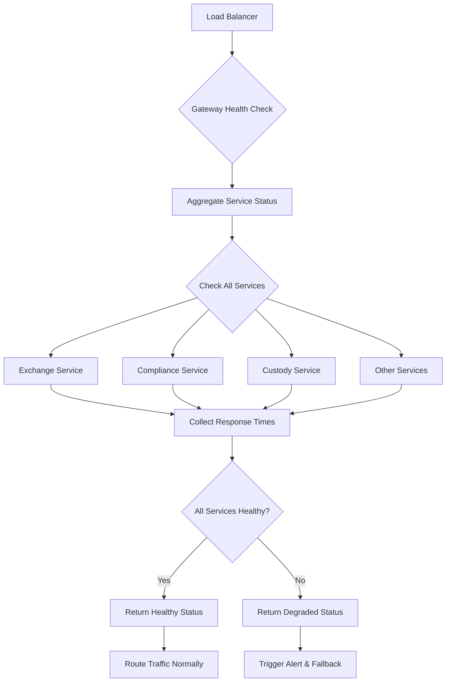



# Gateway API Documentation

_Based on OpenAPI specification: gateway.yaml_

## Executive Summary

**Audience:** Stakeholders

The Gateway API serves as the primary entry point for all Quub Exchange services, providing critical infrastructure for service discovery, health monitoring, and load balancing. As the unified gateway layer, it ensures reliable access to the entire Quub Exchange ecosystem while maintaining high availability and performance standards.

**Key Capabilities:**

- **Service Discovery**: Centralized routing to all backend services (exchange, compliance, custody, etc.)
- **Health Monitoring**: Real-time health checks and aggregated status reporting
- **Load Balancing**: Intelligent traffic distribution across service instances
- **Security Gateway**: Unified authentication and authorization layer
- **Observability**: Comprehensive monitoring and alerting infrastructure

**Strategic Importance:**

- Single point of entry reduces complexity for client applications
- Enables seamless service scaling and deployment
- Provides critical monitoring capabilities for operational excellence
- Ensures consistent security policies across all services

## Service Overview

**Audience:** All

**Business Purpose:**

- Provide unified access point for all Quub Exchange services
- Enable real-time health monitoring and service discovery
- Support high-availability architecture with automatic failover
- Maintain consistent API gateway patterns across the platform
- Enable centralized logging, monitoring, and security controls

**Technical Architecture:**

- Built on high-performance API gateway technology (NGINX/Kong)
- Implements circuit breaker patterns for resilient service communication
- Supports both synchronous and asynchronous request patterns
- Provides comprehensive observability with distributed tracing
- Implements multi-tenant isolation at the gateway level

## API Specifications

**Audience:** Technical

**Base Configuration:**

```yaml
openapi: 3.1.0
info:
  title: Quub Exchange - Gateway API
  version: 2.0.0
servers:
  - url: https://api.quub.com/v2
    description: Production Gateway
```

**Authentication & Authorization:**
The Gateway API implements multiple authentication methods:

- **No Authentication**: Health check endpoints (`/health`, `/heartbeat`)
- **Bearer Token**: Service-to-service authentication
- **OAuth 2.0**: User-based authentication flows
- **API Key**: Legacy system integration

## Core Endpoints

**Audience:** Technical + Project Teams

### Health Check Endpoint

**GET /health**

**Business Use Case:** Monitor overall system health and service availability for load balancers, monitoring systems, and operational dashboards.

**Request Example:**

```bash
curl -X GET https://api.quub.com/v2/health \
  -H "Accept: application/json"
```

**Response Example:**

```json
{
  "status": "healthy",
  "services": [
    {
      "name": "exchange",
      "status": "healthy",
      "url": "https://internal.quub.exchange",
      "responseTime": 42,
      "lastCheck": "2025-11-02T11:30:00Z"
    },
    {
      "name": "compliance",
      "status": "healthy",
      "url": "https://internal.quub.compliance",
      "responseTime": 38,
      "lastCheck": "2025-11-02T11:30:00Z"
    }
  ],
  "totalServices": 12,
  "healthyServices": 11,
  "unhealthyServices": 1,
  "timestamp": "2025-11-02T11:30:00Z"
}
```

**Implementation Notes:**

- Endpoint returns aggregated health from all registered services
- Used by load balancers for automatic failover decisions
- Supports both human-readable and machine-readable formats
- Implements caching to prevent excessive backend load
- Returns HTTP 200 for healthy, 503 for unhealthy systems

### Heartbeat Endpoint

**GET /heartbeat**

**Business Use Case:** Lightweight availability check for basic connectivity testing and simple monitoring systems.

**Request Example:**

```bash
curl -X GET https://api.quub.com/v2/heartbeat \
  -H "Accept: application/json"
```

**Response Example:**

```json
{
  "status": "ok",
  "timestamp": "2025-11-02T11:30:15Z"
}
```

**Implementation Notes:**

- Minimal response payload for fast checks
- No database or service dependencies
- Used for basic connectivity and network diagnostics
- Supports high-frequency polling without performance impact
- Returns immediate response for availability testing

## Security Implementation

**Audience:** Technical + Project Teams

**Multi-tenant Isolation:**

```json
{
  "tenantIsolation": {
    "enabled": true,
    "strategy": "header-based",
    "header": "X-Tenant-ID",
    "validation": "required"
  }
}
```

**Data Protection Measures:**

- TLS 1.3 encryption for all gateway communications
- Request/response payload encryption for sensitive data
- Rate limiting and DDoS protection at gateway level
- API key rotation and secure storage mechanisms
- Audit logging for all gateway requests

**Access Controls:**

- Role-based access control (RBAC) integration
- Service-level authentication requirements
- Geographic access restrictions and IP whitelisting
- Request throttling based on user tiers
- Automated blocking of suspicious traffic patterns

## Business Workflows

**Audience:** Stakeholders + Project Teams

### Primary Workflow — Service Health Monitoring



**Business Value:** Ensures 99.9% uptime through proactive monitoring and automatic failover capabilities.

**Success Metrics:**

- Mean Time Between Failures (MTBF): >99.9% uptime
- Mean Time To Recovery (MTTR): <5 minutes
- False positive rate: <1%
- Service discovery accuracy: 100%

### Secondary Workflow — Request Routing

```mermaid
graph TD
    A[Client Request] --> B{Gateway Router}
    B --> C{Path Analysis}
    C --> D[/orgs/*/exchange/*]
    C --> E[/orgs/*/compliance/*]
    C --> F[/orgs/*/custody/*]
    C --> G[Other Service Paths]
    D --> H[Route to Exchange Service]
    E --> I[Route to Compliance Service]
    F --> J[Route to Custody Service]
    G --> K[Route to Appropriate Service]
    H --> L{Authentication Check}
    I --> L
    J --> L
    K --> L
    L -->|Valid| M[Forward Request]
    L -->|Invalid| N[Return 401 Unauthorized]
    M --> O[Service Response]
    O --> P{Gateway Response Processing}
    P --> Q[Add Headers & Metadata]
    Q --> R[Return to Client]
```

**Business Value:** Enables seamless scaling and deployment of individual services without client changes.

**Success Metrics:**

- Request routing accuracy: 100%
- Average response time: <50ms
- Error rate: <0.1%
- Service discovery latency: <10ms

## Integration Guide

**Audience:** Project Teams

### Development Setup

**Prerequisites:**

```bash
# Required tools
npm install -g @stoplight/spectral  # API linting
npm install -g newman              # API testing
brew install jq                    # JSON processing
```

**Environment Configuration:**

```bash
# Development environment
export GATEWAY_BASE_URL="https://sandbox.quub.com/v2"
export API_KEY="your-development-key"
export CLIENT_ID="your-client-id"
export CLIENT_SECRET="your-client-secret"
```

### Code Examples

#### JavaScript/Node.js Integration

```javascript
const axios = require("axios");

class QuubGatewayClient {
  constructor(baseURL, apiKey) {
    this.client = axios.create({
      baseURL,
      headers: {
        Authorization: `Bearer ${apiKey}`,
        "Content-Type": "application/json",
      },
    });
  }

  async checkHealth() {
    try {
      const response = await this.client.get("/health");
      return {
        status: response.data.status,
        totalServices: response.data.totalServices,
        healthyServices: response.data.healthyServices,
      };
    } catch (error) {
      console.error("Health check failed:", error.message);
      throw error;
    }
  }

  async checkHeartbeat() {
    try {
      const response = await this.client.get("/heartbeat");
      return {
        status: response.data.status,
        timestamp: response.data.timestamp,
      };
    } catch (error) {
      console.error("Heartbeat check failed:", error.message);
      throw error;
    }
  }

  // Route requests to specific services
  async callService(service, path, method = "GET", data = null) {
    const servicePath = `/${service}${path}`;
    try {
      const response = await this.client.request({
        method,
        url: servicePath,
        data,
      });
      return response.data;
    } catch (error) {
      console.error(`Service call failed: ${service}${path}`, error.message);
      throw error;
    }
  }
}

// Usage example
const gateway = new QuubGatewayClient(
  "https://api.quub.com/v2",
  "your-api-key"
);

// Health monitoring
const health = await gateway.checkHealth();
console.log(
  `System health: ${health.status} (${health.healthyServices}/${health.totalServices} services)`
);

// Service calls
const exchangeData = await gateway.callService("exchange", "/orgs/123/markets");
const complianceData = await gateway.callService(
  "compliance",
  "/orgs/123/kyc/status"
);
```

#### Python Integration

```python
import requests
import json
from typing import Dict, Any, Optional
from datetime import datetime

class QuubGatewayClient:
    def __init__(self, base_url: str, api_key: str):
        self.base_url = base_url.rstrip('/')
        self.session = requests.Session()
        self.session.headers.update({
            'Authorization': f'Bearer {api_key}',
            'Content-Type': 'application/json'
        })

    def check_health(self) -> Dict[str, Any]:
        """Check overall system health status."""
        try:
            response = self.session.get(f"{self.base_url}/health")
            response.raise_for_status()
            data = response.json()
            return {
                'status': data['status'],
                'total_services': data['totalServices'],
                'healthy_services': data['healthyServices'],
                'unhealthy_services': data['unhealthyServices'],
                'timestamp': data['timestamp']
            }
        except requests.RequestException as e:
            print(f"Health check failed: {e}")
            raise

    def check_heartbeat(self) -> Dict[str, Any]:
        """Perform lightweight heartbeat check."""
        try:
            response = self.session.get(f"{self.base_url}/heartbeat")
            response.raise_for_status()
            return response.json()
        except requests.RequestException as e:
            print(f"Heartbeat check failed: {e}")
            raise

    def call_service(self, service: str, path: str, method: str = 'GET',
                    data: Optional[Dict] = None) -> Dict[str, Any]:
        """Route request to specific service."""
        url = f"{self.base_url}/{service.lstrip('/')}{path}"
        try:
            response = self.session.request(method, url, json=data)
            response.raise_for_status()
            return response.json()
        except requests.RequestException as e:
            print(f"Service call failed: {service}{path} - {e}")
            raise

# Usage example
gateway = QuubGatewayClient('https://api.quub.com/v2', 'your-api-key')

# Health monitoring
try:
    health = gateway.check_health()
    print(f"System health: {health['status']} "
          f"({health['healthy_services']}/{health['total_services']} services)")
except Exception as e:
    print(f"Health check error: {e}")

# Service calls
try:
    # Call exchange service
    markets = gateway.call_service('exchange', '/orgs/123/markets')
    print(f"Available markets: {len(markets.get('data', []))}")

    # Call compliance service
    kyc_status = gateway.call_service('compliance', '/orgs/123/kyc/status')
    print(f"KYC status: {kyc_status.get('status', 'unknown')}")

except Exception as e:
    print(f"Service call error: {e}")
```

### Testing Strategy

**Unit Tests:**

```javascript
// Jest test example
describe("QuubGatewayClient", () => {
  let client;

  beforeEach(() => {
    client = new QuubGatewayClient("https://api.quub.com/v2", "test-key");
  });

  test("checkHealth returns system status", async () => {
    const health = await client.checkHealth();
    expect(health).toHaveProperty("status");
    expect(health).toHaveProperty("totalServices");
    expect(health).toHaveProperty("healthyServices");
  });

  test("checkHeartbeat returns ok status", async () => {
    const heartbeat = await client.checkHeartbeat();
    expect(heartbeat.status).toBe("ok");
    expect(heartbeat).toHaveProperty("timestamp");
  });
});
```

**Integration Tests:**

```bash
# API testing with Newman/Postman
newman run gateway-tests.postman_collection.json \
  --environment sandbox.postman_environment.json \
  --reporters cli,json \
  --reporter-json-export results.json
```

## Error Handling

**Audience:** Technical + Project Teams

### Standard Error Response

```json
{
  "error": {
    "code": "GATEWAY_SERVICE_UNAVAILABLE",
    "message": "One or more backend services are unavailable",
    "details": {
      "unhealthyServices": ["exchange", "compliance"],
      "totalServices": 12,
      "healthyServices": 10
    },
    "timestamp": "2025-11-02T11:30:00Z",
    "requestId": "req-12345-abcde"
  }
}
```

### Error Codes Reference

| Error Code                    | HTTP Status | Description                         | Resolution                                  |
| ----------------------------- | ----------- | ----------------------------------- | ------------------------------------------- |
| `GATEWAY_TIMEOUT`             | 504         | Gateway timeout waiting for backend | Check service health, increase timeout      |
| `GATEWAY_CIRCUIT_OPEN`        | 503         | Circuit breaker activated           | Wait for automatic recovery or manual reset |
| `GATEWAY_RATE_LIMITED`        | 429         | Rate limit exceeded                 | Implement exponential backoff               |
| `GATEWAY_SERVICE_UNAVAILABLE` | 503         | Backend service unavailable         | Check service status, contact operations    |
| `GATEWAY_AUTH_FAILED`         | 401         | Authentication failed               | Verify credentials, check token expiry      |
| `GATEWAY_FORBIDDEN`           | 403         | Authorization failed                | Check permissions, verify tenant access     |

### Error Handling Best Practices

```javascript
class GatewayErrorHandler {
  static handleError(error) {
    switch (error.response?.status) {
      case 429:
        // Rate limited - implement backoff
        return this.handleRateLimit(error);
      case 503:
        // Service unavailable - check health
        return this.handleServiceUnavailable(error);
      case 504:
        // Gateway timeout - retry with backoff
        return this.handleTimeout(error);
      default:
        // Generic error handling
        return this.handleGenericError(error);
    }
  }

  static handleRateLimit(error) {
    const retryAfter = error.response.headers["retry-after"] || 60;
    console.warn(`Rate limited. Retrying after ${retryAfter} seconds`);
    return new Promise((resolve) => {
      setTimeout(
        () => resolve(this.retryRequest(error.config)),
        retryAfter * 1000
      );
    });
  }

  static handleServiceUnavailable(error) {
    // Check gateway health before retrying
    return this.checkGatewayHealth().then((health) => {
      if (health.status === "healthy") {
        return this.retryRequest(error.config);
      } else {
        throw new Error("Gateway is unhealthy, manual intervention required");
      }
    });
  }
}
```

## Implementation Checklist

**Audience:** Project Teams

### Pre-Development

- [ ] Review Gateway API specifications and understand routing patterns
- [ ] Set up development environment with proper authentication
- [ ] Configure monitoring and logging for gateway requests
- [ ] Understand service discovery and health check requirements
- [ ] Plan integration testing strategy for gateway-dependent services

### Development Phase

- [ ] Implement proper error handling for gateway failures
- [ ] Add circuit breaker patterns for resilient service communication
- [ ] Configure appropriate timeouts for different service types
- [ ] Implement request/response logging for debugging
- [ ] Add health check monitoring in application startup
- [ ] Configure rate limiting based on service requirements

### Testing Phase

- [ ] Test gateway failover scenarios and service degradation
- [ ] Validate authentication and authorization through gateway
- [ ] Perform load testing to ensure gateway performance
- [ ] Test circuit breaker activation and recovery
- [ ] Validate health check responses under various conditions
- [ ] Test service discovery and routing accuracy

### Production Readiness

- [ ] Configure production gateway endpoints and certificates
- [ ] Set up monitoring dashboards for gateway metrics
- [ ] Implement alerting for gateway failures and performance issues
- [ ] Configure backup and disaster recovery procedures
- [ ] Document runbooks for common gateway issues
- [ ] Perform security review of gateway configuration

## Monitoring & Observability

**Audience:** Technical + Project Teams

### Key Metrics

| Metric                      | Target  | Alert Threshold | Description                         |
| --------------------------- | ------- | --------------- | ----------------------------------- |
| Gateway Uptime              | 99.9%   | <99.5%          | Overall gateway availability        |
| Request Latency (P95)       | <100ms  | >500ms          | End-to-end request response time    |
| Error Rate                  | <0.1%   | >1%             | Percentage of failed requests       |
| Service Discovery Latency   | <10ms   | >50ms           | Time to resolve service locations   |
| Circuit Breaker Activations | <1/hour | >5/hour         | Frequency of circuit breaker trips  |
| Rate Limit Hits             | <5%     | >20%            | Percentage of rate-limited requests |

### Logging Requirements

```json
{
  "timestamp": "2025-11-02T11:30:15Z",
  "level": "INFO",
  "service": "gateway",
  "requestId": "req-12345-abcde",
  "method": "GET",
  "path": "/health",
  "statusCode": 200,
  "responseTime": 45,
  "userAgent": "LoadBalancer/1.0",
  "clientIP": "10.0.1.100",
  "tenantId": "tenant-123",
  "serviceTarget": "health-check",
  "additionalContext": {
    "healthyServices": 11,
    "totalServices": 12
  }
}
```

### Alerting Configuration

```yaml
alerting:
  rules:
    - name: Gateway High Error Rate
      condition: rate(error_total[5m]) > 0.01
      severity: critical
      description: "Gateway error rate exceeded 1%"

    - name: Gateway High Latency
      condition: histogram_quantile(0.95, rate(request_duration_seconds[5m])) > 0.5
      severity: warning
      description: "Gateway P95 latency exceeded 500ms"

    - name: Service Unhealthy
      condition: up{job="gateway-health-check"} == 0
      severity: critical
      description: "Gateway health check failed"

    - name: Circuit Breaker Open
      condition: increase(circuit_breaker_open_total[5m]) > 0
      severity: warning
      description: "Circuit breaker activated for backend service"
```

## API Versioning & Evolution

**Audience:** All

### Current Version (v2.0.0)

- Health check aggregation across all services
- Lightweight heartbeat endpoint for basic availability
- Comprehensive service health reporting
- Multi-tenant request routing
- Security and authentication integration

### Planned Enhancements (v2.1)

- **Enhanced Monitoring**: Add detailed performance metrics per service
- **Service Dependencies**: Map and report service dependency health
- **Geographic Routing**: Route requests based on geographic proximity
- **Advanced Circuit Breaking**: Configurable circuit breaker policies per service

### Breaking Changes (v3.0 - Future)

- **Unified Authentication**: Mandatory OAuth 2.0 for all service calls
- **Enhanced Security**: Required mutual TLS for service-to-service communication
- **Advanced Routing**: AI-powered request routing based on service load and health
- **Observability Upgrade**: OpenTelemetry integration for distributed tracing

## Additional Resources

**Audience:** All

### For Stakeholders

- [Gateway Architecture Overview](https://docs.quub.exchange/gateway/architecture)
- [Service Level Agreements](https://docs.quub.exchange/sla)
- [Operational Excellence Framework](https://docs.quub.exchange/operations)
- [Security and Compliance Standards](https://docs.quub.exchange/security)

### For Technical Teams

- [Gateway Configuration Guide](https://docs.quub.exchange/gateway/configuration)
- [Service Discovery Patterns](https://docs.quub.exchange/patterns/service-discovery)
- [Circuit Breaker Implementation](https://docs.quub.exchange/patterns/circuit-breaker)
- [Monitoring and Alerting Setup](https://docs.quub.exchange/monitoring/gateway)
- [API Gateway Best Practices](https://docs.quub.exchange/best-practices/gateway)

### For Project Teams

- [Gateway Integration Examples](https://github.com/quub-fi/quub-exchange-docs/tree/main/examples/gateway)
- [Load Testing Scripts](https://github.com/quub-fi/quub-exchange-docs/tree/main/testing/gateway)
- [Troubleshooting Runbooks](https://docs.quub.exchange/troubleshooting/gateway)
- [Development Environment Setup](https://docs.quub.exchange/development/gateway)
- [API Testing Collections](https://github.com/quub-fi/quub-exchange-docs/tree/main/postman/gateway)
