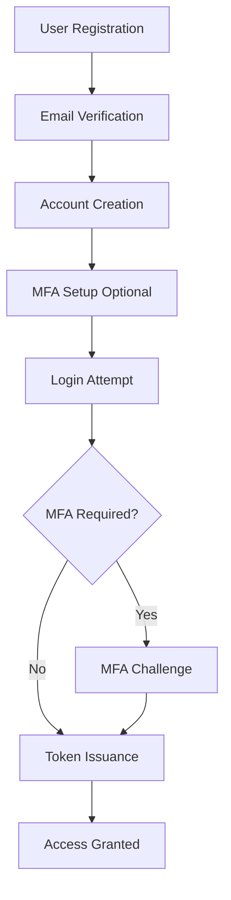
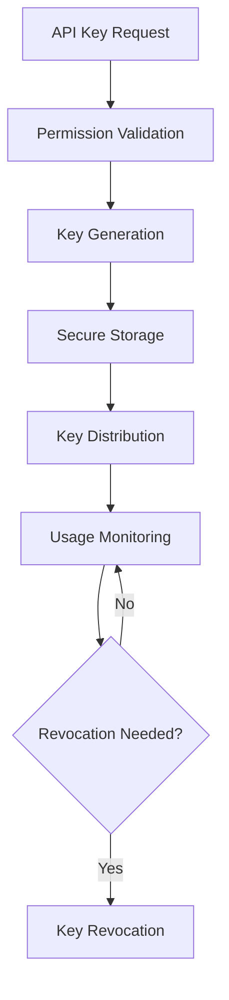



# Identity API Documentation

_Based on OpenAPI specification: identity.yaml_

## Executive Summary

**Audience:** Stakeholders

The Identity Service provides the core Identity and Access Management (IAM) layer for Quub Exchange, enabling secure user authentication, organization management, and access control. This service is critical for maintaining platform security, enabling multi-tenant operations, and ensuring regulatory compliance through comprehensive user lifecycle management.

**Key Capabilities:**

- **User Account Management**: Complete lifecycle management for individual and organizational accounts
- **Multi-Factor Authentication**: Enhanced security through MFA challenges and verification
- **API Key Management**: Secure programmatic access with granular permissions
- **Role-Based Access Control**: Flexible authorization system supporting complex permission hierarchies
- **Organization Management**: Multi-tenant architecture with isolated organizational contexts

**Strategic Importance:**

- Foundation for platform security and compliance
- Enables scalable multi-tenant operations
- Supports regulatory requirements for user verification and audit trails
- Critical for maintaining trust and security in financial operations

## Service Overview

**Audience:** All

**Business Purpose:**

- Provide secure identity management for all platform users and organizations
- Enable multi-tenant operations with proper data isolation
- Support regulatory compliance through comprehensive audit trails
- Facilitate secure API access through key management
- Ensure platform security through MFA and access controls

**Technical Architecture:**

- RESTful API design following OpenAPI 3.1.0 specifications
- JWT-based authentication with refresh token support
- Multi-tenant architecture with organization-level isolation
- Event-driven architecture for audit logging and compliance monitoring
- Scalable microservice design supporting horizontal scaling

## API Specifications

**Audience:** Technical

**Base Configuration:**

```yaml
openapi: 3.1.0
info:
  title: Quub Exchange - Identity Service
  version: 2.0.0
servers:
  - url: https://api.quub.exchange/v1
  - url: https://api.sandbox.quub.exchange/v1
```

**Authentication & Authorization:**

- **Bearer Token Authentication**: JWT tokens for API access
- **API Key Authentication**: For programmatic access
- **Multi-Factor Authentication**: TOTP-based MFA support
- **Role-Based Permissions**: Granular access control system

## Core Endpoints

**Audience:** Technical + Project Teams

### Account Management

**GET /Accounts**
_Business Use Case:_ Retrieve paginated list of user accounts for administrative purposes
_Request Example:_

```bash
GET /Accounts?status=ACTIVE&type=INDIVIDUAL&limit=50
Authorization: Bearer {jwt_token}
```

_Response Example:_

```json
{
  "data": [
    {
      "id": "acc_1234567890abcdef",
      "type": "INDIVIDUAL",
      "email": "user@example.com",
      "status": "ACTIVE",
      "createdAt": "2025-01-15T10:30:00Z"
    }
  ],
  "pagination": {
    "cursor": "next_page_cursor",
    "hasMore": true
  }
}
```

_Implementation Notes:_

- Supports filtering by status, type, and organization
- Pagination required for large result sets
- Admin permissions required for cross-organization access

**POST /Accounts**
_Business Use Case:_ Create new user or organizational accounts
_Request Example:_

```json
{
  "type": "INDIVIDUAL",
  "email": "newuser@example.com",
  "phone": "+14155551234"
}
```

_Response Example:_

```json
{
  "data": {
    "id": "acc_1234567890abcdef",
    "type": "INDIVIDUAL",
    "email": "newuser@example.com",
    "status": "PENDING_VERIFICATION",
    "createdAt": "2025-01-15T10:30:00Z"
  }
}
```

_Implementation Notes:_

- Email verification required for account activation
- Idempotency key support for safe retries
- Automatic organization assignment for enterprise users

### Authentication Endpoints

**POST /auth/login**
_Business Use Case:_ Authenticate users and issue access tokens
_Request Example:_

```json
{
  "email": "user@example.com",
  "password": "secure_password",
  "mfaCode": "123456"
}
```

_Response Example:_

```json
{
  "accessToken": "eyJhbGciOiJIUzI1NiIsInR5cCI6IkpXVCJ9...",
  "refreshToken": "refresh_token_here",
  "expiresIn": 3600,
  "tokenType": "Bearer"
}
```

_Implementation Notes:_

- MFA challenge issued for accounts with MFA enabled
- Rate limiting applied to prevent brute force attacks
- Session tracking for security monitoring

**POST /auth/register**
_Business Use Case:_ Register new user accounts with email verification
_Request Example:_

```json
{
  "email": "newuser@example.com",
  "password": "SecurePass123!",
  "type": "INDIVIDUAL"
}
```

_Response Example:_

```json
{
  "message": "Registration successful. Please check your email for verification.",
  "accountId": "acc_1234567890abcdef"
}
```

_Implementation Notes:_

- Email verification required before account activation
- Password strength validation enforced
- Duplicate email prevention

### MFA Management

**POST /Accounts/{accountId}/mfa**
_Business Use Case:_ Enable MFA for enhanced account security
_Request Example:_

```json
{
  "method": "TOTP"
}
```

_Response Example:_

```json
{
  "secret": "JBSWY3DPEHPK3PXP",
  "qrCodeUrl": "otpauth://totp/Quub:user@example.com?secret=JBSWY3DPEHPK3PXP",
  "backupCodes": ["12345678", "87654321"]
}
```

_Implementation Notes:_

- TOTP standard for time-based one-time passwords
- Backup codes provided for recovery
- QR code generation for easy setup

## Security Implementation

**Audience:** Technical + Project Teams

**Multi-tenant Isolation:**

```yaml
# Organization-level data isolation
components:
  securitySchemes:
    bearerAuth:
      type: http
      scheme: bearer
      bearerFormat: JWT
    orgIsolation:
      type: apiKey
      in: header
      name: X-Organization-ID
```

**Data Protection Measures:**

- **Encryption at Rest**: AES-256 encryption for sensitive data
- **TLS 1.3**: End-to-end encryption for all API communications
- **Password Hashing**: Argon2id for secure password storage
- **Token Security**: Short-lived JWTs with refresh token rotation

**Access Controls:**

```json
{
  "roles": {
    "ADMIN": ["read:*", "write:*"],
    "USER": ["read:own", "write:own"],
    "AUDITOR": ["read:*"]
  },
  "permissions": {
    "account:create": "ADMIN",
    "account:read": "USER",
    "mfa:manage": "USER"
  }
}
```

## Business Workflows

**Audience:** Stakeholders + Project Teams

**Primary Workflow** — User Onboarding & Authentication



**Business Value:** Streamlined user onboarding with security-first approach
**Success Metrics:** 95% account verification completion rate, <5% failed login attempts

**Secondary Workflow** — API Key Management



**Business Value:** Secure programmatic access with audit capabilities
**Success Metrics:** 99.9% API key security, <1% compromised key incidents

## Integration Guide

**Audience:** Project Teams

**Development Setup:**

```bash
# Install dependencies
npm install @quub/identity-client axios

# Environment configuration
export QUUB_IDENTITY_URL=https://api.quub.exchange/v1
export QUUB_API_KEY=your_api_key_here
```

**JavaScript/Node.js Example:**

```javascript
const { IdentityClient } = require("@quub/identity-client");

const client = new IdentityClient({
  baseURL: process.env.QUUB_IDENTITY_URL,
  apiKey: process.env.QUUB_API_KEY,
});

// User registration
async function registerUser(email, password) {
  try {
    const response = await client.register({
      email,
      password,
      type: "INDIVIDUAL",
    });
    console.log("Registration successful:", response.accountId);
  } catch (error) {
    console.error("Registration failed:", error.message);
  }
}

// Authentication
async function authenticateUser(email, password, mfaCode) {
  try {
    const tokens = await client.login({
      email,
      password,
      mfaCode,
    });
    // Store tokens securely
    localStorage.setItem("accessToken", tokens.accessToken);
    return tokens;
  } catch (error) {
    console.error("Authentication failed:", error.message);
  }
}
```

**Python Example:**

```python
import requests
from typing import Dict, Optional

class IdentityClient:
    def __init__(self, base_url: str, api_key: str):
        self.base_url = base_url
        self.session = requests.Session()
        self.session.headers.update({
            'Authorization': f'Bearer {api_key}',
            'Content-Type': 'application/json'
        })

    def register_user(self, email: str, password: str) -> Dict:
        """Register a new user account"""
        response = self.session.post(
            f"{self.base_url}/auth/register",
            json={
                "email": email,
                "password": password,
                "type": "INDIVIDUAL"
            }
        )
        response.raise_for_status()
        return response.json()

    def authenticate(self, email: str, password: str, mfa_code: Optional[str] = None) -> Dict:
        """Authenticate user and get tokens"""
        payload = {"email": email, "password": password}
        if mfa_code:
            payload["mfaCode"] = mfa_code

        response = self.session.post(
            f"{self.base_url}/auth/login",
            json=payload
        )
        response.raise_for_status()
        return response.json()

# Usage example
client = IdentityClient(
    base_url="https://api.quub.exchange/v1",
    api_key="your_api_key_here"
)

# Register user
result = client.register_user("user@example.com", "SecurePass123!")
print(f"Account created: {result['accountId']}")

# Authenticate
tokens = client.authenticate("user@example.com", "SecurePass123!")
print(f"Access token: {tokens['accessToken']}")
```

**Testing Strategy:**

```bash
# Unit tests
npm test -- --grep "Identity"

# Integration tests
npm run test:integration -- --service=identity

# Load testing
npm run test:load -- --endpoint=/auth/login --concurrency=100
```

## Error Handling

**Audience:** Technical + Project Teams

**Standard Error Response:**

```json
{
  "error": {
    "code": "AUTHENTICATION_FAILED",
    "message": "Invalid email or password",
    "details": {
      "field": "password",
      "reason": "incorrect_credentials"
    },
    "requestId": "req_1234567890abcdef",
    "timestamp": "2025-01-15T10:30:00Z"
  }
}
```

**Error Codes Reference:**
| Code | HTTP Status | Description | Resolution |
|------|-------------|-------------|------------|
| `AUTHENTICATION_FAILED` | 401 | Invalid credentials | Check email/password, verify MFA |
| `ACCOUNT_NOT_VERIFIED` | 403 | Email not verified | Complete email verification |
| `MFA_REQUIRED` | 403 | MFA challenge needed | Provide MFA code |
| `ACCOUNT_SUSPENDED` | 403 | Account suspended | Contact support |
| `RATE_LIMIT_EXCEEDED` | 429 | Too many requests | Implement exponential backoff |
| `INVALID_TOKEN` | 401 | JWT token invalid | Refresh token or re-authenticate |

**Error Handling Best Practices:**

```javascript
class IdentityService {
  async authenticateWithRetry(email, password, maxRetries = 3) {
    for (let attempt = 1; attempt <= maxRetries; attempt++) {
      try {
        const tokens = await this.authenticate(email, password);

        // Store tokens securely
        this.storeTokens(tokens);
        return tokens;
      } catch (error) {
        if (error.code === "MFA_REQUIRED" && attempt === 1) {
          // Handle MFA challenge
          const mfaCode = await this.promptForMFACode();
          return await this.authenticate(email, password, mfaCode);
        } else if (error.code === "RATE_LIMIT_EXCEEDED") {
          // Exponential backoff
          const delay = Math.pow(2, attempt) * 1000;
          await this.delay(delay);
          continue;
        } else {
          // Non-retryable error
          throw error;
        }
      }
    }
  }
}
```

## Implementation Checklist

**Audience:** Project Teams

**Pre-Development:**

- [ ] Review OpenAPI specification for endpoint compatibility
- [ ] Set up development environment with proper TLS certificates
- [ ] Configure multi-tenant organization isolation
- [ ] Implement secure token storage mechanisms
- [ ] Set up email verification service integration
- [ ] Configure MFA provider (TOTP/Authy)

**Development Phase:**

- [ ] Implement user registration with email verification
- [ ] Build authentication flow with MFA support
- [ ] Create account management CRUD operations
- [ ] Implement role-based access control
- [ ] Add API key generation and management
- [ ] Integrate audit logging for compliance
- [ ] Implement rate limiting and abuse prevention
- [ ] Add comprehensive input validation

**Testing Phase:**

- [ ] Unit tests for all service methods (target: >90% coverage)
- [ ] Integration tests for authentication flows
- [ ] Security testing for common vulnerabilities
- [ ] Load testing for concurrent user scenarios
- [ ] MFA flow testing with various providers
- [ ] Cross-browser compatibility testing
- [ ] Mobile app integration testing

**Production Readiness:**

- [ ] Security audit and penetration testing completed
- [ ] Performance benchmarks meet requirements
- [ ] Monitoring and alerting configured
- [ ] Backup and disaster recovery procedures documented
- [ ] GDPR/CCPA compliance verified
- [ ] Incident response plan established
- [ ] Documentation updated and reviewed

## Monitoring & Observability

**Audience:** Technical + Project Teams

**Key Metrics:**

- **Authentication Success Rate**: Target >99.5% (tracks failed login attempts)
- **Account Creation Time**: Target <30 seconds (end-to-end registration)
- **MFA Adoption Rate**: Target >80% (security enhancement metric)
- **API Response Time**: Target <200ms P95 (performance metric)
- **Failed Authentication Rate**: Target <5% (security monitoring)
- **Token Refresh Rate**: Target <10% daily (session management efficiency)

**Logging Requirements:**

```json
{
  "level": "INFO",
  "message": "User authentication successful",
  "userId": "acc_1234567890abcdef",
  "orgId": "org_abcdef1234567890",
  "ipAddress": "192.168.1.100",
  "userAgent": "Mozilla/5.0...",
  "sessionId": "sess_abcdef1234567890",
  "timestamp": "2025-01-15T10:30:00Z",
  "requestId": "req_1234567890abcdef"
}
```

**Alerting Configuration:**

```yaml
alerts:
  - name: High Failed Authentication Rate
    condition: rate(authentication_failures[5m]) > 0.1
    severity: critical
    description: "Authentication failure rate exceeds 10%"

  - name: MFA Bypass Attempt
    condition: mfa_bypass_attempts > 0
    severity: critical
    description: "Potential security breach - MFA bypass detected"

  - name: Account Creation Spike
    condition: rate(account_creations[1h]) > 100
    severity: warning
    description: "Unusual account creation activity detected"
```

## API Versioning & Evolution

**Audience:** All

**Current Version:** v2.0.0

- Complete rewrite with improved security
- Enhanced MFA support with backup codes
- Multi-tenant organization isolation
- Event-driven audit logging

**Planned Enhancements (v2.1):**

- Social login integration (Google, GitHub)
- Advanced password policies
- Biometric authentication support
- Enhanced audit trail with compliance exports

**Breaking Changes (v3.0 - Future):**

- Migration to OAuth 2.1 standard
- Removal of deprecated password grant flow
- Enhanced security requirements for API keys
- Updated MFA requirements for high-risk operations

## Additional Resources

**Audience:** All

**For Stakeholders:**

- [Identity Management Best Practices](https://docs.quub.exchange/best-practices/identity)
- [Security Compliance Overview](https://docs.quub.exchange/compliance/security)
- [Multi-Tenant Architecture Guide](https://docs.quub.exchange/architecture/multi-tenant)

**For Technical Teams:**

- [OpenAPI Specification](https://api.quub.exchange/v1/openapi.json)
- [Authentication Flow Diagrams](https://docs.quub.exchange/diagrams/auth-flows)
- [Security Implementation Guide](https://docs.quub.exchange/security/implementation)
- [API Rate Limiting](https://docs.quub.exchange/api/rate-limiting)

**For Project Teams:**

- [Identity Service SDK](https://github.com/quub-fi/identity-sdk)
- [Integration Examples Repository](https://github.com/quub-fi/integration-examples)
- [Testing Utilities](https://github.com/quub-fi/identity-testing)
- [Deployment Playbooks](https://docs.quub.exchange/deploy/identity)
- [Troubleshooting Guide](https://docs.quub.exchange/troubleshoot/identity)
