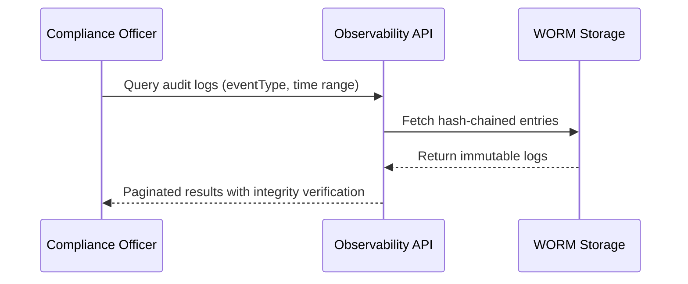
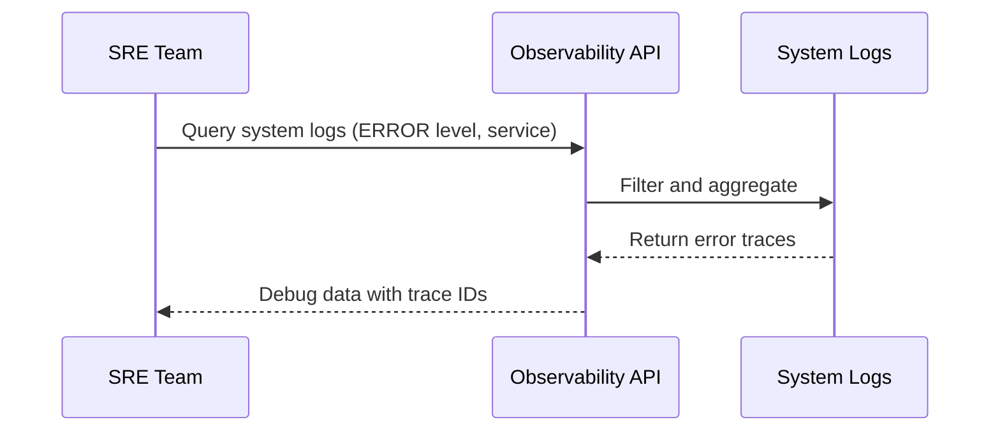



# Observability API Documentation

_Based on OpenAPI specification: observability.yaml_

## Executive Summary

**Audience:** Stakeholders

- Business value: comprehensive audit trail and system observability for compliance, troubleshooting, and performance monitoring; enables forensic analysis, regulatory reporting, and proactive issue detection.
- Key capabilities: immutable audit logs with tamper detection, system-level logging, organization-specific metrics, and real-time telemetry.
- Strategic importance: Builds trust through transparency, reduces incident response time, supports compliance audits, and provides data-driven insights for platform optimization.

## Service Overview

**Audience:** All

- Business Purpose:

  - Provide immutable audit logs for all user and system actions to support compliance and forensic investigations.
  - Enable querying of system logs for debugging and operational monitoring.
  - Deliver organization-level metrics for performance tracking and capacity planning.
  - Support tamper detection through hash-chained audit entries (WORM storage).
  - Facilitate regulatory reporting with structured, searchable log data.

- Technical Architecture:
  - RESTful API with multi-tenant isolation via orgId parameters.
  - WORM (Write-Once-Read-Many) storage for audit logs with cryptographic hash chaining.
  - Event-driven log ingestion from all services with structured JSON payloads.
  - Metrics aggregation from distributed telemetry sources (Prometheus-style).
  - Role-based access controls with OAuth2 scopes for read/write observability data.
  - Pagination and filtering for large-scale log queries.

## API Specifications

**Audience:** Technical

- Base Configuration (YAML reference):

```yaml
openapi: 3.1.0
info:
  title: Quub Exchange - Observability API
  version: 2.0.0
servers:
  - url: https://api.quub.exchange/v1
```

- Authentication & Authorization:
  - OAuth2 with scopes (read:observability, write:observability) for fine-grained access.
  - API key authentication for service-to-service calls.
  - Admin-level access required for system logs; org-scoped for audit logs and metrics.

## Core Endpoints

Grouped by functional area. For each endpoint below we include method, path, business use case, request and response examples, and implementation notes.

### Audit Logs

- GET /orgs/{orgId}/audit-logs
  - Business use case: Retrieve immutable audit log entries for compliance audits, security investigations, and user activity tracking.
  - Query parameters: startTime, endTime, eventType, limit, cursor.
  - Request example:

```json
GET /orgs/01234567-89ab-cdef-0123-456789abcdef/audit-logs?eventType=USER_LOGIN&limit=50
Authorization: Bearer <token>
```

- Response example (200):

```json
{
  "data": [
    {
      "id": "f47ac10b-58cc-4372-a567-0e02b2c3d479",
      "timestamp": "2025-11-02T10:00:00Z",
      "orgId": "01234567-89ab-cdef-0123-456789abcdef",
      "accountId": "user-123",
      "eventType": "USER_LOGIN",
      "action": "LOGIN_SUCCESS",
      "resourceType": "ACCOUNT",
      "resourceId": "user-123",
      "changes": { "lastLogin": "2025-11-02T10:00:00Z" },
      "ipAddress": "192.168.1.1",
      "userAgent": "Mozilla/5.0...",
      "hashChain": "abc123..."
    }
  ]
}
```

- Implementation notes:
  1. Logs are immutable and hash-chained for tamper detection; any modification invalidates the chain.
  2. Support cursor-based pagination for large result sets.
  3. Enforce org-scoped access; users can only query their own org's logs.
  4. Retention configurable per org (default 7 years for compliance).

### System Logs

- GET /admin/system-logs
  - Business use case: Query application and infrastructure logs for debugging, monitoring, and incident response.
  - Query parameters: level (DEBUG/INFO/WARN/ERROR), service, limit.
  - Request example:

```json
GET /admin/system-logs?level=ERROR&service=exchange-core&limit=100
Authorization: Bearer <admin-token>
```

- Response example (200):

```json
{
  "data": [
    {
      "timestamp": "2025-11-02T10:05:00Z",
      "level": "ERROR",
      "service": "exchange-core",
      "message": "Failed to process trade order",
      "traceId": "req_abc123",
      "metadata": { "orderId": "ord-456", "error": "insufficient funds" }
    }
  ]
}
```

- Implementation notes:
  1. Admin-only endpoint; requires elevated permissions.
  2. Logs aggregated from all microservices with distributed tracing IDs.
  3. Support filtering by service name and severity level.
  4. Rate-limited to prevent abuse; intended for operational use.

### Metrics

- GET /orgs/{orgId}/metrics
  - Business use case: Retrieve performance and usage metrics for capacity planning, billing, and SLA monitoring.
  - Query parameters: range (e.g., 24h, 7d).
  - Request example:

```json
GET /orgs/01234567-89ab-cdef-0123-456789abcdef/metrics?range=24h
Authorization: Bearer <token>
```

- Response example (200):

```json
{
  "data": {
    "collectedAt": "2025-11-02T10:00:00Z",
    "metrics": [
      {
        "name": "request_rate",
        "value": 150.5,
        "unit": "requests/sec"
      },
      {
        "name": "error_rate",
        "value": 0.02,
        "unit": "errors/sec"
      }
    ]
  }
}
```

- Implementation notes:
  1. Metrics aggregated from telemetry sources across the platform.
  2. Support time-range queries with predefined windows.
  3. Org-scoped to prevent cross-tenant data leakage.
  4. Cached for performance; updates every 5-10 minutes.

## Security Implementation

**Audience:** Technical + Project Teams

- Multi-tenant isolation:
  - OrgId enforced in path and headers; server-side validation ensures users can only access their org's data.
  - Example policy (YAML snippet):

```yaml
multiTenant:
  enforceOrgScope: true
  adminBypass: false
```

- Data protection measures:

  - Audit logs encrypted at rest with WORM storage.
  - PII in logs (IP addresses, user agents) masked or anonymized where possible.
  - Access logs for all observability queries to detect misuse.

- Access Controls (example):

```json
{ "roles": ["org_admin", "observability_reader", "platform_admin"] }
```

## Business Workflows

**Audience:** Stakeholders + Project Teams

### Primary Workflow — Audit Log Query (Mermaid)



- Business value: Enables rapid compliance audits and forensic investigations with guaranteed data integrity.
- Success metrics: 100% audit log availability, <1% query latency for 95th percentile, zero tampering incidents.

### Secondary Workflow — Incident Response



## Integration Guide

**Audience:** Project Teams

- Development setup (bash):

```bash
# install deps (example)
npm install axios dotenv
export API_BASE=https://api.quub.exchange/v1
```

- JavaScript/Node.js example (query audit logs):

```javascript
import axios from "axios";

async function queryAuditLogs(orgId, token, params = {}) {
  const res = await axios.get(
    `https://api.quub.exchange/v1/orgs/${orgId}/audit-logs`,
    {
      headers: { Authorization: `Bearer ${token}` },
      params,
    }
  );
  return res.data;
}

// usage
queryAuditLogs("org-uuid", process.env.API_TOKEN, {
  eventType: "TRADE_EXECUTED",
  limit: 10,
});
```

- Python example (get metrics):

```python
import requests

def get_metrics(org_id, token, range_param='24h'):
    url = f"https://api.quub.exchange/v1/orgs/{org_id}/metrics"
    headers = { 'Authorization': f'Bearer {token}' }
    params = { 'range': range_param }
    r = requests.get(url, headers=headers, params=params)
    return r.json()

# usage
get_metrics('org-uuid', 'TOKEN', '7d')
```

## Error Handling

**Audience:** Technical + Project Teams

- Standard error response:

```json
{
  "error": {
    "code": "ValidationError",
    "message": "Invalid time range",
    "details": [{ "field": "range", "message": "Must be one of: 1h, 24h, 7d" }]
  }
}
```

- Error codes reference (table):
  | Code | HTTP Status | Description |
  |------|-------------|-------------|
  | ValidationError | 400 | Invalid query parameters |
  | Unauthorized | 401 | Missing or invalid auth |
  | Forbidden | 403 | Insufficient permissions |
  | NotFound | 404 | Org or resource not found |
  | TooManyRequests | 429 | Rate limit exceeded |
  | InternalServerError | 500 | Platform error |

- Best practices:
  1. Use pagination cursors for large queries to avoid timeouts.
  2. Implement retry logic with exponential backoff for 429/500 errors.
  3. Validate hash chains on audit log responses for integrity.

## Implementation Checklist

**Audience:** Project Teams

- Pre-Development:

  - [ ] Confirm WORM storage provider and hash algorithm (SHA-256).
  - [ ] Define retention policies and archival strategy.
  - [ ] Prepare RBAC policies for observability access.

- Development Phase:

  - [ ] Implement endpoints with pagination and filtering.
  - [ ] Add hash chain verification for audit logs.
  - [ ] Integrate with telemetry systems for metrics.

- Testing Phase:

  - [ ] Unit tests for query logic and validation.
  - [ ] Integration tests with mock WORM storage.
  - [ ] Load tests for high-volume log queries.

- Production Readiness:
  - [ ] Monitoring for query performance and storage usage.
  - [ ] Backup and disaster recovery for audit logs.
  - [ ] Security audit for data protection measures.

## Monitoring & Observability

**Audience:** Technical + Project Teams

- Key metrics:

  - query_latency_ms (target: <500ms p95)
  - audit_log_integrity_checks (target: 100% pass rate)
  - storage_usage_gb (target: <80% capacity)
  - error_rate (target: <0.1%)

- Logging (structured JSON example):

```json
{
  "timestamp": "2025-11-02T10:00:00Z",
  "level": "INFO",
  "service": "observability-api",
  "event": "audit_log_query",
  "orgId": "org-uuid",
  "queryParams": { "eventType": "LOGIN", "limit": 100 },
  "resultCount": 50
}
```

- Alerting Configuration (YAML example):

```yaml
alerts:
  - name: High Query Latency
    condition: query_latency_ms > 1000 for 5m
    severity: warning
  - name: Audit Log Tamper Detected
    condition: integrity_checks_failed > 0
    severity: critical
```

## API Versioning & Evolution

**Audience:** All

- Current Version: v1 (stable)
- Planned Enhancements (v1.1): Real-time log streaming via WebSockets, advanced metrics dashboards.
- Breaking Changes (v2.0): Migration to event-sourced architecture with eventual consistency for metrics.

## Additional Resources

**Audience:** All

- Stakeholders:

  - Compliance guide: /docs/observability/compliance
  - Security overview: /docs/observability/security

- Technical:

  - OpenAPI spec: /openapi/observability.yaml
  - Hash chaining docs: /docs/observability/hash-chaining

- Project teams:
  - SRE runbook: /runbooks/observability
  - Telemetry setup: /docs/observability/telemetry

## Footer

For questions or issues, include orgId, request-id, and query parameters in support tickets. Audit logs are immutable; contact platform engineering for any data corrections.
