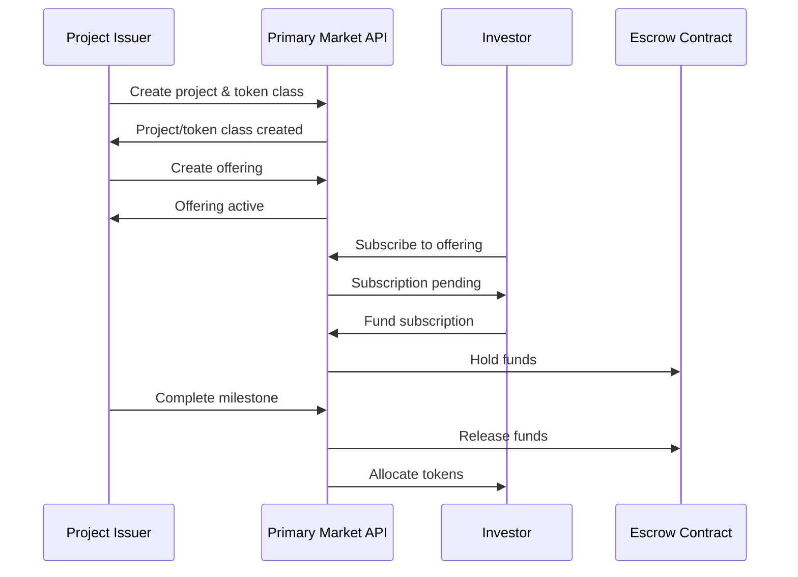
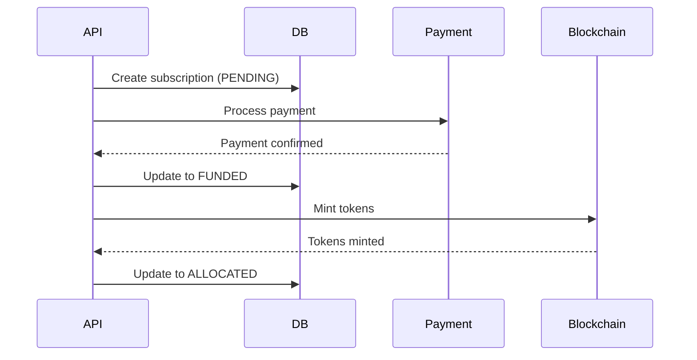



# Primary Market API Documentation

_Based on OpenAPI specification: primary-market.yaml_

## Executive Summary

**Audience:** Stakeholders

- Business value proposition: Complete primary market platform for tokenized asset issuance; enables secure, compliant fundraising through project setup, token creation, offerings, subscriptions, and milestone-based fund releases.
- Key capabilities: Project governance, token class definitions, subscription flows with escrow, milestone certification, and automated token allocation.
- Strategic importance: Democratizes asset tokenization, reduces issuance costs, ensures regulatory compliance, and builds trust through transparent escrow and milestone tracking.

## Service Overview

**Audience:** All

- Business Purpose:

  - Manage tokenized asset projects with governance and metadata.
  - Define token classes with standards, rights, and transfer restrictions.
  - Create and manage offerings with pricing, caps, and timelines.
  - Handle investor subscriptions with payment attachment and token allocation.
  - Implement milestone-based escrow releases for project funding.
  - Provide audit trails for compliance and investor protection.

- Technical Architecture:
  - RESTful API with org-scoped multi-tenancy.
  - Event-driven subscription flows (create → fund → allocate).
  - Integration with payment systems and blockchain networks.
  - Escrow smart contracts for fund holding and milestone releases.
  - Comprehensive audit logging and state machine for subscriptions/milestones.

## API Specifications

**Audience:** Technical

- Base Configuration (YAML format):

```yaml
openapi: 3.1.0
info:
  title: Quub Exchange - Primary Market Service
  version: 2.0.0
servers:
  - url: https://api.quub.exchange/v1
```

- Authentication & Authorization:
  - OAuth2 with scopes (read:primary-market, write:primary-market).
  - API key support for service integrations.
  - Org-scoped access with RBAC for project management.

## Core Endpoints

Grouped by functional area. For each endpoint below we include method, path, business use case, request and response examples, and implementation notes.

### Projects

- GET /orgs/{orgId}/projects
  - Business use case: List all projects for an organization, filtered by type or SPV.
  - Request example:

```json
GET /orgs/01234567-89ab-cdef-0123-456789abcdef/projects?type=REAL_ESTATE&limit=20
Authorization: Bearer <token>
```

- Response example (200):

```json
{
  "data": [
    {
      "id": "proj_123",
      "orgId": "org_456",
      "name": "Green Energy Project",
      "type": "REAL_ESTATE",
      "currency": "USD",
      "status": "ACTIVE",
      "createdAt": "2025-01-01T00:00:00Z"
    }
  ],
  "pagination": {
    "cursor": "next-page",
    "hasMore": true
  }
}
```

- Implementation notes:

  1. Supports filtering by project type and SPV ID.
  2. Paginated results with cursor-based navigation.
  3. Cache project lists for improved performance.
  4. Enforce org-scoped access to prevent cross-org data leakage.

- POST /orgs/{orgId}/projects
  - Business use case: Create a new project for tokenized asset issuance.
  - Request example:

```json
POST /orgs/01234567-89ab-cdef-0123-456789abcdef/projects
{
  "name": "Solar Farm Tokenization",
  "type": "ENERGY",
  "currency": "USD",
  "location": "California, USA",
  "spvId": "org_spv_789"
}
```

- Response example (201):

```json
{
  "data": {
    "id": "proj_123",
    "orgId": "org_456",
    "name": "Solar Farm Tokenization",
    "type": "ENERGY",
    "currency": "USD",
    "status": "ACTIVE",
    "createdAt": "2025-11-02T12:00:00Z"
  }
}
```

- Implementation notes:

  1. Idempotent creation with idempotency-key header.
  2. Validate project type against allowed enums.
  3. Create associated SPV if spvId provided.
  4. Trigger project setup workflows (legal docs, compliance checks).

- GET /orgs/{orgId}/projects/{projectId}
  - Business use case: Retrieve detailed information about a specific project.
  - Request example:

```json
GET /orgs/01234567-89ab-cdef-0123-456789abcdef/projects/proj_123
Authorization: Bearer <token>
```

- Response example (200):

```json
{
  "data": {
    "id": "proj_123",
    "name": "Solar Farm Tokenization",
    "type": "ENERGY",
    "currency": "USD",
    "location": "California, USA",
    "status": "ACTIVE",
    "milestones": ["milestone_1", "milestone_2"],
    "createdAt": "2025-01-01T00:00:00Z"
  }
}
```

### Token Classes

- GET /orgs/{orgId}/token-classes
  - Business use case: List token classes defined for the organization.
  - Request example:

```json
GET /orgs/01234567-89ab-cdef-0123-456789abcdef/token-classes?chainId=1&rights=VOTING
Authorization: Bearer <token>
```

- Response example (200):

```json
{
  "data": [
    {
      "id": "tc_123",
      "orgId": "org_456",
      "standard": "ERC20",
      "rights": "VOTING",
      "transferRestricted": false,
      "decimals": 18,
      "chainId": 1,
      "contractAddr": "0x1234567890abcdef...",
      "createdAt": "2025-01-01T00:00:00Z"
    }
  ]
}
```

- Implementation notes:

  1. Filter by chainId and rights for targeted queries.
  2. Include contract deployment status.
  3. Support multiple standards (ERC20, ERC721, etc.).

- POST /orgs/{orgId}/token-classes
  - Business use case: Define a new token class for asset tokenization.
  - Request example:

```json
POST /orgs/01234567-89ab-cdef-0123-456789abcdef/token-classes
{
  "standard": "ERC20",
  "rights": "DIVIDEND",
  "transferRestricted": true,
  "decimals": 6,
  "chainId": 1
}
```

- Response example (201):

```json
{
  "data": {
    "id": "tc_123",
    "standard": "ERC20",
    "rights": "DIVIDEND",
    "transferRestricted": true,
    "decimals": 6,
    "chainId": 1,
    "status": "PENDING_DEPLOYMENT"
  }
}
```

### Offerings

- GET /orgs/{orgId}/offerings
  - Business use case: List active offerings for investment opportunities.
  - Request example:

```json
GET /orgs/01234567-89ab-cdef-0123-456789abcdef/offerings?projectId=proj_123
Authorization: Bearer <token>
```

- Response example (200):

```json
{
  "data": [
    {
      "id": "off_123",
      "projectId": "proj_123",
      "tokenClassId": "tc_123",
      "tranche": "SERIES_A",
      "price": 10.5,
      "minLot": 100,
      "hardCap": 1000000,
      "startAt": "2025-11-01T00:00:00Z",
      "endAt": "2025-12-01T00:00:00Z",
      "status": "ACTIVE"
    }
  ]
}
```

- Implementation notes:

  1. Filter by projectId and tokenClassId.
  2. Include offering status (DRAFT, ACTIVE, CLOSED).
  3. Calculate remaining capacity dynamically.

- POST /orgs/{orgId}/offerings
  - Business use case: Create a new offering for token sales.
  - Request example:

```json
POST /orgs/01234567-89ab-cdef-0123-456789abcdef/offerings
{
  "projectId": "proj_123",
  "tokenClassId": "tc_123",
  "tranche": "SERIES_A",
  "price": 10.50,
  "minLot": 100,
  "hardCap": 1000000,
  "startAt": "2025-11-01T00:00:00Z",
  "endAt": "2025-12-01T00:00:00Z"
}
```

- Response example (201):

```json
{
  "data": {
    "id": "off_123",
    "projectId": "proj_123",
    "tokenClassId": "tc_123",
    "tranche": "SERIES_A",
    "price": 10.5,
    "minLot": 100,
    "hardCap": 1000000,
    "status": "DRAFT"
  }
}
```

### Subscriptions

- POST /orgs/{orgId}/subscriptions
  - Business use case: Create an investor subscription to an offering.
  - Request example:

```json
POST /orgs/01234567-89ab-cdef-0123-456789abcdef/subscriptions
{
  "accountId": "acc_123",
  "offeringId": "off_123",
  "qty": 1000
}
```

- Response example (201):

```json
{
  "data": {
    "id": "sub_123",
    "orgId": "org_456",
    "accountId": "acc_123",
    "offeringId": "off_123",
    "qty": 1000,
    "price": 10.5,
    "totalAmount": 10500,
    "status": "PENDING",
    "subscribedAt": "2025-11-02T12:00:00Z"
  }
}
```

- Implementation notes:

  1. Idempotent with idempotency-key.
  2. Validate minLot and available capacity.
  3. Calculate totalAmount from qty \* price.

- POST /orgs/{orgId}/subscriptions/{subscriptionId}/fund
  - Business use case: Attach payment to a subscription.
  - Request example:

```json
POST /orgs/01234567-89ab-cdef-0123-456789abcdef/subscriptions/sub_123/fund
{
  "paymentRef": "txn_789"
}
```

- Response example (200):

```json
{
  "data": {
    "id": "sub_123",
    "status": "FUNDED",
    "fundedAt": "2025-11-02T12:05:00Z",
    "paymentRef": "txn_789"
  }
}
```

- POST /orgs/{orgId}/subscriptions/{subscriptionId}/allocate
  - Business use case: Mint and allocate tokens to the investor's wallet.
  - Request example:

```json
POST /orgs/01234567-89ab-cdef-0123-456789abcdef/subscriptions/sub_123/allocate
{
  "walletId": "wlt_abc123def456"
}
```

- Response example (200):

```json
{
  "data": {
    "id": "sub_123",
    "status": "ALLOCATED",
    "allocatedAt": "2025-11-02T12:10:00Z"
  }
}
```

### Milestones

- GET /orgs/{orgId}/milestones
  - Business use case: List milestones for a project to track progress and fund releases.
  - Request example:

```json
GET /orgs/01234567-89ab-cdef-0123-456789abcdef/milestones?projectId=proj_123
Authorization: Bearer <token>
```

- Response example (200):

```json
{
  "data": [
    {
      "id": "mil_123",
      "projectId": "proj_123",
      "title": "Site Acquisition",
      "escrowReleasePct": 25,
      "status": "COMPLETED",
      "completedAt": "2025-10-01T00:00:00Z"
    }
  ]
}
```

- Implementation notes:

  1. Required projectId filter.
  2. Include escrow release percentages.
  3. Status tracking (PENDING, IN_PROGRESS, COMPLETED).

- POST /orgs/{orgId}/milestones
  - Business use case: Create a milestone for fund release upon completion.
  - Request example:

```json
POST /orgs/01234567-89ab-cdef-0123-456789abcdef/milestones
{
  "projectId": "proj_123",
  "name": "Construction Phase 1",
  "escrowReleasePct": 30,
  "targetDay": 90
}
```

- Response example (201):

```json
{
  "data": {
    "id": "mil_123",
    "projectId": "proj_123",
    "title": "Construction Phase 1",
    "escrowReleasePct": 30,
    "status": "PENDING"
  }
}
```

## Security Implementation

**Audience:** Technical + Project Teams

- Multi-tenant isolation:
  - All endpoints require orgId path param and header.
  - Enforce org membership via OAuth2 claims.

```yaml
multiTenant:
  enforceOrgScope: true
  orgHeader: X-Org-Id
```

- Data protection measures:

  - Encrypted storage for sensitive project metadata.
  - Audit logs for all subscription and milestone changes.
  - Rate limiting per org to prevent abuse.

- Access Controls:

```json
{ "roles": ["primary_market_admin", "investor", "project_manager"] }
```

## Business Workflows

**Audience:** Stakeholders + Project Teams

### Primary Workflow — Token Issuance (Mermaid)



- Business value: Secure, transparent token issuance with escrow protection.
- Success metrics: 99.9% fund security, <2% failed allocations, 95% milestone completion rate.

### Secondary Workflow — Subscription Flow



## Integration Guide

**Audience:** Project Teams

- Development Setup:

```bash
npm install axios
export API_BASE=https://api.quub.exchange/v1
export ORG_ID=your-org-id
```

- JavaScript/Node.js example (create subscription):

```javascript
import axios from "axios";

async function createSubscription(orgId, token, subscriptionData) {
  const response = await axios.post(
    `/orgs/${orgId}/subscriptions`,
    subscriptionData,
    { headers: { Authorization: `Bearer ${token}` } }
  );
  return response.data;
}

// usage
createSubscription("org-uuid", "TOKEN", {
  accountId: "acc-123",
  offeringId: "off-456",
  qty: 100,
});
```

- Python example (fund subscription):

```python
import requests

def fund_subscription(org_id, sub_id, token, payment_ref):
    url = f'https://api.quub.exchange/v1/orgs/{org_id}/subscriptions/{sub_id}/fund'
    headers = {'Authorization': f'Bearer {token}'}
    data = {'paymentRef': payment_ref}
    r = requests.post(url, json=data, headers=headers)
    return r.json()

# usage
fund_subscription('org-uuid', 'sub-123', 'TOKEN', 'txn-789')
```

## Error Handling

**Audience:** Technical + Project Teams

- Standard error response:

```json
{
  "error": {
    "code": "ValidationError",
    "message": "Invalid offering parameters",
    "details": [
      { "field": "hardCap", "message": "Must be greater than softCap" }
    ]
  }
}
```

- Error codes:

  - BadRequest (400) — Invalid input data
  - Unauthorized (401) — Missing/invalid auth
  - Forbidden (403) — Insufficient permissions
  - NotFound (404) — Resource not found
  - Conflict (409) — Idempotency conflict
  - ValidationError (422) — Business rule violation
  - TooManyRequests (429) — Rate limit exceeded

- Best practices:
  1. Use idempotency keys for safe retries.
  2. Handle 409 conflicts by checking existing resources.
  3. Implement exponential backoff for transient errors.

## Implementation Checklist

**Audience:** Project Teams

- Pre-Development:

  - [ ] Confirm legal and regulatory requirements for token issuance
  - [ ] Set up escrow smart contracts
  - [ ] Define project types and token standards

- Development Phase:

  - [ ] Implement CRUD operations for projects/token classes
  - [ ] Add subscription state machine (PENDING→FUNDED→ALLOCATED)
  - [ ] Integrate with payment and blockchain providers

- Testing Phase:

  - [ ] Unit tests for business logic and validations
  - [ ] Integration tests with payment/blockchain mocks
  - [ ] End-to-end tests for complete issuance flows

- Production Readiness:
  - [ ] Security audit for escrow and token minting
  - [ ] Monitoring for subscription failures and delays
  - [ ] Backup and disaster recovery for fund data

## Monitoring & Observability

**Audience:** Technical + Project Teams

- Key metrics:

  - subscription_success_rate (target: >98%)
  - avg_allocation_time_ms (target: <5000ms)
  - escrow_balance_accuracy (target: 100%)
  - milestone_completion_rate (target: >90%)

- Logging example:

```json
{
  "timestamp": "2025-11-02T12:00:00Z",
  "orgId": "org-uuid",
  "event": "subscription.allocated",
  "subscriptionId": "sub-123",
  "offeringId": "off-456",
  "qty": 1000
}
```

- Alerts:
  - Subscription failure rate > 5% for 10m
  - Escrow balance mismatch detected
  - Milestone overdue by 7 days

## API Versioning & Evolution

**Audience:** All

- Current Version: v1 (stable)
- Planned Enhancements (v1.1): Secondary market integration, automated KYC checks.
- Breaking Changes (v2.0): Event-driven architecture with webhooks for real-time updates.

## Additional Resources

**Audience:** All

- Stakeholders:

  - Token issuance guide: /docs/primary-market/issuance
  - Regulatory compliance: /docs/primary-market/compliance

- Technical:

  - OpenAPI spec: /openapi/primary-market.yaml
  - Smart contract templates: /contracts/escrow

- Project teams:
  - Integration examples: /examples/primary-market
  - Troubleshooting: /docs/primary-market/troubleshooting

## Footer

For support with token issuance or escrow issues, contact the primary market team with orgId, subscriptionId, and error details.
