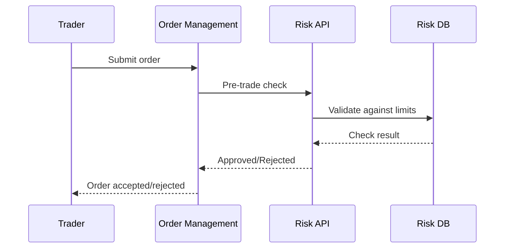
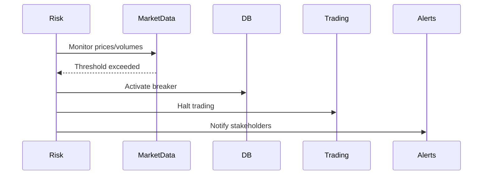



# Risk & Limits API Documentation

_Based on OpenAPI specification: risk-limits.yaml_

## Executive Summary

**Audience:** Stakeholders

- Business value proposition: Comprehensive risk management framework for trading operations; prevents losses through configurable limits, pre-trade validations, and market circuit breakers.
- Key capabilities: Quantitative risk limits (order size, position exposure), real-time pre-trade checks, automated circuit breaker triggers for market volatility.
- Strategic importance: Ensures regulatory compliance, protects capital, maintains market stability, and builds trader confidence through transparent risk controls.

## Service Overview

**Audience:** All

- Business Purpose:

  - Define and enforce quantitative risk limits per organization.
  - Perform pre-trade risk validations before order execution.
  - Monitor market conditions and trigger circuit breakers during volatility.
  - Provide audit trails for risk decisions and limit breaches.
  - Support multi-asset risk management across equities, crypto, and commodities.

- Technical Architecture:
  - RESTful API with real-time risk evaluation engine.
  - Integration with order management and market data feeds.
  - Event-driven circuit breaker activation with automated trading halts.
  - Persistent storage for limit configurations and breach history.
  - High-performance caching for sub-millisecond pre-trade checks.

## API Specifications

**Audience:** Technical

- Base Configuration (YAML format):

```yaml
openapi: 3.1.0
info:
  title: Quub Exchange - Risk & Limits API
  version: 2.0.0
servers:
  - url: https://api.quub.exchange/v1
```

- Authentication & Authorization:
  - OAuth2 scopes (read:risk, write:risk) for risk management access.
  - API key support for automated trading systems.
  - Org-scoped permissions with admin controls for limit updates.

## Core Endpoints

Grouped by functional area. For each endpoint below we include method, path, business use case, request and response examples, and implementation notes.

### Risk Limits

- GET /orgs/{orgId}/risk/limits
  - Business use case: Retrieve current risk limit configurations for compliance and monitoring.
  - Request example:

```json
GET /orgs/01234567-89ab-cdef-0123-456789abcdef/risk/limits
Authorization: Bearer <token>
```

- Response example (200):

```json
{
  "data": [
    {
      "id": "limit_123",
      "limitType": "ORDER_SIZE",
      "maxValue": 1000000,
      "currency": "USD",
      "updatedAt": "2025-11-02T10:00:00Z"
    },
    {
      "id": "limit_456",
      "limitType": "DAILY_VOLUME",
      "maxValue": 50000000,
      "currency": "USD",
      "updatedAt": "2025-11-01T00:00:00Z"
    }
  ]
}
```

- Implementation notes:

  1. Returns all active limits for the organization.
  2. Cache limits for fast access during pre-trade checks.
  3. Include last updated timestamp for audit purposes.

- PUT /orgs/{orgId}/risk/limits
  - Business use case: Update risk limit configurations for changing market conditions or regulatory requirements.
  - Request example:

```json
PUT /orgs/01234567-89ab-cdef-0123-456789abcdef/risk/limits
{
  "limits": [
    {
      "limitType": "ORDER_SIZE",
      "maxValue": 2000000,
      "currency": "USD"
    },
    {
      "limitType": "POSITION_SIZE",
      "maxValue": 10000000,
      "currency": "USD"
    }
  ]
}
```

- Response example (200):

```json
{
  "message": "Risk limits updated successfully"
}
```

- Implementation notes:
  1. Validate limit values against business rules (e.g., max order size < position size).
  2. Invalidate cached limits after updates.
  3. Log all limit changes for audit compliance.
  4. Support partial updates (only changed limits need to be included).

### Pre-Trade Checks

- POST /orgs/{orgId}/risk/pre-trade-check
  - Business use case: Validate trading orders against risk limits before execution to prevent breaches.
  - Request example:

```json
POST /orgs/01234567-89ab-cdef-0123-456789abcdef/risk/pre-trade-check
{
  "symbol": "BTC-USD",
  "side": "BUY",
  "quantity": 5.0,
  "price": 45000.0
}
```

- Response example (200 - approved):

```json
{
  "approved": true,
  "reason": null,
  "limitBreaches": []
}
```

- Response example (200 - rejected):

```json
{
  "approved": false,
  "reason": "Order size exceeds maximum limit",
  "limitBreaches": [
    {
      "id": "limit_123",
      "limitType": "ORDER_SIZE",
      "maxValue": 1000000,
      "currency": "USD"
    }
  ]
}
```

- Implementation notes:
  1. Synchronous validation with <100ms response time.
  2. Check against multiple limit types (order size, position exposure, daily volume).
  3. Include detailed breach information for client handling.
  4. Log all checks for risk monitoring and analytics.

### Circuit Breakers

- GET /orgs/{orgId}/risk/circuit-breakers
  - Business use case: Monitor market circuit breaker status for volatility management and trading halts.
  - Request example:

```json
GET /orgs/01234567-89ab-cdef-0123-456789abcdef/risk/circuit-breakers
Authorization: Bearer <token>
```

- Response example (200):

```json
{
  "data": [
    {
      "symbol": "BTC-USD",
      "triggerType": "PRICE_DROP",
      "threshold": 10,
      "active": false,
      "triggeredAt": null
    },
    {
      "symbol": "ETH-USD",
      "triggerType": "VOLUME_SURGE",
      "threshold": 200,
      "active": true,
      "triggeredAt": "2025-11-02T09:30:00Z"
    }
  ]
}
```

- Implementation notes:
  1. Real-time status of all configured circuit breakers.
  2. Include trigger timestamps for incident response.
  3. Support multiple trigger types (price movements, volume spikes).
  4. Integrate with market data feeds for automatic activation.

## Security Implementation

**Audience:** Technical + Project Teams

- Multi-tenant isolation:
  - Org-scoped risk configurations prevent cross-contamination.
  - Enforce org membership for all risk operations.

```yaml
multiTenant:
  enforceOrgScope: true
  riskIsolation: true
```

- Data protection measures:

  - Encrypted storage for sensitive limit configurations.
  - Audit logging for all risk decisions and limit changes.
  - Rate limiting on pre-trade checks to prevent abuse.

- Access Controls:

```json
{ "roles": ["risk_admin", "trading_desk", "compliance_officer"] }
```

## Business Workflows

**Audience:** Stakeholders + Project Teams

### Primary Workflow — Pre-Trade Risk Check (Mermaid)



- Business value: Prevents unauthorized trades and ensures compliance with risk policies.
- Success metrics: 99.9% check availability, <50ms average response time, <0.1% false rejections.

### Secondary Workflow — Circuit Breaker Activation



## Integration Guide

**Audience:** Project Teams

- Development Setup:

```bash
npm install axios
export RISK_API_URL=https://api.quub.exchange/v1
export ORG_ID=your-org-id
```

- JavaScript/Node.js example (pre-trade check):

```javascript
import axios from "axios";

async function checkTrade(orgId, token, tradeData) {
  const response = await axios.post(
    `/orgs/${orgId}/risk/pre-trade-check`,
    tradeData,
    { headers: { Authorization: `Bearer ${token}` } }
  );
  return response.data;
}

// usage
const result = await checkTrade("org-uuid", "TOKEN", {
  symbol: "BTC-USD",
  side: "BUY",
  quantity: 1.5,
  price: 45000,
});
if (!result.approved) {
  console.log("Trade rejected:", result.reason);
}
```

- Python example (get limits):

```python
import requests

def get_risk_limits(org_id, token):
    url = f'https://api.quub.exchange/v1/orgs/{org_id}/risk/limits'
    headers = {'Authorization': f'Bearer {token}'}
    r = requests.get(url, headers=headers)
    return r.json()['data']

# usage
limits = get_risk_limits('org-uuid', 'TOKEN')
for limit in limits:
    print(f"{limit['limitType']}: {limit['maxValue']} {limit['currency']}")
```

## Error Handling

**Audience:** Technical + Project Teams

- Standard error response:

```json
{
  "error": {
    "code": "ValidationError",
    "message": "Invalid limit configuration",
    "details": [{ "field": "maxValue", "message": "Must be positive number" }]
  }
}
```

- Error codes:

  - BadRequest (400) — Invalid input parameters
  - Unauthorized (401) — Authentication failure
  - Forbidden (403) — Insufficient permissions
  - Conflict (409) — Concurrent limit update
  - ValidationError (422) — Business rule violation
  - TooManyRequests (429) — Rate limit exceeded

- Best practices:
  1. Implement retry logic with exponential backoff for 429/500 errors.
  2. Cache limit configurations locally to reduce API calls.
  3. Handle pre-trade check failures gracefully (e.g., manual approval).

## Implementation Checklist

**Audience:** Project Teams

- Pre-Development:

  - [ ] Define risk limit types and default values
  - [ ] Configure circuit breaker thresholds
  - [ ] Set up monitoring and alerting for breaches

- Development Phase:

  - [ ] Implement limit CRUD operations
  - [ ] Add pre-trade validation logic
  - [ ] Integrate circuit breaker monitoring

- Testing Phase:

  - [ ] Unit tests for limit calculations
  - [ ] Integration tests with order flow
  - [ ] Stress tests for high-volume pre-trade checks

- Production Readiness:
  - [ ] Security review for risk data handling
  - [ ] Performance optimization for <10ms checks
  - [ ] Backup and failover for risk engine

## Monitoring & Observability

**Audience:** Technical + Project Teams

- Key metrics:

  - pre_trade_check_latency_ms (target: <50ms)
  - limit_breach_rate (target: <1%)
  - circuit_breaker_activation_count (target: minimize)
  - risk_api_availability (target: >99.9%)

- Logging example:

```json
{
  "timestamp": "2025-11-02T12:00:00Z",
  "orgId": "org-uuid",
  "event": "pre_trade_check",
  "symbol": "BTC-USD",
  "approved": false,
  "reason": "Order size limit exceeded",
  "checkDurationMs": 25
}
```

- Alerts:
  - Pre-trade check latency > 100ms for 5m
  - Limit breach rate > 5% for 10m
  - Circuit breaker activated unexpectedly

## API Versioning & Evolution

**Audience:** All

- Current Version: v1 (stable)
- Planned Enhancements (v1.1): Machine learning-based dynamic limits, cross-asset correlation checks.
- Breaking Changes (v2.0): Real-time streaming risk updates via WebSockets.

## Additional Resources

**Audience:** All

- Stakeholders:

  - Risk policy guide: /docs/risk/policy
  - Regulatory requirements: /docs/risk/compliance

- Technical:

  - OpenAPI spec: /openapi/risk-limits.yaml
  - Risk calculation formulas: /docs/risk/formulas

- Project teams:
  - Integration patterns: /examples/risk-integration
  - Troubleshooting: /docs/risk/troubleshooting

## Footer

For risk-related incidents or limit configuration issues, contact the risk management team with orgId, timestamp, and breach details.
