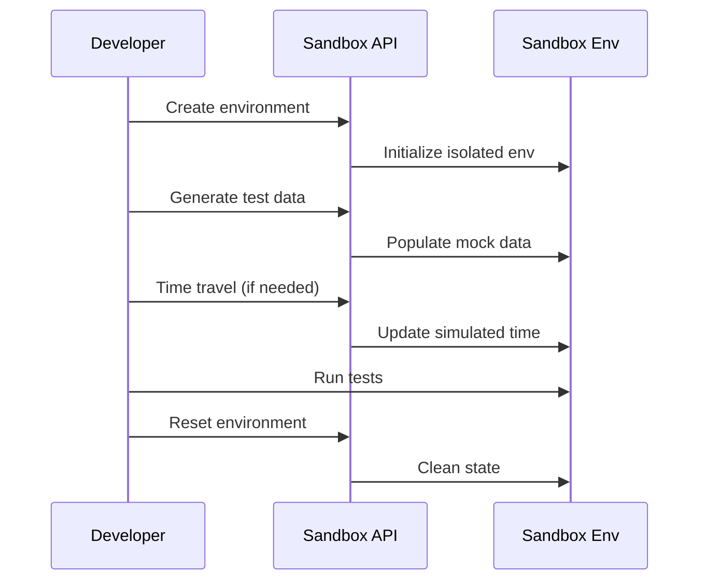
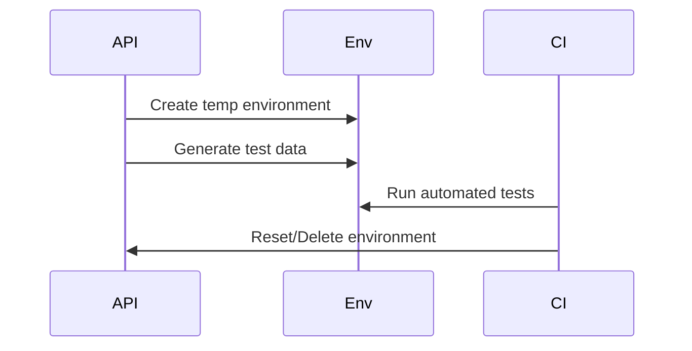



# Sandbox & Test Harness API Documentation

_Based on OpenAPI specification: sandbox.yaml_

## Executive Summary

**Audience:** Stakeholders

- Business value proposition: Isolated testing environments for safe development and integration; enables comprehensive testing without production risk.
- Key capabilities: Multiple sandbox environments, automated mock data generation, time travel simulation, and safe environment resets.
- Strategic importance: Accelerates development cycles, ensures integration quality, reduces production incidents, and supports regulatory testing requirements.

## Service Overview

**Audience:** All

- Business Purpose:

  - Create isolated environments for development and testing.
  - Generate realistic mock data for accounts, projects, tokens, and orders.
  - Simulate time-dependent scenarios with time travel functionality.
  - Safely reset environments to clean states for repeatable testing.
  - Support parallel development teams with independent test environments.

- Technical Architecture:
  - Isolated sandbox environments with dedicated databases and blockchains.
  - Mock data generators for realistic test scenarios.
  - Time simulation engine for testing temporal logic.
  - Environment lifecycle management (create, reset, delete).
  - Integration with production APIs for seamless testing.

## API Specifications

**Audience:** Technical

- Base Configuration (YAML format):

```yaml
openapi: 3.1.0
info:
  title: Quub Exchange - Sandbox & Test Harness API
  version: 2.0.0
servers:
  - url: https://sandbox-api.quub.exchange/v1
```

- Authentication & Authorization:
  - OAuth2 scopes (read:sandbox, write:sandbox, admin:sandbox).
  - API key support for CI/CD pipelines.
  - User-scoped environment access with admin controls.

## Core Endpoints

Grouped by functional area. For each endpoint below we include method, path, business use case, request and response examples, and implementation notes.

### Environments

- GET /sandbox/envs
  - Business use case: List all accessible sandbox environments for environment management.
  - Request example:

```json
GET /sandbox/envs?limit=20
Authorization: Bearer <token>
```

- Response example (200):

```json
{
  "data": [
    {
      "id": "9d2a5a64-7e10-4a7f-b213-7e0bfc6b5e5f",
      "name": "Dev Team Sandbox",
      "status": "ACTIVE",
      "currentTime": "2025-11-02T12:00:00Z",
      "createdAt": "2025-10-01T08:00:00Z",
      "updatedAt": "2025-11-02T10:00:00Z"
    }
  ],
  "pagination": {
    "cursor": "next-page",
    "hasMore": false
  }
}
```

- Implementation notes:

  1. Returns environments owned by or shared with the authenticated user.
  2. Includes status and current simulated time.
  3. Paginated for large numbers of environments.

- POST /sandbox/envs
  - Business use case: Create a new isolated sandbox environment for testing.
  - Request example:

```json
POST /sandbox/envs
{
  "name": "Integration Test Environment"
}
```

- Response example (201):

```json
{
  "data": {
    "id": "9d2a5a64-7e10-4a7f-b213-7e0bfc6b5e5f",
    "name": "Integration Test Environment",
    "status": "ACTIVE",
    "currentTime": "2025-11-02T12:00:00Z",
    "createdAt": "2025-11-02T12:00:00Z",
    "updatedAt": "2025-11-02T12:00:00Z"
  }
}
```

- Implementation notes:

  1. Creates isolated database and blockchain instances.
  2. Initializes with clean state and default configurations.
  3. Returns environment ID for subsequent operations.

- GET /sandbox/envs/{envId}
  - Business use case: Retrieve detailed information about a specific sandbox environment.
  - Request example:

```json
GET /sandbox/envs/9d2a5a64-7e10-4a7f-b213-7e0bfc6b5e5f
Authorization: Bearer <token>
```

- Response example (200):

```json
{
  "data": {
    "id": "9d2a5a64-7e10-4a7f-b213-7e0bfc6b5e5f",
    "name": "Dev Team Sandbox",
    "status": "ACTIVE",
    "currentTime": "2025-11-02T12:00:00Z",
    "createdAt": "2025-10-01T08:00:00Z",
    "updatedAt": "2025-11-02T10:00:00Z",
    "metadata": {
      "network": "sandbox-chain",
      "version": "v1.0.0"
    }
  }
}
```

- DELETE /sandbox/envs/{envId}
  - Business use case: Permanently delete a sandbox environment and all test data.
  - Request example:

```json
DELETE /sandbox/envs/9d2a5a64-7e10-4a7f-b213-7e0bfc6b5e5f
Authorization: Bearer <token>
```

- Response example (204):

```json
// No content
```

- Implementation notes:
  1. Requires admin permissions.
  2. Permanently removes all data and resources.
  3. Cannot be undone.

### Test Data

- POST /sandbox/envs/{envId}/generate-data
  - Business use case: Populate the environment with mock data for comprehensive testing.
  - Request example:

```json
POST /sandbox/envs/9d2a5a64-7e10-4a7f-b213-7e0bfc6b5e5f/generate-data
{
  "dataTypes": ["accounts", "projects", "tokens", "orders"],
  "count": 50
}
```

- Response example (201):

```json
{
  "data": {
    "id": "9d2a5a64-7e10-4a7f-b213-7e0bfc6b5e5f",
    "name": "Dev Team Sandbox",
    "status": "ACTIVE",
    "currentTime": "2025-11-02T12:00:00Z",
    "metadata": {
      "generatedData": {
        "accounts": 50,
        "projects": 10,
        "tokens": 25,
        "orders": 100
      }
    }
  }
}
```

- Implementation notes:
  1. Generates realistic mock data based on selected types.
  2. Configurable count per data type.
  3. Maintains referential integrity between generated entities.

### Time Travel

- POST /sandbox/envs/{envId}/time-travel
  - Business use case: Simulate time progression for testing time-dependent features like expirations or milestones.
  - Request example:

```json
POST /sandbox/envs/9d2a5a64-7e10-4a7f-b213-7e0bfc6b5e5f/time-travel
{
  "timestamp": "2025-12-01T12:00:00Z"
}
```

- Response example (200):

```json
{
  "data": {
    "id": "9d2a5a64-7e10-4a7f-b213-7e0bfc6b5e5f",
    "name": "Dev Team Sandbox",
    "status": "ACTIVE",
    "currentTime": "2025-12-01T12:00:00Z",
    "updatedAt": "2025-11-02T12:05:00Z"
  }
}
```

- Implementation notes:
  1. Updates the environment's simulated clock.
  2. Triggers time-dependent events and calculations.
  3. Supports both forward and backward time travel.

### Reset

- POST /sandbox/envs/{envId}/reset
  - Business use case: Reset the environment to clean state for repeatable testing scenarios.
  - Request example:

```json
POST /sandbox/envs/9d2a5a64-7e10-4a7f-b213-7e0bfc6b5e5f/reset
```

- Response example (200):

```json
{
  "data": {
    "id": "9d2a5a64-7e10-4a7f-b213-7e0bfc6b5e5f",
    "name": "Dev Team Sandbox",
    "status": "ACTIVE",
    "currentTime": "2025-11-02T12:00:00Z",
    "updatedAt": "2025-11-02T12:10:00Z"
  }
}
```

- Implementation notes:
  1. Clears all generated data while preserving environment configuration.
  2. Resets simulated time to current real time.
  3. Maintains environment metadata and settings.

## Security Implementation

**Audience:** Technical + Project Teams

- Multi-tenant isolation:
  - User-scoped environments prevent cross-user data access.
  - Isolated databases and blockchains per environment.

```yaml
multiTenant:
  enforceUserScope: true
  environmentIsolation: true
```

- Data protection measures:

  - Sandbox data is clearly marked as test data.
  - Audit logging for environment lifecycle events.
  - Rate limiting on data generation to prevent abuse.

- Access Controls:

```json
{ "roles": ["sandbox_user", "sandbox_admin", "developer"] }
```

## Business Workflows

**Audience:** Stakeholders + Project Teams

### Primary Workflow — Development Testing (Mermaid)



- Business value: Enables safe, repeatable testing without production impact.
- Success metrics: 99% environment availability, <5min setup time, 100% data isolation.

### Secondary Workflow — CI/CD Integration



## Integration Guide

**Audience:** Project Teams

- Development Setup:

```bash
npm install axios
export SANDBOX_API_URL=https://sandbox-api.quub.exchange/v1
```

- JavaScript/Node.js example (create environment):

```javascript
import axios from "axios";

async function createSandbox(token, name) {
  const response = await axios.post(
    "/sandbox/envs",
    { name },
    { headers: { Authorization: `Bearer ${token}` } }
  );
  return response.data.data;
}

// usage
const env = await createSandbox("TOKEN", "My Test Env");
console.log("Created env:", env.id);
```

- Python example (generate data):

```python
import requests

def generate_test_data(env_id, token, data_types, count=100):
    url = f'https://sandbox-api.quub.exchange/v1/sandbox/envs/{env_id}/generate-data'
    headers = {'Authorization': f'Bearer {token}'}
    data = {'dataTypes': data_types, 'count': count}
    r = requests.post(url, json=data, headers=headers)
    return r.json()

# usage
result = generate_test_data('env-uuid', 'TOKEN', ['accounts', 'orders'], 50)
```

## Error Handling

**Audience:** Technical + Project Teams

- Standard error response:

```json
{
  "error": {
    "code": "ValidationError",
    "message": "Invalid timestamp for time travel",
    "details": [
      { "field": "timestamp", "message": "Cannot travel to past date" }
    ]
  }
}
```

- Error codes:

  - BadRequest (400) — Invalid parameters
  - Unauthorized (401) — Authentication failure
  - Forbidden (403) — Insufficient permissions
  - NotFound (404) — Environment not found
  - Conflict (409) — Environment in use
  - ValidationError (422) — Business rule violation
  - TooManyRequests (429) — Rate limit exceeded

- Best practices:
  1. Check environment status before operations.
  2. Handle 409 conflicts by waiting or using different environment.
  3. Implement cleanup in CI/CD to avoid resource leaks.

## Implementation Checklist

**Audience:** Project Teams

- Pre-Development:

  - [ ] Define environment resource limits
  - [ ] Configure mock data templates
  - [ ] Set up monitoring for environment usage

- Development Phase:

  - [ ] Implement environment CRUD operations
  - [ ] Add data generation logic
  - [ ] Integrate time travel functionality

- Testing Phase:

  - [ ] Test environment isolation
  - [ ] Validate data generation quality
  - [ ] Stress test concurrent environments

- Production Readiness:
  - [ ] Security audit for data isolation
  - [ ] Resource monitoring and auto-cleanup
  - [ ] Backup strategy for critical test data

## Monitoring & Observability

**Audience:** Technical + Project Teams

- Key metrics:

  - active_environments_count (target: <100 per user)
  - data_generation_time_ms (target: <30s)
  - environment_uptime_pct (target: >99%)
  - reset_operation_success_rate (target: >98%)

- Logging example:

```json
{
  "timestamp": "2025-11-02T12:00:00Z",
  "userId": "user-uuid",
  "event": "environment.created",
  "envId": "env-uuid",
  "envName": "Test Environment"
}
```

- Alerts:
  - Environment creation failure rate > 5%
  - Data generation taking > 5min
  - Resource usage exceeding limits

## API Versioning & Evolution

**Audience:** All

- Current Version: v1 (stable)
- Planned Enhancements (v1.1): Snapshot/restore functionality, advanced data scenarios.
- Breaking Changes (v2.0): Multi-environment orchestration for complex test suites.

## Additional Resources

**Audience:** All

- Stakeholders:

  - Testing best practices: /docs/sandbox/best-practices
  - Environment limits: /docs/sandbox/limits

- Technical:

  - OpenAPI spec: /openapi/sandbox.yaml
  - Mock data schemas: /schemas/sandbox

- Project teams:
  - CI/CD integration: /examples/sandbox-ci
  - Troubleshooting: /docs/sandbox/troubleshooting

## Footer

For sandbox environment issues or resource limits, contact the platform engineering team with envId and timestamps.
