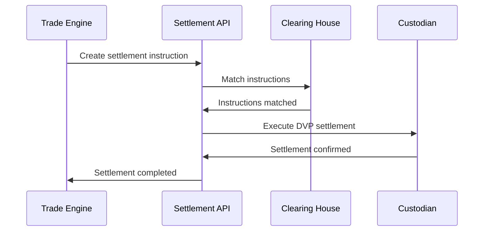
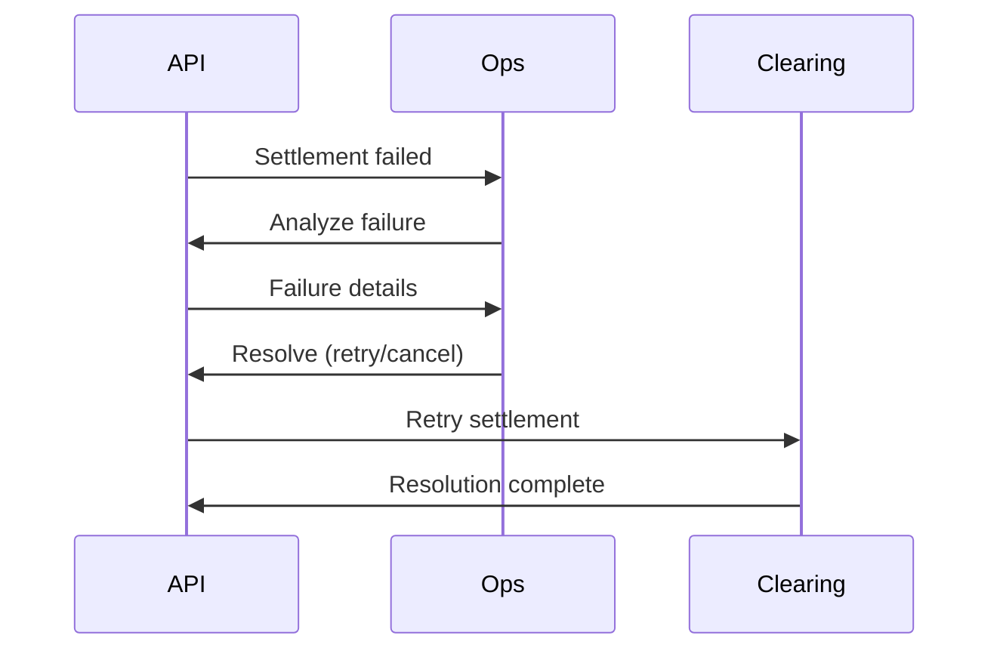



# Settlement & Clearing API Documentation

_Based on OpenAPI specification: settlements.yaml_

## Executive Summary

**Audience:** Stakeholders

- Business value proposition: Complete settlement and clearing infrastructure for secure, efficient trade settlement; supports multiple settlement models and cycles with comprehensive failure handling.
- Key capabilities: Settlement instructions management, real-time status tracking, netting calculations, batch processing, and failed trade resolution.
- Strategic importance: Ensures regulatory compliance, reduces settlement risk, enables T+0 to T+2 settlement cycles, and provides audit trails for financial reporting.

## Service Overview

**Audience:** All

- Business Purpose:

  - Manage settlement instructions for trades and transfers.
  - Track settlement lifecycle from pending to settled.
  - Perform netting calculations to optimize cash and asset movements.
  - Handle failed settlements with automated retry and manual resolution.
  - Provide settlement calendars and business day calculations.
  - Support multiple settlement models (DVP, DAP, RVP, FOP).

- Technical Architecture:
  - Event-driven settlement processing with state machines.
  - Integration with custodians, payment systems, and blockchains.
  - Real-time settlement status updates and notifications.
  - Comprehensive audit logging for regulatory compliance.
  - High-throughput batch processing for end-of-day settlements.

## API Specifications

**Audience:** Technical

- Base Configuration (YAML format):

```yaml
openapi: 3.1.0
info:
  title: Quub Exchange - Settlement & Clearing API
  version: 2.0.0
servers:
  - url: https://api.quub.exchange/v1
```

- Authentication & Authorization:
  - OAuth2 scopes (read:settlements, write:settlements, admin:settlements).
  - API key support for settlement processors.
  - Org-scoped access with role-based permissions for settlement operations.

## Core Endpoints

Grouped by functional area. For each endpoint below we include method, path, business use case, request and response examples, and implementation notes.

### Settlement Instructions

- GET /orgs/{orgId}/settlements/instructions
  - Business use case: List settlement instructions for monitoring and reconciliation.
  - Request example:

```json
GET /orgs/01234567-89ab-cdef-0123-456789abcdef/settlements/instructions?status=PENDING&settlementDate=2025-11-02
Authorization: Bearer <token>
```

- Response example (200):

```json
{
  "data": [
    {
      "id": "instr_123",
      "orgId": "org_456",
      "tradeId": "trade_789",
      "settlementType": "DVP",
      "settlementDate": "2025-11-02",
      "status": "PENDING",
      "deliveryAccount": "acc_deliver",
      "receivingAccount": "acc_receive",
      "assetId": "asset_123",
      "quantity": "1000",
      "cashAmount": "50000",
      "currency": "USD",
      "counterpartyId": "org_counter",
      "cycle": "T+2",
      "createdAt": "2025-11-01T10:00:00Z"
    }
  ],
  "pagination": {
    "cursor": "next-page",
    "hasMore": false
  }
}
```

- Implementation notes:

  1. Supports filtering by status, settlement date, and counterparty.
  2. Paginated results for large instruction volumes.
  3. Includes settlement cycle and model information.

- POST /orgs/{orgId}/settlements/instructions
  - Business use case: Create settlement instructions for trades requiring settlement.
  - Request example:

```json
POST /orgs/01234567-89ab-cdef-0123-456789abcdef/settlements/instructions
{
  "tradeId": "trade_789",
  "settlementType": "DVP",
  "settlementDate": "2025-11-02",
  "deliveryAccount": "acc_deliver",
  "receivingAccount": "acc_receive",
  "notes": "Standard settlement"
}
```

- Response example (201):

```json
{
  "data": {
    "id": "instr_123",
    "orgId": "org_456",
    "tradeId": "trade_789",
    "settlementType": "DVP",
    "settlementDate": "2025-11-02",
    "status": "PENDING",
    "deliveryAccount": "acc_deliver",
    "receivingAccount": "acc_receive",
    "createdAt": "2025-11-01T10:00:00Z"
  }
}
```

- Implementation notes:

  1. Validates trade exists and settlement parameters.
  2. Automatically calculates settlement cycle based on asset type.
  3. Triggers matching process for counterparty instructions.

- GET /orgs/{orgId}/settlements/instructions/{instructionId}
  - Business use case: Retrieve detailed information about a specific settlement instruction.
  - Request example:

```json
GET /orgs/01234567-89ab-cdef-0123-456789abcdef/settlements/instructions/instr_123
Authorization: Bearer <token>
```

- Response example (200):

```json
{
  "data": {
    "id": "instr_123",
    "orgId": "org_456",
    "tradeId": "trade_789",
    "settlementType": "DVP",
    "settlementDate": "2025-11-02",
    "status": "SETTLED",
    "settledAt": "2025-11-02T15:30:00Z",
    "deliveryAccount": "acc_deliver",
    "receivingAccount": "acc_receive",
    "assetId": "asset_123",
    "quantity": "1000",
    "cashAmount": "50000",
    "currency": "USD"
  }
}
```

- PUT /orgs/{orgId}/settlements/instructions/{instructionId}
  - Business use case: Update settlement instruction status or priority.
  - Request example:

```json
PUT /orgs/01234567-89ab-cdef-0123-456789abcdef/settlements/instructions/instr_123
{
  "status": "AFFIRMED",
  "priority": "HIGH",
  "notes": "Urgent settlement required"
}
```

- Response example (200):

```json
{
  "data": {
    "id": "instr_123",
    "status": "AFFIRMED",
    "priority": "HIGH",
    "notes": "Urgent settlement required",
    "updatedAt": "2025-11-01T11:00:00Z"
  }
}
```

### Settlement Status

- GET /orgs/{orgId}/settlements/status
  - Business use case: Get settlement status overview for a specific date.
  - Request example:

```json
GET /orgs/01234567-89ab-cdef-0123-456789abcdef/settlements/status?settlementDate=2025-11-02
Authorization: Bearer <token>
```

- Response example (200):

```json
{
  "data": {
    "settlementDate": "2025-11-02",
    "totalInstructions": 150,
    "pending": 20,
    "matched": 50,
    "settled": 75,
    "failed": 5,
    "totalValue": "2500000",
    "currency": "USD"
  }
}
```

- Implementation notes:

  1. Aggregates status across all instructions for the date.
  2. Provides real-time settlement metrics.
  3. Supports multiple currencies with conversion.

- GET /settlements/calendar
  - Business use case: Retrieve settlement calendar with business days and holidays.
  - Request example:

```json
GET /settlements/calendar?startDate=2025-11-01&endDate=2025-11-30
Authorization: Bearer <token>
```

- Response example (200):

```json
{
  "data": {
    "entries": [
      {
        "date": "2025-11-02",
        "isBusinessDay": true,
        "market": "US",
        "holidays": []
      },
      {
        "date": "2025-11-11",
        "isBusinessDay": false,
        "market": "US",
        "holidays": ["Veterans Day"]
      }
    ],
    "startDate": "2025-11-01",
    "endDate": "2025-11-30"
  }
}
```

### Netting

- POST /orgs/{orgId}/settlements/netting
  - Business use case: Calculate netting to optimize settlement obligations between counterparties.
  - Request example:

```json
POST /orgs/01234567-89ab-cdef-0123-456789abcdef/settlements/netting
{
  "settlementDate": "2025-11-02",
  "counterpartyId": "org_counter",
  "assetId": "asset_123"
}
```

- Response example (201):

```json
{
  "data": [
    {
      "settlementDate": "2025-11-02",
      "counterpartyId": "org_counter",
      "assetId": "asset_123",
      "grossBuy": "1500",
      "grossSell": "1200",
      "netPosition": "300",
      "netDirection": "BUY",
      "instructionCount": 8,
      "batchId": "batch_456",
      "netAmount": 15000,
      "currency": "USD",
      "instructionIds": ["instr_1", "instr_2"],
      "createdAt": "2025-11-01T12:00:00Z"
    }
  ]
}
```

- Implementation notes:

  1. Reduces settlement volume by offsetting buy/sell positions.
  2. Creates settlement batches for efficient processing.
  3. Supports multi-asset and multi-currency netting.

- GET /orgs/{orgId}/settlements/batches
  - Business use case: List settlement batches for processing and monitoring.
  - Request example:

```json
GET /orgs/01234567-89ab-cdef-0123-456789abcdef/settlements/batches?settlementDate=2025-11-02
Authorization: Bearer <token>
```

- Response example (200):

```json
{
  "data": [
    {
      "id": "batch_456",
      "settlementDate": "2025-11-02",
      "batchNumber": 1,
      "instructionCount": 25,
      "status": "PROCESSING",
      "createdAt": "2025-11-01T14:00:00Z",
      "instructionIds": ["instr_1", "instr_2"],
      "totalAmount": 500000,
      "currency": "USD"
    }
  ]
}
```

### Failed Trades

- GET /orgs/{orgId}/settlements/failed-trades
  - Business use case: List failed trades requiring resolution.
  - Request example:

```json
GET /orgs/01234567-89ab-cdef-0123-456789abcdef/settlements/failed-trades?status=PENDING_RESOLUTION
Authorization: Bearer <token>
```

- Response example (200):

```json
{
  "data": [
    {
      "id": "fail_123",
      "tradeId": "trade_789",
      "settlementInstructionId": "instr_123",
      "failureReason": "Insufficient cash balance",
      "failureCode": "INSUFFICIENT_CASH",
      "status": "PENDING_RESOLUTION",
      "failedAt": "2025-11-02T10:00:00Z"
    }
  ]
}
```

- Implementation notes:

  1. Tracks settlement failures with detailed error codes.
  2. Supports workflow for resolution (retry, cancel, manual settle).
  3. Includes audit trail for regulatory compliance.

- POST /orgs/{orgId}/settlements/failed-trades/{tradeId}/resolve
  - Business use case: Resolve failed trades through retry, cancellation, or manual settlement.
  - Request example:

```json
POST /orgs/01234567-89ab-cdef-0123-456789abcdef/settlements/failed-trades/trade_789/resolve
{
  "resolutionType": "RETRY",
  "notes": "Cash balance now sufficient"
}
```

- Response example (201):

```json
{
  "data": {
    "id": "fail_123",
    "status": "RESOLVED",
    "resolutionType": "RETRY",
    "resolvedAt": "2025-11-02T11:00:00Z",
    "resolution": "Retried settlement successfully"
  }
}
```

## Security Implementation

**Audience:** Technical + Project Teams

- Multi-tenant isolation:
  - Org-scoped settlement operations prevent cross-org interference.
  - Secure handling of settlement instructions and cash movements.

```yaml
multiTenant:
  enforceOrgScope: true
  settlementIsolation: true
```

- Data protection measures:

  - Encrypted settlement data at rest and in transit.
  - Audit logging for all settlement operations.
  - PCI-compliant handling of payment information.

- Access Controls:

```json
{ "roles": ["settlement_ops", "clearing_admin", "compliance_officer"] }
```

## Business Workflows

**Audience:** Stakeholders + Project Teams

### Primary Workflow — Settlement Processing (Mermaid)



- Business value: Ensures atomic delivery vs payment for secure settlements.
- Success metrics: 99.9% settlement success rate, <2 hour average settlement time, 100% audit compliance.

### Secondary Workflow — Failed Trade Resolution



## Integration Guide

**Audience:** Project Teams

- Development Setup:

```bash
npm install axios
export SETTLEMENT_API_URL=https://api.quub.exchange/v1
export ORG_ID=your-org-id
```

- JavaScript/Node.js example (create instruction):

```javascript
import axios from "axios";

async function createSettlementInstruction(orgId, token, instruction) {
  const response = await axios.post(
    `/orgs/${orgId}/settlements/instructions`,
    instruction,
    { headers: { Authorization: `Bearer ${token}` } }
  );
  return response.data;
}

// usage
createSettlementInstruction("org-uuid", "TOKEN", {
  tradeId: "trade-123",
  settlementType: "DVP",
  settlementDate: "2025-11-02",
});
```

- Python example (get status):

```python
import requests

def get_settlement_status(org_id, token, date):
    url = f'https://api.quub.exchange/v1/orgs/{org_id}/settlements/status'
    headers = {'Authorization': f'Bearer {token}'}
    params = {'settlementDate': date}
    r = requests.get(url, headers=headers, params=params)
    return r.json()

# usage
status = get_settlement_status('org-uuid', 'TOKEN', '2025-11-02')
print(f"Settled: {status['data']['settled']}")
```

## Error Handling

**Audience:** Technical + Project Teams

- Standard error response:

```json
{
  "error": {
    "code": "ValidationError",
    "message": "Invalid settlement date",
    "details": [
      { "field": "settlementDate", "message": "Must be a business day" }
    ]
  }
}
```

- Error codes:

  - BadRequest (400) — Invalid parameters or business rules
  - Unauthorized (401) — Authentication failure
  - Forbidden (403) — Insufficient permissions
  - NotFound (404) — Instruction or trade not found
  - Conflict (409) — Settlement already processed
  - ValidationError (422) — Business rule violation
  - TooManyRequests (429) — Rate limit exceeded

- Best practices:
  1. Implement idempotency for instruction creation.
  2. Monitor settlement status regularly.
  3. Handle failed settlements promptly to avoid delays.

## Implementation Checklist

**Audience:** Project Teams

- Pre-Development:

  - [ ] Confirm settlement models and cycles required
  - [ ] Set up custodian and payment integrations
  - [ ] Define netting and batching strategies

- Development Phase:

  - [ ] Implement instruction CRUD operations
  - [ ] Add netting calculation logic
  - [ ] Integrate with clearing and settlement systems

- Testing Phase:

  - [ ] Test settlement workflows end-to-end
  - [ ] Validate netting calculations
  - [ ] Stress test high-volume settlement days

- Production Readiness:
  - [ ] Security audit for settlement data handling
  - [ ] Monitoring for settlement failures and delays
  - [ ] Backup and disaster recovery for settlement records

## Monitoring & Observability

**Audience:** Technical + Project Teams

- Key metrics:

  - settlement_success_rate (target: >99.5%)
  - avg_settlement_time_hours (target: <4)
  - failed_trade_resolution_time_hours (target: <24)
  - netting_efficiency_pct (target: >80%)

- Logging example:

```json
{
  "timestamp": "2025-11-02T15:30:00Z",
  "orgId": "org-uuid",
  "event": "settlement.completed",
  "instructionId": "instr-123",
  "settlementType": "DVP",
  "settlementTimeMs": 1800000
}
```

- Alerts:
  - Settlement success rate < 95% for 1h
  - Failed trades > 10 unresolved for 24h
  - Settlement delay > 8h from expected time

## API Versioning & Evolution

**Audience:** All

- Current Version: v1 (stable)
- Planned Enhancements (v1.1): Real-time settlement streaming, enhanced netting algorithms.
- Breaking Changes (v2.0): Migration to event-driven settlement with webhooks.

## Additional Resources

**Audience:** All

- Stakeholders:

  - Settlement models guide: /docs/settlements/models
  - Regulatory requirements: /docs/settlements/compliance

- Technical:

  - OpenAPI spec: /openapi/settlements.yaml
  - Settlement workflows: /docs/settlements/workflows

- Project teams:
  - Integration patterns: /examples/settlements
  - Troubleshooting: /docs/settlements/troubleshooting

## Footer

For settlement failures or urgent issues, contact the settlement operations team with orgId, instructionId, and failure details.
