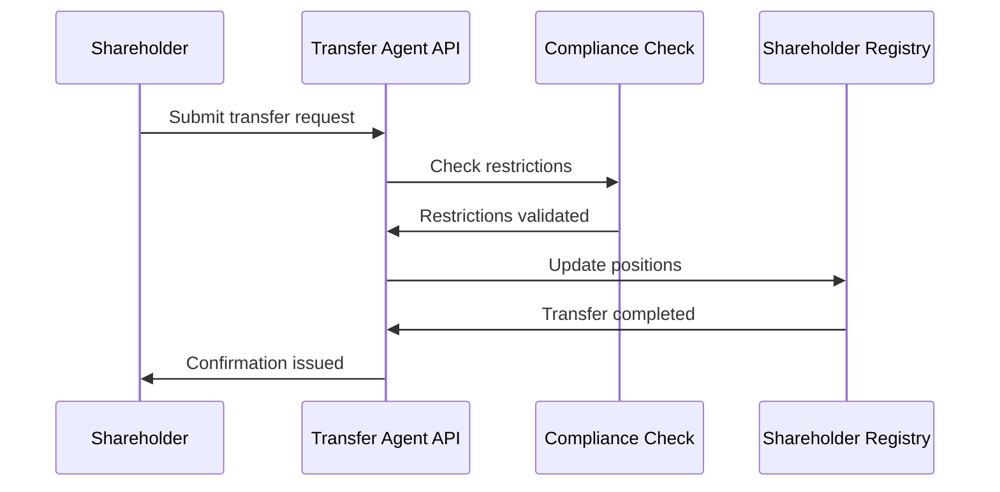
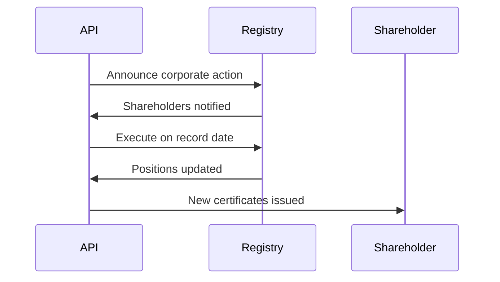



# Transfer Agent API Documentation

_Based on OpenAPI specification: transfer-agent.yaml_

## Executive Summary

**Audience:** Stakeholders

- Business value proposition: Complete transfer agent services for managing shareholder registries, enforcing transfer restrictions, and administering corporate actions with full regulatory compliance.
- Key capabilities: Real-time shareholder registry (cap table), transfer restriction enforcement (Rule 144, lock-ups), certificate lifecycle management, corporate action processing, and automated shareholder reporting.
- Strategic importance: Ensures SEC compliance (Rule 17Ad-10), maintains accurate ownership records, enables corporate governance, and provides audit trails for regulatory reporting.

## Service Overview

**Audience:** All

- Business Purpose:

  - Maintain official shareholder registry (cap table of record).
  - Enforce transfer restrictions and compliance rules.
  - Issue and manage stock certificates.
  - Process corporate actions (splits, dividends, mergers).
  - Generate shareholder reports and statements.
  - Support annual shareholder meetings and communications.

- Technical Architecture:
  - Immutable ledger for shareholder transactions.
  - Real-time restriction checking and validation.
  - Integration with corporate governance systems.
  - Automated certificate generation and tracking.
  - Event-driven corporate action processing.
  - Regulatory-compliant audit logging and reporting.

## API Specifications

**Audience:** Technical

- Base Configuration (YAML format):

```yaml
openapi: 3.1.0
info:
  title: Quub Exchange - Transfer Agent API
  version: 2.0.0
servers:
  - url: https://api.quub.exchange/v1
```

- Authentication & Authorization:
  - OAuth2 scopes (read:transfer-agent, write:transfer-agent).
  - API key authentication for transfer agent operations.
  - Role-based access for compliance officers and administrators.

## Core Endpoints

Grouped by functional area. For each endpoint below we include method, path, business use case, request and response examples, and implementation notes.

### Registry

- GET /orgs/{orgId}/transfer-agent/registry/assets/{assetId}/holders
  - Business use case: Retrieve current shareholder registry for compliance and reporting.
  - Request example:

```json
GET /orgs/01234567-89ab-cdef-0123-456789abcdef/transfer-agent/registry/assets/asset_123/holders?asOfDate=2025-11-02&limit=100
Authorization: Bearer <token>
```

- Response example (200):

```json
{
  "data": [
    {
      "accountId": "acc_456",
      "accountName": "John Doe",
      "assetId": "asset_123",
      "assetName": "Quub Common Stock",
      "shares": "10000",
      "percentOwnership": "5.2",
      "certificateNumbers": ["CERT-001", "CERT-002"],
      "restrictions": ["LOCK_UP"],
      "acquisitionDate": "2025-01-15"
    }
  ],
  "pagination": {
    "cursor": "next-page",
    "hasMore": true
  }
}
```

- Implementation notes:

  1. Point-in-time queries for historical analysis.
  2. Paginated results for large shareholder bases.
  3. Includes restriction status for compliance monitoring.

- GET /orgs/{orgId}/transfer-agent/registry/holders/{accountId}
  - Business use case: Get all positions held by a specific shareholder across assets.
  - Request example:

```json
GET /orgs/01234567-89ab-cdef-0123-456789abcdef/transfer-agent/registry/holders/acc_456
Authorization: Bearer <token>
```

- Response example (200):

```json
{
  "data": [
    {
      "accountId": "acc_456",
      "accountName": "John Doe",
      "assetId": "asset_123",
      "assetName": "Quub Common Stock",
      "shares": "10000",
      "percentOwnership": "5.2",
      "certificateNumbers": ["CERT-001"],
      "restrictions": [],
      "acquisitionDate": "2025-01-15"
    }
  ]
}
```

### Transfers

- GET /orgs/{orgId}/transfer-agent/transfers
  - Business use case: List transfer requests for processing and compliance review.
  - Request example:

```json
GET /orgs/01234567-89ab-cdef-0123-456789abcdef/transfer-agent/transfers?status=PENDING&assetId=asset_123
Authorization: Bearer <token>
```

- Response example (200):

```json
{
  "data": [
    {
      "id": "transfer_789",
      "orgId": "org_123",
      "assetId": "asset_123",
      "fromAccountId": "acc_456",
      "toAccountId": "acc_789",
      "shares": "5000",
      "status": "PENDING",
      "requestedAt": "2025-11-01T10:00:00Z",
      "restrictionCheck": {
        "passed": true,
        "violations": []
      }
    }
  ],
  "pagination": {
    "cursor": null,
    "hasMore": false
  }
}
```

- Implementation notes:

  1. Filters for status, asset, accounts, and date ranges.
  2. Includes automatic restriction validation results.
  3. Supports bulk transfer processing workflows.

- POST /orgs/{orgId}/transfer-agent/transfers
  - Business use case: Create transfer request with automatic restriction checking.
  - Request example:

```json
POST /orgs/01234567-89ab-cdef-0123-456789abcdef/transfer-agent/transfers
{
  "assetId": "asset_123",
  "fromAccountId": "acc_456",
  "toAccountId": "acc_789",
  "shares": "5000",
  "notes": "Gift transfer"
}
```

- Response example (201):

```json
{
  "data": {
    "id": "transfer_789",
    "orgId": "org_123",
    "assetId": "asset_123",
    "fromAccountId": "acc_456",
    "toAccountId": "acc_789",
    "shares": "5000",
    "status": "PENDING",
    "requestedAt": "2025-11-02T14:30:00Z",
    "restrictionCheck": {
      "passed": true,
      "violations": []
    }
  }
}
```

- POST /orgs/{orgId}/transfer-agent/transfers/{transferId}/approve
  - Business use case: Approve pending transfer request after compliance review.
  - Request example:

```json
POST /orgs/01234567-89ab-cdef-0123-456789abcdef/transfer-agent/transfers/transfer_789/approve
Authorization: Bearer <token>
```

- Response example (200):

```json
{
  "data": {
    "id": "transfer_789",
    "status": "APPROVED",
    "approvedAt": "2025-11-02T15:00:00Z"
  }
}
```

### Transfer Restrictions

- GET /orgs/{orgId}/transfer-agent/restrictions
  - Business use case: List active transfer restrictions for compliance monitoring.
  - Request example:

```json
GET /orgs/01234567-89ab-cdef-0123-456789abcdef/transfer-agent/restrictions?assetId=asset_123
Authorization: Bearer <token>
```

- Response example (200):

```json
{
  "data": [
    {
      "id": "restrict_123",
      "assetId": "asset_123",
      "accountId": "acc_456",
      "restrictionType": "LOCK_UP",
      "description": "IPO lock-up period",
      "expiresAt": "2026-11-02T00:00:00Z",
      "createdAt": "2025-01-15T10:00:00Z"
    }
  ]
}
```

- POST /orgs/{orgId}/transfer-agent/restrictions
  - Business use case: Create transfer restriction for compliance requirements.
  - Request example:

```json
POST /orgs/01234567-89ab-cdef-0123-456789abcdef/transfer-agent/restrictions
{
  "assetId": "asset_123",
  "accountId": "acc_456",
  "restrictionType": "RULE_144",
  "description": "Rule 144 holding period",
  "expiresAt": "2026-05-15T00:00:00Z"
}
```

- Response example (201):

```json
{
  "data": {
    "id": "restrict_456",
    "assetId": "asset_123",
    "accountId": "acc_456",
    "restrictionType": "RULE_144",
    "description": "Rule 144 holding period",
    "expiresAt": "2026-05-15T00:00:00Z",
    "createdAt": "2025-11-02T16:00:00Z"
  }
}
```

### Certificates

- GET /orgs/{orgId}/transfer-agent/certificates
  - Business use case: List issued certificates for tracking and reconciliation.
  - Request example:

```json
GET /orgs/01234567-89ab-cdef-0123-456789abcdef/transfer-agent/certificates?assetId=asset_123&status=ACTIVE
Authorization: Bearer <token>
```

- Response example (200):

```json
{
  "data": [
    {
      "id": "cert_123",
      "certificateNumber": "CERT-001",
      "assetId": "asset_123",
      "accountId": "acc_456",
      "shares": "10000",
      "status": "ACTIVE",
      "issuedAt": "2025-01-15T10:00:00Z"
    }
  ]
}
```

- POST /orgs/{orgId}/transfer-agent/certificates
  - Business use case: Issue new stock certificate for shareholder.
  - Request example:

```json
POST /orgs/01234567-89ab-cdef-0123-456789abcdef/transfer-agent/certificates
{
  "assetId": "asset_123",
  "accountId": "acc_456",
  "shares": "10000",
  "certificateNumber": "CERT-002"
}
```

- Response example (201):

```json
{
  "data": {
    "id": "cert_456",
    "certificateNumber": "CERT-002",
    "assetId": "asset_123",
    "accountId": "acc_456",
    "shares": "10000",
    "status": "ACTIVE",
    "issuedAt": "2025-11-02T17:00:00Z"
  }
}
```

- POST /orgs/{orgId}/transfer-agent/certificates/{certificateId}/cancel
  - Business use case: Cancel certificate due to transfer or other corporate action.
  - Request example:

```json
POST /orgs/01234567-89ab-cdef-0123-456789abcdef/transfer-agent/certificates/cert_123/cancel
{
  "reason": "Stock split conversion"
}
```

- Response example (200):

```json
{
  "data": {
    "id": "cert_123",
    "status": "CANCELLED",
    "cancelledAt": "2025-11-02T18:00:00Z"
  }
}
```

### Corporate Actions

- GET /orgs/{orgId}/transfer-agent/corporate-actions
  - Business use case: List corporate actions for planning and shareholder communication.
  - Request example:

```json
GET /orgs/01234567-89ab-cdef-0123-456789abcdef/transfer-agent/corporate-actions?assetId=asset_123&type=SPLIT
Authorization: Bearer <token>
```

- Response example (200):

```json
{
  "data": [
    {
      "id": "action_123",
      "assetId": "asset_123",
      "actionType": "SPLIT",
      "description": "2-for-1 stock split",
      "recordDate": "2025-12-01",
      "effectiveDate": "2025-12-15",
      "ratio": "2:1",
      "status": "ANNOUNCED"
    }
  ]
}
```

- POST /orgs/{orgId}/transfer-agent/corporate-actions
  - Business use case: Create corporate action for shareholder registry updates.
  - Request example:

```json
POST /orgs/01234567-89ab-cdef-0123-456789abcdef/transfer-agent/corporate-actions
{
  "assetId": "asset_123",
  "actionType": "DIVIDEND",
  "description": "Quarterly cash dividend",
  "recordDate": "2025-12-01",
  "effectiveDate": "2025-12-15",
  "ratio": "0.25"
}
```

- Response example (201):

```json
{
  "data": {
    "id": "action_456",
    "assetId": "asset_123",
    "actionType": "DIVIDEND",
    "description": "Quarterly cash dividend",
    "recordDate": "2025-12-01",
    "effectiveDate": "2025-12-15",
    "ratio": "0.25",
    "status": "ANNOUNCED"
  }
}
```

- POST /orgs/{orgId}/transfer-agent/corporate-actions/{actionId}/execute
  - Business use case: Execute corporate action to update shareholder positions.
  - Request example:

```json
POST /orgs/01234567-89ab-cdef-0123-456789abcdef/transfer-agent/corporate-actions/action_123/execute
Authorization: Bearer <token>
```

- Response example (200):

```json
{
  "data": {
    "id": "action_123",
    "status": "EXECUTED",
    "executedAt": "2025-12-15T10:00:00Z"
  }
}
```

### Reports

- GET /orgs/{orgId}/transfer-agent/reports/shareholders
  - Business use case: Generate shareholder report for regulatory filings and communications.
  - Request example:

```json
GET /orgs/01234567-89ab-cdef-0123-456789abcdef/transfer-agent/reports/shareholders?assetId=asset_123&asOfDate=2025-11-02&format=PDF
Authorization: Bearer <token>
```

- Response example (200):

```json
{
  "data": {
    "assetId": "asset_123",
    "asOfDate": "2025-11-02",
    "totalShares": "1000000",
    "holders": [
      {
        "accountId": "acc_456",
        "accountName": "John Doe",
        "shares": "50000",
        "percentOwnership": "5.0"
      }
    ]
  }
}
```

## Security Implementation

**Audience:** Technical + Project Teams

- Multi-tenant isolation:
  - Org-scoped shareholder data prevents cross-company access.
  - Certificate numbers are globally unique.

```yaml
multiTenant:
  enforceOrgScope: true
  shareholderIsolation: true
```

- Data protection measures:

  - Encrypted shareholder registry data.
  - Audit logging for all transfer operations.
  - Immutable transaction history.

- Access Controls:

```json
{ "roles": ["transfer_agent", "compliance_officer", "shareholder_services"] }
```

## Business Workflows

**Audience:** Stakeholders + Project Teams

### Primary Workflow — Transfer Processing (Mermaid)



- Business value: Ensures compliant and accurate shareholder transfers.
- Success metrics: 99.9% restriction compliance, <1 hour average processing time, 100% audit accuracy.

### Secondary Workflow — Corporate Action Execution



## Integration Guide

**Audience:** Project Teams

- Development Setup:

```bash
npm install axios
export TRANSFER_AGENT_API_URL=https://api.quub.exchange/v1
export ORG_ID=your-org-id
```

- JavaScript/Node.js example (create transfer request):

```javascript
import axios from "axios";

async function createTransferRequest(orgId, token, transfer) {
  const response = await axios.post(
    `/orgs/${orgId}/transfer-agent/transfers`,
    transfer,
    { headers: { Authorization: `Bearer ${token}` } }
  );
  return response.data;
}

// usage
createTransferRequest("org-uuid", "TOKEN", {
  assetId: "asset-123",
  fromAccountId: "acc-sender",
  toAccountId: "acc-receiver",
  shares: "1000",
});
```

- Python example (get shareholder registry):

```python
import requests

def get_shareholder_registry(org_id, token, asset_id):
    url = f'https://api.quub.exchange/v1/orgs/{org_id}/transfer-agent/registry/assets/{asset_id}/holders'
    headers = {'Authorization': f'Bearer {token}'}
    r = requests.get(url, headers=headers)
    return r.json()

# usage
registry = get_shareholder_registry('org-uuid', 'TOKEN', 'asset-123')
print(f"Total holders: {len(registry['data'])}")
```

## Error Handling

**Audience:** Technical + Project Teams

- Standard error response:

```json
{
  "error": {
    "code": "ValidationError",
    "message": "Transfer violates restriction",
    "details": [{ "field": "shares", "message": "Exceeds lock-up period" }]
  }
}
```

- Error codes:

  - BadRequest (400) — Invalid parameters or business rules
  - Unauthorized (401) — Authentication failure
  - Forbidden (403) — Insufficient permissions or restriction violation
  - NotFound (404) — Shareholder or certificate not found
  - Conflict (409) — Transfer already processed or restriction conflict
  - ValidationError (422) — Business rule violation
  - TooManyRequests (429) — Rate limit exceeded

- Best practices:
  1. Check restrictions before submitting transfers.
  2. Use idempotency keys for reliable processing.
  3. Monitor certificate status for lifecycle management.

## Implementation Checklist

**Audience:** Project Teams

- Pre-Development:

  - [ ] Confirm regulatory requirements (SEC Rule 17Ad-10)
  - [ ] Set up shareholder registry database
  - [ ] Define restriction types and validation rules

- Development Phase:

  - [ ] Implement registry CRUD operations
  - [ ] Add restriction checking logic
  - [ ] Integrate certificate generation

- Testing Phase:

  - [ ] Test transfer workflows end-to-end
  - [ ] Validate restriction enforcement
  - [ ] Stress test corporate action processing

- Production Readiness:
  - [ ] Security audit for shareholder data handling
  - [ ] Monitoring for transfer processing delays
  - [ ] Backup and recovery for registry data

## Monitoring & Observability

**Audience:** Technical + Project Teams

- Key metrics:

  - transfer_processing_time_hours (target: <2)
  - restriction_violation_rate (target: <0.1%)
  - certificate_issuance_time_minutes (target: <5)
  - shareholder_registry_accuracy (target: >99.99%)

- Logging example:

```json
{
  "timestamp": "2025-11-02T15:30:00Z",
  "orgId": "org-uuid",
  "event": "transfer.completed",
  "transferId": "transfer-123",
  "shares": "5000",
  "processingTimeMs": 1500
}
```

- Alerts:
  - Restriction violations > 1 in 1h
  - Transfer processing delay > 4h
  - Certificate issuance failures > 5%
  - Registry data inconsistencies detected

## API Versioning & Evolution

**Audience:** All

- Current Version: v1 (stable)
- Planned Enhancements (v1.1): Real-time registry streaming, enhanced reporting formats.
- Breaking Changes (v2.0): Migration to event-driven transfer processing, mandatory digital certificates.

## Additional Resources

**Audience:** All

- Stakeholders:

  - Transfer agent regulations: /docs/transfer-agent/compliance
  - Corporate actions guide: /docs/transfer-agent/actions

- Technical:

  - OpenAPI spec: /openapi/transfer-agent.yaml
  - Registry workflows: /docs/transfer-agent/registry

- Project teams:
  - Integration examples: /examples/transfer-agent
  - Certificate management: /docs/transfer-agent/certificates

## Footer

For transfer restriction disputes or certificate issues, contact the transfer agent team with orgId, accountId, and transaction details.
