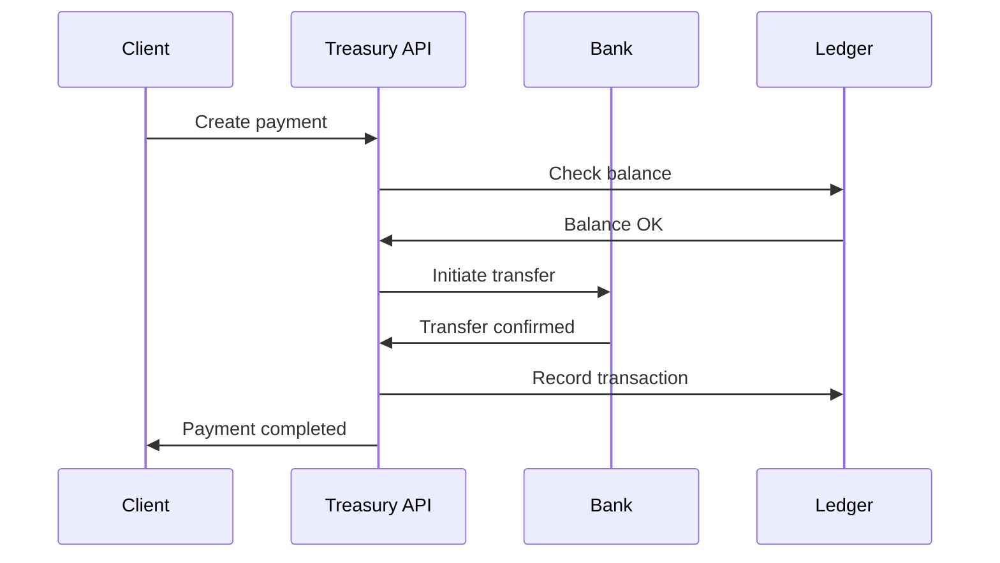
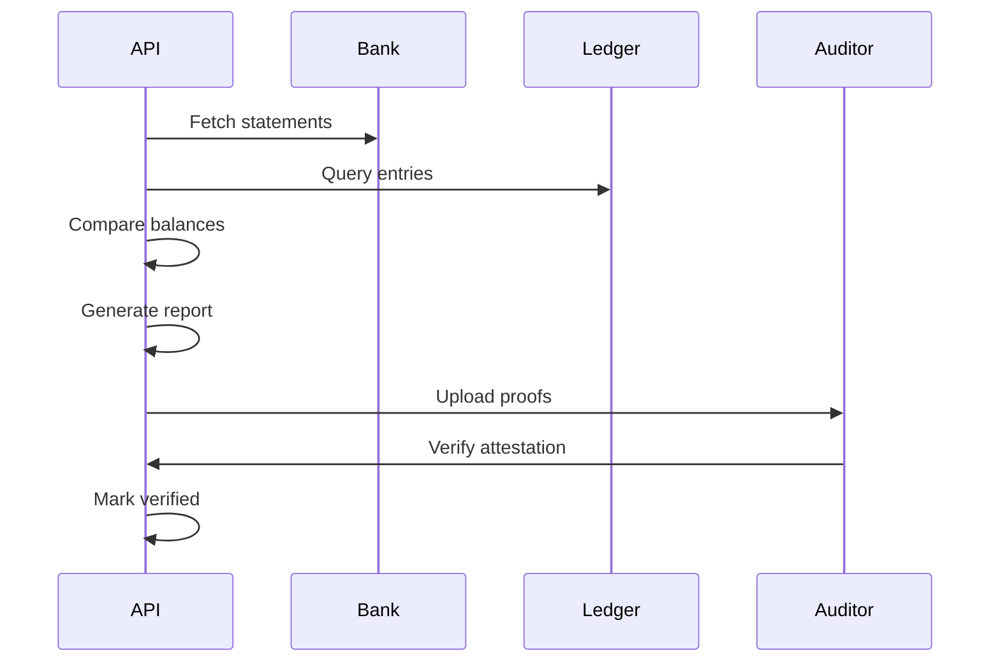



# Treasury & Reconciliation API Documentation

_Based on OpenAPI specification: treasury.yaml_

## Executive Summary

**Audience:** Stakeholders

- Business value proposition: Complete treasury management platform with escrow accounts, payment processing, distributions, and real-time reconciliation between blockchain and banking systems with continuous proof-of-reserves streaming.
- Key capabilities: Escrow account management, multi-method payment processing, automated token holder distributions, comprehensive ledger auditing, and live reconciliation with WebSocket streaming for regulatory compliance.
- Strategic importance: Ensures financial transparency, enables real-time audit visibility, supports regulatory compliance with proof-of-reserves requirements, and provides secure fund management for digital assets.

## Service Overview

**Audience:** All

- Business Purpose:

  - Manage escrow accounts for project funds and settlements.
  - Process payments across multiple methods and currencies.
  - Execute automated distributions to token holders.
  - Maintain comprehensive audit ledger for all transactions.
  - Perform daily reconciliation between internal and external systems.
  - Provide real-time proof-of-reserves streaming via WebSocket.

- Technical Architecture:
  - Multi-currency escrow account management with bank integration.
  - Event-driven payment processing with idempotency guarantees.
  - Automated distribution calculations based on token holdings.
  - Immutable ledger with Merkle tree hashing for audit trails.
  - Real-time reconciliation engine with discrepancy detection.
  - WebSocket streaming for continuous audit visibility.

## API Specifications

**Audience:** Technical

- Base Configuration (YAML format):

```yaml
openapi: 3.1.0
info:
  title: Quub Exchange - Treasury & Reconciliation API
  version: 2.0.0
servers:
  - url: https://api.quub.exchange/v1
  - url: wss://stream.quub.exchange/v1
```

- Authentication & Authorization:
  - OAuth2 scopes (read:treasury, write:treasury).
  - API key authentication for treasury operations.
  - HMAC signatures for WebSocket streaming authentication.

## Core Endpoints

Grouped by functional area. For each endpoint below we include method, path, business use case, request and response examples, and implementation notes.

### Escrow Accounts

- GET /orgs/{orgId}/escrows
  - Business use case: List escrow accounts for fund management and monitoring.
  - Request example:

```json
GET /orgs/01234567-89ab-cdef-0123-456789abcdef/escrows?projectId=proj_123&limit=50
Authorization: Bearer <token>
```

- Response example (200):

```json
{
  "data": [
    {
      "id": "escrow_456",
      "projectId": "proj_123",
      "orgId": "org_789",
      "currency": "USD",
      "balance": 50000.0,
      "holdBalance": 5000.0,
      "status": "ACTIVE",
      "bankAccount": {
        "bankName": "Citibank",
        "accountNumber": "****1234",
        "routingNumber": "021000021"
      },
      "createdAt": "2025-01-15T10:00:00Z"
    }
  ],
  "pagination": {
    "cursor": "next-page",
    "hasMore": false
  }
}
```

- Implementation notes:

  1. Filters by project and currency for targeted account management.
  2. Balances include held funds for settlement processing.
  3. Bank details masked for security.

- POST /orgs/{orgId}/escrows
  - Business use case: Create escrow account for secure fund management.
  - Request example:

```json
POST /orgs/01234567-89ab-cdef-0123-456789abcdef/escrows
{
  "currency": "USD",
  "projectId": "proj_123",
  "bankRef": "CITI-ESCROW-12345"
}
```

- Response example (201):

```json
{
  "id": "escrow_456",
  "projectId": "proj_123",
  "orgId": "org_789",
  "currency": "USD",
  "balance": 0.0,
  "holdBalance": 0.0,
  "status": "ACTIVE",
  "bankAccount": {
    "bankName": "Citibank",
    "accountNumber": "****1234",
    "routingNumber": "021000021"
  },
  "createdAt": "2025-11-02T14:30:00Z"
}
```

- Implementation notes:

  1. Automatic bank account provisioning for supported currencies.
  2. Idempotency key prevents duplicate account creation.
  3. Integration with banking partners for account setup.

- GET /orgs/{orgId}/escrows/{escrowId}
  - Business use case: Retrieve detailed escrow account information.
  - Request example:

```json
GET /orgs/01234567-89ab-cdef-0123-456789abcdef/escrows/escrow_456
Authorization: Bearer <token>
```

- Response example (200):

```json
{
  "id": "escrow_456",
  "projectId": "proj_123",
  "orgId": "org_789",
  "currency": "USD",
  "balance": 50000.0,
  "holdBalance": 5000.0,
  "status": "ACTIVE",
  "bankAccount": {
    "bankName": "Citibank",
    "accountNumber": "****1234",
    "routingNumber": "021000021",
    "swift": "CITIUS33"
  },
  "createdAt": "2025-01-15T10:00:00Z"
}
```

### Payments

- GET /orgs/{orgId}/payments
  - Business use case: List payments for transaction monitoring and reconciliation.
  - Request example:

```json
GET /orgs/01234567-89ab-cdef-0123-456789abcdef/payments?direction=OUTBOUND&status=COMPLETED
Authorization: Bearer <token>
```

- Response example (200):

```json
{
  "data": [
    {
      "id": "pay_789",
      "orgId": "org_123",
      "direction": "OUTBOUND",
      "method": "WIRE",
      "amount": 25000.0,
      "currency": "USD",
      "status": "COMPLETED",
      "from": "escrow_456",
      "to": "bank_acc_789",
      "valueDate": "2025-11-02",
      "createdAt": "2025-11-01T15:30:00Z",
      "completedAt": "2025-11-02T10:00:00Z"
    }
  ],
  "pagination": {
    "cursor": null,
    "hasMore": false
  }
}
```

- Implementation notes:

  1. Filters by direction, status, and date ranges.
  2. Includes payment method and settlement details.
  3. Supports multiple currencies and payment rails.

- POST /orgs/{orgId}/payments
  - Business use case: Initiate payment for fund transfers and settlements.
  - Request example:

```json
POST /orgs/01234567-89ab-cdef-0123-456789abcdef/payments
{
  "direction": "OUTBOUND",
  "method": "WIRE",
  "amount": 25000.00,
  "currency": "USD",
  "from": "escrow_456",
  "to": "bank_acc_789",
  "valueDate": "2025-11-02",
  "refs": {
    "invoice": "INV-2025-001",
    "purpose": "Settlement payment"
  }
}
```

- Response example (201):

```json
{
  "id": "pay_789",
  "orgId": "org_123",
  "direction": "OUTBOUND",
  "method": "WIRE",
  "amount": 25000.0,
  "currency": "USD",
  "status": "PENDING",
  "from": "escrow_456",
  "to": "bank_acc_789",
  "valueDate": "2025-11-02",
  "createdAt": "2025-11-02T14:45:00Z"
}
```

- Implementation notes:
  1. Supports multiple payment methods (wire, ACH, crypto).
  2. Automatic balance validation before payment initiation.
  3. Idempotency prevents duplicate payment creation.

### Distributions

- GET /orgs/{orgId}/distributions
  - Business use case: List distributions for dividend and interest payments.
  - Request example:

```json
GET /orgs/01234567-89ab-cdef-0123-456789abcdef/distributions?limit=20
Authorization: Bearer <token>
```

- Response example (200):

```json
{
  "data": [
    {
      "id": "dist_123",
      "tokenClassId": "token_456",
      "projectId": "proj_123",
      "type": "DIVIDEND",
      "totalAmount": 50000.0,
      "currency": "USD",
      "perShareAmount": 0.5,
      "recordDate": "2025-11-01",
      "paymentDate": "2025-11-15",
      "status": "ANNOUNCED",
      "recipientCount": 1000,
      "paidAmount": 0.0
    }
  ],
  "pagination": {
    "cursor": "next-page",
    "hasMore": true
  }
}
```

- Implementation notes:

  1. Tracks distribution lifecycle from announcement to completion.
  2. Includes recipient count and payment progress.
  3. Supports multiple distribution types.

- POST /orgs/{orgId}/distributions
  - Business use case: Create distribution batch for token holder payments.
  - Request example:

```json
POST /orgs/01234567-89ab-cdef-0123-456789abcdef/distributions
{
  "tokenClassId": "token_456",
  "period": "Q3-2025",
  "net": 50000.00,
  "gross": 55000.00,
  "fees": 2500.00,
  "taxWithheld": 2500.00
}
```

- Response example (201):

```json
{
  "id": "dist_123",
  "tokenClassId": "token_456",
  "projectId": "proj_123",
  "type": "DIVIDEND",
  "totalAmount": 50000.0,
  "currency": "USD",
  "perShareAmount": 0.5,
  "recordDate": "2025-11-01",
  "paymentDate": "2025-11-15",
  "status": "ANNOUNCED",
  "recipientCount": 1000,
  "paidAmount": 0.0
}
```

- Implementation notes:
  1. Automatic calculation of per-share amounts.
  2. Tax withholding and fee calculations.
  3. Integration with shareholder registry for recipient lists.

### Ledger

- GET /orgs/{orgId}/ledger
  - Business use case: Query ledger entries for audit and reconciliation.
  - Request example:

```json
GET /orgs/01234567-89ab-cdef-0123-456789abcdef/ledger?accountId=acc_123&limit=100
Authorization: Bearer <token>
```

- Response example (200):

```json
{
  "data": [
    {
      "id": "ledger_789",
      "type": "DEBIT",
      "accountRef": "escrow_456",
      "amount": 25000.0,
      "currency": "USD",
      "description": "Wire transfer to counterparty",
      "relatedEntityType": "PAYMENT",
      "relatedEntityId": "pay_789",
      "timestamp": "2025-11-02T10:00:00Z",
      "orgId": "org_123",
      "accountId": "acc_123"
    }
  ],
  "pagination": {
    "cursor": null,
    "hasMore": false
  }
}
```

- Implementation notes:
  1. Double-entry bookkeeping with debit/credit entries.
  2. Links to related business entities (payments, distributions).
  3. Immutable audit trail with timestamps.

### Reconciliation

- GET /orgs/{orgId}/reconciliation
  - Business use case: List daily reconciliation reports for audit compliance.
  - Request example:

```json
GET /orgs/01234567-89ab-cdef-0123-456789abcdef/reconciliation?fromDate=2025-11-01&toDate=2025-11-02
Authorization: Bearer <token>
```

- Response example (200):

```json
{
  "data": [
    {
      "id": "recon_2025_11_02",
      "date": "2025-11-02",
      "status": "MATCHED",
      "hashRoot": "a1b2c3d4...",
      "discrepancies": [],
      "proofs": [
        {
          "type": "bank_statement",
          "fileUrl": "https://files.quub.exchange/recon/proof_123.pdf",
          "uploadedAt": "2025-11-02T18:00:00Z",
          "verifiedBy": "Citibank"
        }
      ],
      "generatedAt": "2025-11-02T17:00:00Z",
      "verifiedAt": "2025-11-02T18:30:00Z"
    }
  ],
  "pagination": {
    "cursor": null,
    "hasMore": false
  }
}
```

- Implementation notes:

  1. Daily reconciliation with Merkle tree hashing.
  2. Tracks discrepancies and proof attestations.
  3. Supports multiple proof types (bank statements, on-chain proofs).

- POST /orgs/{orgId}/reconciliation
  - Business use case: Trigger daily reconciliation process.
  - Request example:

```json
POST /orgs/01234567-89ab-cdef-0123-456789abcdef/reconciliation
{
  "date": "2025-11-02"
}
```

- Response example (201):

```json
{
  "id": "recon_2025_11_02",
  "date": "2025-11-02",
  "status": "PENDING",
  "hashRoot": null,
  "discrepancies": [],
  "proofs": [],
  "generatedAt": "2025-11-02T17:00:00Z",
  "verifiedAt": null
}
```

- POST /orgs/{orgId}/reconciliation/{reportId}/attest
  - Business use case: Upload proof documents for reconciliation verification.
  - Request example:

```json
POST /orgs/01234567-89ab-cdef-0123-456789abcdef/reconciliation/recon_2025_11_02/attest
Content-Type: multipart/form-data

--boundary
Content-Disposition: form-data; name="file"; filename="bank_statement.pdf"
Content-Type: application/pdf

<file content>
--boundary
Content-Disposition: form-data; name="type"

bank_statement
--boundary--
```

- Response example (200):

```json
{
  "id": "recon_2025_11_02",
  "status": "VERIFIED",
  "proofs": [
    {
      "type": "bank_statement",
      "fileUrl": "https://files.quub.exchange/recon/proof_456.pdf",
      "uploadedAt": "2025-11-02T18:00:00Z",
      "verifiedBy": "Citibank"
    }
  ],
  "verifiedAt": "2025-11-02T18:30:00Z"
}
```

- GET /orgs/{orgId}/reconciliation/live-status
  - Business use case: Establish WebSocket connection for real-time reconciliation streaming.
  - Request example:

```json
GET wss://stream.quub.exchange/v1/orgs/01234567-89ab-cdef-0123-456789abcdef/reconciliation/live-status
Authorization: Bearer <token>
```

- Response example (WebSocket message):

```json
{
  "sequence": 15823,
  "timestamp": "2025-11-02T15:30:00Z",
  "type": "BALANCE_UPDATE",
  "orgId": "org-123",
  "data": {
    "accountRef": "escrow_456",
    "oldBalance": 50000.0,
    "newBalance": 25000.0
  },
  "signature": "HMAC_SHA256(...)"
}
```

- Implementation notes:
  1. HMAC-signed messages for authenticity.
  2. Real-time balance changes and discrepancy alerts.
  3. Enables continuous proof-of-reserves monitoring.

## Security Implementation

**Audience:** Technical + Project Teams

- Multi-tenant isolation:
  - Org-scoped escrow accounts and ledger entries.
  - Secure payment processing with encryption.

```yaml
multiTenant:
  enforceOrgScope: true
  escrowIsolation: true
```

- Data protection measures:

  - Encrypted bank account details and payment information.
  - Merkle tree hashing for reconciliation integrity.
  - Audit logging for all treasury operations.

- Access Controls:

```json
{ "roles": ["treasury_admin", "reconciliation_officer", "auditor"] }
```

## Business Workflows

**Audience:** Stakeholders + Project Teams

### Primary Workflow — Payment Processing (Mermaid)



- Business value: Secure and compliant payment processing with full audit trail.
- Success metrics: 99.9% payment success rate, <2 hour average settlement time, 100% reconciliation accuracy.

### Secondary Workflow — Daily Reconciliation



## Integration Guide

**Audience:** Project Teams

- Development Setup:

```bash
npm install ws axios crypto
export TREASURY_API_URL=https://api.quub.exchange/v1
export STREAM_URL=wss://stream.quub.exchange/v1
export ORG_ID=your-org-id
```

- JavaScript/Node.js example (create escrow account):

```javascript
import axios from "axios";

async function createEscrowAccount(orgId, token, escrow) {
  const response = await axios.post(`/orgs/${orgId}/escrows`, escrow, {
    headers: { Authorization: `Bearer ${token}` },
  });
  return response.data;
}

// usage
createEscrowAccount("org-uuid", "TOKEN", {
  currency: "USD",
  projectId: "proj-123",
  bankRef: "BANK-REF-456",
});
```

- Python example (WebSocket streaming):

```python
import websocket
import json
import hmac
import hashlib

def on_message(ws, message):
    data = json.loads(message)
    # Verify HMAC signature
    expected_sig = hmac.new(
        'your-api-secret'.encode(),
        message.encode(),
        hashlib.sha256
    ).hexdigest()
    if data['signature'] == expected_sig:
        print(f"Balance update: {data['data']}")

ws = websocket.WebSocketApp(
    "wss://stream.quub.exchange/v1/orgs/org-uuid/reconciliation/live-status",
    on_message=on_message,
    header={"Authorization": "Bearer TOKEN"}
)
ws.run_forever()
```

## Error Handling

**Audience:** Technical + Project Teams

- Standard error response:

```json
{
  "error": {
    "code": "ValidationError",
    "message": "Insufficient escrow balance",
    "details": [{ "field": "amount", "message": "Exceeds available funds" }]
  }
}
```

- Error codes:

  - BadRequest (400) — Invalid parameters or business rules
  - Unauthorized (401) — Authentication failure
  - Forbidden (403) — Insufficient permissions or account restrictions
  - NotFound (404) — Escrow account or payment not found
  - Conflict (409) — Idempotency conflict or account status issue
  - ValidationError (422) — Business rule violation
  - TooManyRequests (429) — Rate limit exceeded

- Best practices:
  1. Use idempotency keys for payment creation.
  2. Monitor escrow balances before initiating payments.
  3. Implement WebSocket reconnection for streaming.

## Implementation Checklist

**Audience:** Project Teams

- Pre-Development:

  - [ ] Confirm banking partner integrations
  - [ ] Set up escrow account structures
  - [ ] Define reconciliation frequency and requirements

- Development Phase:

  - [ ] Implement escrow account CRUD operations
  - [ ] Add payment processing with multiple methods
  - [ ] Integrate ledger and reconciliation logic

- Testing Phase:

  - [ ] Test payment workflows end-to-end
  - [ ] Validate reconciliation calculations
  - [ ] Stress test WebSocket streaming

- Production Readiness:
  - [ ] Security audit for payment data handling
  - [ ] Monitoring for reconciliation discrepancies
  - [ ] Backup and recovery for ledger data

## Monitoring & Observability

**Audience:** Technical + Project Teams

- Key metrics:

  - payment_success_rate (target: >99.5%)
  - reconciliation_match_rate (target: >99.9%)
  - escrow_balance_accuracy (target: 100%)
  - websocket_connection_uptime (target: >99.9%)

- Logging example:

```json
{
  "timestamp": "2025-11-02T15:30:00Z",
  "orgId": "org-uuid",
  "event": "payment.completed",
  "paymentId": "pay-123",
  "amount": 25000.0,
  "currency": "USD",
  "processingTimeMs": 1800000
}
```

- Alerts:
  - Payment failure rate > 1% for 1h
  - Reconciliation discrepancies > $1000
  - Escrow balance mismatches detected
  - WebSocket streaming interruptions > 5min

## API Versioning & Evolution

**Audience:** All

- Current Version: v1 (stable)
- Planned Enhancements (v1.1): Enhanced payment methods, automated reconciliation triggers.
- Breaking Changes (v2.0): Mandatory WebSocket streaming for all treasury operations, enhanced proof-of-reserves requirements.

## Additional Resources

**Audience:** All

- Stakeholders:

  - Treasury management guide: /docs/treasury/overview
  - Reconciliation requirements: /docs/treasury/compliance

- Technical:

  - OpenAPI spec: /openapi/treasury.yaml
  - WebSocket streaming: /docs/treasury/streaming

- Project teams:
  - Integration examples: /examples/treasury
  - Banking integrations: /docs/treasury/banking

## Footer

For payment failures or reconciliation issues, contact the treasury team with orgId, escrowId, and transaction details.
